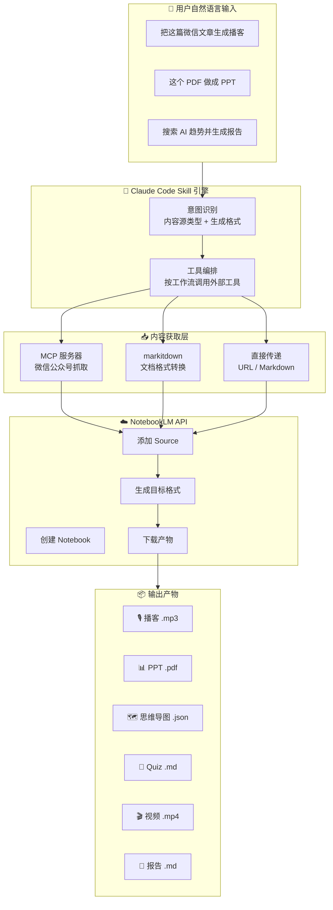

**anything-to-notebooklm** 是一个运行在 [Claude Code](https://docs.anthropic.com/en/docs/claude-code) 中的 **Skill**（技能插件），它的核心使命只有一个：**让你用一句自然语言，把任何来源的内容，转换成任何你想要的格式**。你不需要记住任何命令行参数、不需要手动转换文件格式、不需要打开浏览器操作 NotebookLM——说出你的意图，剩下的全部自动完成。

```
你说：把这篇微信文章生成播客
AI ：✅ 8 分钟播客已生成 → podcast.mp3

你说：这本 EPUB 电子书做成思维导图
AI ：✅ 思维导图已生成 → mindmap.json
```

项目的运行原理可以概括为三个阶段：**自动识别内容源 → 智能获取并转换 → 上传 NotebookLM 生成目标格式**。它借助 MCP（Model Context Protocol）服务器抓取微信公众号等受保护页面，利用 Microsoft 的 markitdown 工具将 15+ 种文件格式统一转为文本，最终通过 `notebooklm-py` CLI 与 Google NotebookLM API 交互，生成播客、PPT、思维导图等 8 种输出产物。

Sources: [README.md](README.md#L21-L37), [SKILL.md](SKILL.md#L1-L11)

---

## 项目定位：它是谁，不是谁

在深入技术细节之前，先厘清几个关键概念，帮助你在正确的框架下理解这个项目。

**它是一个 Claude Code Skill**，而非独立的 Python 应用。Skill 的本质是一份结构化的指令文档（[SKILL.md](SKILL.md)），Claude Code 读取这份文档后，便获得了"理解用户自然语言意图 → 编排多工具协作完成任务"的能力。因此，项目仓库中不存在传统意义上的 `main.py` 或 `app.py`，核心逻辑由 Claude 的推理引擎根据 SKILL.md 中的工作流规范动态执行。

**它依赖三个外部工具链**协同工作：

| 工具链 | 角色 | 安装方式 |
|--------|------|----------|
| **wexin-read-mcp** | 微信公众号内容抓取（基于 Playwright 浏览器模拟） | `install.sh` 自动克隆并安装依赖 |
| **markitdown** | 15+ 种文件格式 → Markdown/TXT 统一转换 | `pip install markitdown[all]`，由 `install.sh` 执行 |
| **notebooklm-py** | NotebookLM CLI，提供 `login`、`source add`、`generate` 等命令 | `pip install` 从 Git 仓库安装，由 `install.sh` 执行 |

**它的前置条件极简**：只需 Python 3.9+ 和 Git，其余所有依赖通过一键安装脚本 [install.sh](install.sh) 自动部署。

Sources: [SKILL.md](SKILL.md#L1-L6), [install.sh](install.sh#L1-L10), [requirements.txt](requirements.txt#L1-L12)

---

## 整体架构一览

下面的 Mermaid 图展示了从用户输入到最终产物的完整数据流。这是理解整个项目运作方式的最佳起点——先把握全局，再深入局部。

> **前置知识**：Mermaid 是一种用文本描述图表的标记语言，下方代码块会被渲染为流程图。从上往下阅读，箭头表示数据流向。



架构的核心特征是**三层分工**：Claude Code Skill 引擎负责"思考"（意图识别 + 工具编排），内容获取层负责"搬运"（从各种来源提取统一格式的文本），NotebookLM API 负责"创造"（AI 生成目标格式）。这种设计使得每一层都可以独立扩展——新增内容源只需在内容获取层添加对应的处理逻辑，新增输出格式只需在 NotebookLM 层调用新的 `generate` 命令。

Sources: [SKILL.md](SKILL.md#L138-L238), [README.md](README.md#L237-L274)

---

## 支持的内容源：15+ 种格式

项目支持的内容源可以分为 **6 大类别**，覆盖了日常学习和工作中绝大多数的内容形态。下表按类别整理，便于快速查阅。

| 类别 | 支持的格式 | 处理方式 |
|------|-----------|----------|
| **社交媒体** | 微信公众号文章、YouTube 视频 | MCP 服务器抓取 / URL 直接传递 |
| **网页** | 任意公开网页、搜索关键词汇总 | URL 直接传递 / WebSearch → TXT |
| **Office 文档** | Word (.docx)、PowerPoint (.pptx)、Excel (.xlsx) | markitdown 转换为 TXT |
| **电子书与文档** | PDF（含扫描件 OCR）、EPUB、Markdown (.md) | markitdown 转换 / 直接上传 |
| **图片与音频** | 图片（JPEG/PNG/GIF/WebP）、音频（WAV/MP3） | markitdown OCR / markitdown 转录 |
| **结构化数据** | CSV、JSON、XML、ZIP 压缩包 | markitdown 转换 / 解压后批量转换 |

关键的识别逻辑由 Claude Code 根据 SKILL.md 中定义的规则自动判断——用户无需手动指定内容源类型，系统通过 URL 前缀（如 `mp.weixin.qq.com`）、文件扩展名（如 `.epub`）、或是否包含路径特征来分类路由。

Sources: [SKILL.md](SKILL.md#L12-L53), [README.md](README.md#L38-L77)

---

## 支持的输出格式：8 种产物

NotebookLM 支持 8 种 AI 生成格式，每种格式对应一组中文触发词。用户只需在自然语言中包含这些触发词，Skill 引擎便能自动匹配并调用相应的生成命令。

| 输出格式 | 典型用途 | 生成时间 | 触发词示例 |
|----------|---------|----------|-----------|
| 🎙️ **播客** | 通勤听书、碎片化学习 | 2-5 分钟 | "生成播客"、"做成音频"、"转成语音" |
| 📊 **PPT** | 团队分享、读书会演示 | 1-3 分钟 | "做成PPT"、"生成幻灯片" |
| 🗺️ **思维导图** | 理清知识结构 | 1-2 分钟 | "画个思维导图"、"生成脑图" |
| 📝 **Quiz** | 自测学习效果 | 1-2 分钟 | "生成Quiz"、"出题"、"做个测验" |
| 🎬 **视频** | 可视化展示 | 3-8 分钟 | "做个视频"、"生成视频" |
| 📄 **报告** | 深度分析、综合总结 | 2-4 分钟 | "生成报告"、"写个总结" |
| 📈 **信息图** | 数据可视化 | 2-3 分钟 | "做个信息图"、"可视化" |
| 📋 **闪卡** | 记忆巩固、间隔重复 | 1-2 分钟 | "做成闪卡"、"生成记忆卡片" |

如果没有在自然语言中检测到任何生成意图，默认行为是**仅上传内容到 NotebookLM，不触发生成**，等待用户的后续指令。

Sources: [SKILL.md](SKILL.md#L121-L135), [README.md](README.md#L79-L92)

---

## 工作流：5 步自动化管道

无论输入什么内容源、期望什么输出格式，Skill 引擎都遵循一套固定的 5 步处理管道。这个管道定义在 SKILL.md 中，是整个项目最核心的过程规范。


**Step 1：识别内容源类型** — 根据输入的 URL 前缀或文件扩展名，自动判定内容属于微信公众号、YouTube 视频、本地文档等哪种类型，并路由到对应的处理逻辑。

**Step 2：获取内容** — 不同类型的内容源使用不同的获取策略。微信公众号通过 MCP 服务器（基于 Playwright 浏览器模拟）抓取全文；Office 文档、电子书、图片、音频等通过 markitdown 统一转换为 Markdown/TXT；网页和 YouTube 链接则直接将 URL 传递给 NotebookLM，由 Google 基础设施完成内容提取。

**Step 3：上传到 NotebookLM** — 调用 `notebooklm create` 创建新笔记本，再通过 `notebooklm source add` 逐一添加内容源。**关键细节**：每次 `source add` 都必须附带 `--wait` 参数，等待 NotebookLM 完成服务端处理后才能继续，否则后续的生成步骤会失败。

**Step 4：清理临时文件** — 删除 `/tmp/` 目录下生成的中间 TXT、PDF、JSON 文件，释放磁盘空间。

**Step 5：生成目标格式**（可选） — 如果用户表达了生成意图（如"生成播客"），调用对应的 `notebooklm generate` 命令，然后通过 `artifact wait` 等待生成完成，最后 `download` 下载产物到本地。

Sources: [SKILL.md](SKILL.md#L138-L238)

---

## 项目文件结构

项目的文件结构极为精简——核心有效文件只有 5 个，加上一个 MIT 许可证。这种轻量化设计正是因为项目的"大脑"是 Claude Code 的推理引擎，而非项目自身的代码。

```
anything-to-notebooklm/
├── SKILL.md           # 🧠 核心：Skill 定义文件（工作流规范 + 意图映射 + 错误处理）
├── README.md          # 📖 项目说明（快速开始 + 使用示例 + 故障排查）
├── install.sh         # ⚙️ 一键安装脚本（6 步自动化：Python检查→MCP→依赖→Playwright→NotebookLM→配置指导）
├── check_env.py       # 🔍 环境检查脚本（9 项检测：Python版本、依赖、CLI、MCP配置、认证状态）
├── package.sh         # 📦 打包分发脚本（生成不含大文件的精简 tar.gz）
├── requirements.txt   # 📋 Python 依赖清单（fastmcp、playwright、beautifulsoup4、markitdown 等）
└── LICENSE            # 📄 MIT 开源许可证
```

其中 **SKILL.md 是整个项目最重要的文件**。它不是一个配置文件，而是一份完整的"技能说明书"——定义了支持的内容源、触发方式、意图识别规则、5 步工作流、错误处理策略、高级功能规范。Claude Code 读取它后，便掌握了处理多源内容转换所需的全部知识和决策逻辑。

Sources: [SKILL.md](SKILL.md#L1-L11), [install.sh](install.sh#L1-L9), [check_env.py](check_env.py#L1-L10), [package.sh](package.sh#L1-L10), [requirements.txt](requirements.txt#L1-L12)

---

## 技术依赖全景

项目依赖的 Python 库和外部工具各司其职。下表列出了每个依赖项的具体职责，帮助你在遇到问题时快速定位相关组件。

| 依赖项 | 类型 | 职责 | 对应安装步骤 |
|--------|------|------|-------------|
| **Python ≥ 3.9** | 运行时 | 整个工具链的基础运行环境 | install.sh Step 1 |
| **fastmcp** | Python 库 | MCP 服务器框架，用于微信内容抓取服务 | install.sh Step 3 |
| **playwright** | Python 库 | 浏览器自动化引擎，模拟真实浏览器访问 | install.sh Step 4 |
| **Chromium (Playwright)** | 浏览器 | Playwright 使用的无头浏览器实例 | `playwright install chromium` |
| **beautifulsoup4** | Python 库 | HTML 解析，配合 MCP 服务器提取网页内容 | install.sh Step 3 |
| **lxml** | Python 库 | 高性能 XML/HTML 解析后端 | install.sh Step 3 |
| **markitdown[all]** | Python 库 | 微软开源的文件格式转换器，支持 15+ 种输入格式 | install.sh Step 3 |
| **notebooklm-py** | CLI 工具 | NotebookLM 命令行客户端（`notebooklm login/list/source/generate`） | install.sh Step 5 |
| **wexin-read-mcp** | MCP 服务器 | 微信公众号内容抓取服务（由 install.sh 自动从 Git 克隆） | install.sh Step 2 |

Sources: [requirements.txt](requirements.txt#L1-L12), [install.sh](install.sh#L23-L103)

---

## 核心特性总结

项目的设计围绕四个核心理念展开，这些理念贯穿于每一个技术决策之中：

**🧠 智能识别** — 用户无需关心内容源是什么类型。URL 前缀、文件扩展名、纯文本关键词——系统自动判断并路由到正确的处理管道。这是"零学习成本"体验的基础。

**🚀 全自动处理** — 从内容获取到格式生成，中间所有步骤（抓取、转换、上传、等待、下载）全部自动化。用户只需要说一句话，等待最终产物即可。

**🌐 多源整合** — 支持在一次对话中混合多种内容源（例如"把这篇文章 + 这个视频 + 这个 PDF 一起做成报告"），系统会在同一个 Notebook 中聚合所有 Source 后统一生成。

**🔒 本地优先** — 敏感内容（如微信文章）优先在本地通过 MCP 服务器处理，仅在最终上传和生成阶段才与 NotebookLM 云端交互，最大限度减少数据暴露。

Sources: [README.md](README.md#L203-L236)

---

## 阅读路线建议

本文档是整个知识库的起点。根据你的目标，建议按以下路线深入阅读：

**路线 A：快速上手**（适合想立刻用起来的开发者）
1. → [快速安装与环境配置](2-kuai-su-an-zhuang-yu-huan-jing-pei-zhi) — 一键安装全流程
2. → [NotebookLM 认证与首次使用](3-notebooklm-ren-zheng-yu-shou-ci-shi-yong) — 完成认证即可开始
3. → [自然语言触发方式与使用示例](4-zi-ran-yu-yan-hong-fa-fang-shi-yu-shi-yong-shi-li) — 动手试试各种场景

**路线 B：理解架构**（适合想深入理解技术原理的开发者）
1. → [整体技术架构：从自然语言到文件生成的数据流](5-zheng-ti-ji-zhu-jia-gou-cong-zi-ran-yu-yan-dao-wen-jian-sheng-cheng-de-shu-ju-liu) — 数据流全景
2. → [内容源智能识别：URL 与文件类型自动判断机制](6-nei-rong-yuan-zhi-neng-shi-bie-url-yu-wen-jian-lei-xing-zi-dong-pan-duan-ji-zhi) — 路由决策逻辑
3. → [内容获取与转换：MCP 抓取、markitdown 转换与直接传递](7-nei-rong-huo-qu-yu-zhuan-huan-mcp-zhua-qu-markitdown-zhuan-huan-yu-zhi-jie-chuan-di) — 内容获取层详解

**路线 C：问题排查**（适合遇到问题的开发者）
1. → [常见错误与解决方案：URL 格式、认证失败、生成卡住](25-chang-jian-cuo-wu-yu-jie-jue-fang-an-url-ge-shi-ren-zheng-shi-bai-sheng-cheng-qia-zhu)
2. → [频率限制、内容长度约束与文件清理策略](26-pin-lv-xian-zhi-nei-rong-chang-du-yue-shu-yu-wen-jian-qing-li-ce-lue)