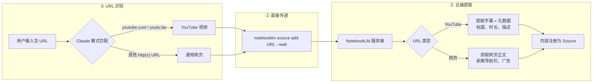
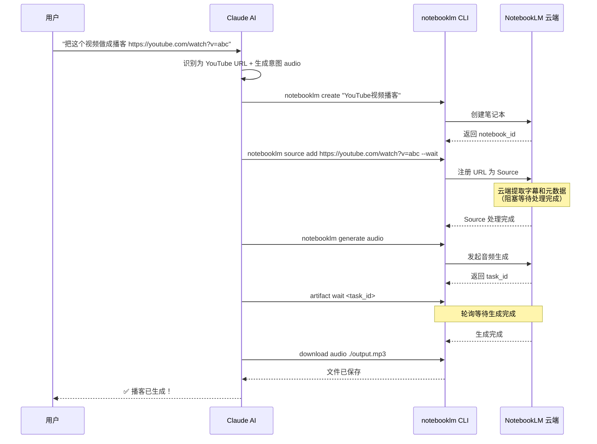
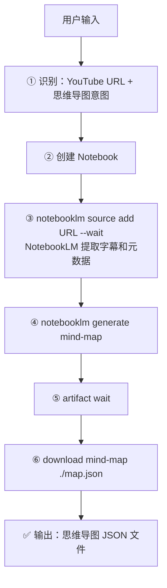
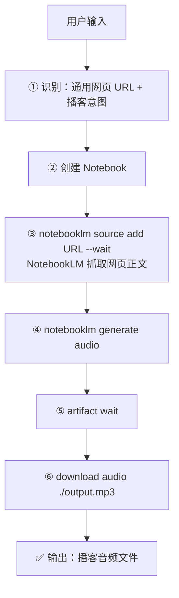

在 anything-to-notebooklm 支持的 15 种内容源中，**网页**和 **YouTube 视频**走了一条最简洁的处理路径——**URL 直接传递**。与微信公众号需要 MCP 服务器抓取、本地文件需要 markitdown 转换不同，这两种内容源不需要任何本地中间处理：Claude AI 将 URL 原封不动地交给 NotebookLM，由 Google 的云端基础设施完成全部内容提取工作。本文将深入拆解这条"零中间层"路径的完整机制，帮助你理解它的工作原理、设计决策和实际使用方式。

Sources: [SKILL.md](SKILL.md#L165-L167)

## 处理流程总览：从 URL 到 NotebookLM Source

当用户输入中包含一个网页或 YouTube URL 时，系统走过一条极其精简的三步管线。下面的 Mermaid 流程图展示了完整的数据流向：



与微信公众号（需要 MCP 服务器 + Playwright 浏览器模拟）和本地文件（需要 markitdown CLI 格式转换）相比，**这条路径不产生任何中间文件**，也不依赖任何本地处理工具。URL 被直接注册为 NotebookLM 的一个 Source，所有内容提取工作都在 NotebookLM 云端完成。

Sources: [SKILL.md](SKILL.md#L139-L167)

## URL 识别规则：YouTube 与网页的区分逻辑

在 [内容源智能识别](6-nei-rong-yuan-zhi-neng-shi-bie-url-yu-wen-jian-lei-xing-zi-dong-pan-duan-ji-zhi) 阶段，Claude AI 通过对 URL 的**域名模式匹配**将输入路由到正确的处理管线。网页和 YouTube 的识别规则如下表所示：

| 优先级 | 输入特征 | 识别结果 | 处理方式 |
|:---:|---------|---------|---------|
| 2 | `https://youtube.com/...` 或 `https://youtu.be/...` | YouTube 视频 | URL 直接传递给 NotebookLM |
| 3 | 其他 `https://` 或 `http://` 开头的 URL | 通用网页 | URL 直接传递给 NotebookLM |

（注：优先级 1 留给了微信公众号的 `mp.weixin.qq.com` 域名匹配，参见 [微信公众号文章：MCP 服务器抓取与反爬虫绕过](9-wei-xin-gong-zhong-hao-wen-zhang-mcp-fu-wu-qi-zhua-qu-yu-fan-pa-chong-rao-guo)。）

### YouTube 的双域名覆盖

YouTube 的识别需要兼容两种 URL 形态，它们指向同一视频资源：

| URL 形态 | 示例 | 来源场景 |
|---------|------|---------|
| 标准完整链接 | `https://www.youtube.com/watch?v=abc123` | 浏览器地址栏复制 |
| 分享短链接 | `https://youtu.be/abc123` | YouTube 分享按钮生成 |

两种 URL 均可被 NotebookLM 正确处理，用户无需关心粘贴的是哪种格式。

### 通用网页的兜底识别

所有以 `https://` 或 `http://` 开头、且不匹配 `mp.weixin.qq.com` 和 `youtube.com/youtu.be` 域名的 URL，都会被识别为**通用网页**。这意味着新闻网站、技术博客、在线文档、API 文档等公开可访问的页面都在此列。

Sources: [SKILL.md](SKILL.md#L146-L147), [README.md](README.md#L205-L213)

## 核心机制：NotebookLM 云端内容提取

URL 直接传递的**核心价值**在于将内容提取的重任完全委托给 NotebookLM 的云端处理能力。下面分别说明 YouTube 视频和通用网页的提取机制。



### YouTube 视频：字幕与元数据提取

NotebookLM 接收到 YouTube URL 后，会自动完成以下提取工作：

| 提取内容 | 说明 |
|---------|------|
| **视频字幕** | 包括手动上传的字幕和 YouTube 自动生成的字幕，NotebookLM 会优先选择最完整的字幕轨道 |
| **视频标题** | 用于创建 Notebook 和 Source 的显示名称 |
| **视频时长** | 元数据记录，便于后续生成时参考内容长度 |
| **视频描述** | 位于视频下方的文字描述区域，包含链接、摘要等信息 |

NotebookLM 对 YouTube 字幕的提取质量通常优于第三方转录工具（如 `youtube-transcript-api`），原因在于 Google 拥有 YouTube 的**完整数据访问权限**，可以直接获取高精度字幕数据，而不依赖 API 的间接获取。

### 通用网页：正文提取与噪声过滤

对于公开可访问的网页，NotebookLM 同样在云端完成内容抓取，并执行智能化的**正文提取**：

| 处理步骤 | 说明 |
|---------|------|
| **网页抓取** | 从 URL 获取完整 HTML 页面 |
| **噪声剥离** | 移除导航栏、侧边栏、广告、Cookie 提示、页脚等非正文内容 |
| **正文提取** | 识别并保留文章主体内容（段落、标题、列表、代码块等） |
| **Source 注册** | 将提取的纯文本注册为 NotebookLM 的一个 Source |

这意味着用户无需关心网页的具体结构——无论是一个简洁的技术博客还是结构复杂的新闻门户，NotebookLM 都能提取出有价值的正文内容。

Sources: [SKILL.md](SKILL.md#L165-L167)

## 设计决策：为什么选择直接传递而非本地抓取

理解"为什么不做本地抓取"这个设计决策，有助于你在遇到问题时做出正确的判断。下表从多个维度对比了**直接传递**与**本地抓取**两种方案：

| 对比维度 | 直接传递（当前方案） | 本地抓取（未采用的方案） |
|---------|-------------------|----------------------|
| **本地依赖** | 零——不需要 HTTP 库、字幕提取 API | 需要 `requests`、`youtube-transcript-api`、`beautifulsoup4` 等 |
| **中间文件** | 无——URL 直接注册为 Source | 需要生成 TXT/MD 中间文件保存到 `/tmp/` |
| **YouTube 字幕质量** | 高——Google 直接访问 YouTube 数据 | 中——依赖第三方 API，可能缺失自动字幕 |
| **网页正文提取质量** | 高——NotebookLM 内置智能提取 | 中——需要自建提取逻辑（readability 算法等） |
| **版权合规** | 好——内容在 NotebookLM 框架内处理 | 有风险——本地抓取可能违反网站 ToS |
| **处理速度** | 快——无本地 I/O 开销 | 慢——需要下载、解析、写入文件 |
| **离线能力** | 不支持——必须联网 | 理论上可支持（但意义不大） |

四项核心考量驱动了这个设计决策：

1. **NotebookLM 对 YouTube 字幕的提取质量**通常优于第三方转录工具，因为 Google 拥有 YouTube 的完整数据访问权限
2. **零本地处理开销**——不需要额外的 HTTP 请求库或字幕提取工具
3. **避免版权风险**——内容始终在 NotebookLM 的合规框架内处理
4. **简化依赖链**——不引入额外的 Python 包，减少安装和排查问题的工作量

Sources: [SKILL.md](SKILL.md#L165-L167)

## 命令参考：URL 直接传递的操作清单

URL 直接传递路径涉及的命令非常少，本质上只有两步：**创建 Notebook** 和 **添加 Source**。

### 基础命令

```bash
# Step 1: 创建笔记本（如果尚未创建）
notebooklm create "{标题}"

# Step 2: 添加 URL 作为 Source（--wait 确保处理完成）
notebooklm source add https://www.youtube.com/watch?v=abc123 --wait
notebooklm source add https://example.com/article --wait
```

### `--wait` 参数的重要性

`--wait` 标志是**关键的可靠性保障**。NotebookLM 接收到 URL 后需要时间进行内容提取和索引——YouTube 视频需要下载和解析字幕，网页需要抓取和分析 HTML。如果在处理未完成时发起后续的生成请求，会导致生成失败或内容不完整。`--wait` 让 CLI 阻塞等待直到 NotebookLM 确认内容已就绪。

### 添加到已有 Notebook

默认情况下，每个请求会创建一个新的 Notebook。但你也可以将 URL 添加到已有的笔记本中，参见 [自定义 Notebook：指定已有笔记本或添加自定义生成指令](23-zi-ding-yi-notebook-zhi-ding-yi-you-bi-ji-ben-huo-tian-jia-zi-ding-yi-sheng-cheng-zhi-ling)。

Sources: [SKILL.md](SKILL.md#L198-L207)

## 完整示例

### 示例 1：YouTube 视频 → 思维导图

**用户输入**：
```
这个视频帮我画个思维导图 https://www.youtube.com/watch?v=abc123
```

**执行流程**：



**预期输出**：
```
✅ YouTube 视频已转换为思维导图！

🎬 视频：Understanding Quantum Computing
⏱️ 时长：23 分钟

🗺️ 思维导图已生成：
📁 文件：/tmp/youtube_quantum_computing_mindmap.json
📊 节点数：45 个
```

Sources: [SKILL.md](SKILL.md#L271-L293)

### 示例 2：网页文章 → 播客

**用户输入**：
```
把这个网页做成播客 https://example.com/ai-trends-2026
```

**执行流程**：



Sources: [SKILL.md](SKILL.md#L97-L99)

### 示例 3：仅上传不生成（默认行为）

**用户输入**：
```
帮我把这个视频上传到 NotebookLM https://www.youtube.com/watch?v=xyz
```

如果用户没有指定任何生成意图（没有说"生成播客"、"做成 PPT"等），系统默认**只上传不生成**，等待用户后续指令。这是一种"惰性生成"策略，避免不必要的 API 调用和等待时间。

Sources: [SKILL.md](SKILL.md#L135)

## 支持的 URL 类型与限制

### 支持的 URL 类型

| 类型 | URL 格式 | 内容提取能力 | 示例 |
|------|---------|------------|------|
| YouTube 视频（标准链接） | `https://www.youtube.com/watch?v=*` | 字幕 + 标题 + 时长 + 描述 | 技术讲座、教程视频 |
| YouTube 视频（短链接） | `https://youtu.be/*` | 同上 | 分享链接 |
| 公开网页 | `https://*` 或 `http://*` | 正文内容（自动去噪） | 新闻、博客、在线文档 |

### 已知限制

| 限制 | 说明 | 建议处理方式 |
|------|------|------------|
| **需要登录的网页** | NotebookLM 无法访问需要认证的页面（如付费文章） | 手动复制内容为纯文本输入 |
| **YouTube 无字幕视频** | 如果视频既没有手动字幕也没有自动字幕，提取内容可能为空 | 检查视频是否有可用字幕 |
| **动态渲染页面** | 部分重度依赖 JavaScript 渲染的页面，NotebookLM 可能无法正确提取 | 尝试寻找静态版本的页面 |
| **内容过长** | 单个 Source 内容超过 50 万字可能影响生成效果 | 考虑分段处理 |
| **内容过短** | 少于 500 字的页面生成效果可能不佳 | 结合多个内容源一起处理，参见 [多源内容混合整合](24-duo-yuan-nei-rong-hun-he-zheng-he) |

Sources: [SKILL.md](SKILL.md#L407-L457), [SKILL.md](SKILL.md#L497-L522)

## 多源混合场景中的 URL 直接传递

URL 直接传递在**多源内容混合整合**场景中尤为强大。你可以在一次请求中同时提供网页 URL、YouTube URL 和本地文件路径，系统会统一处理：

```
把这些内容一起做成PPT：
- https://example.com/article1        → URL 直接传递
- https://youtube.com/watch?v=xyz     → URL 直接传递
- /Users/joe/research.pdf            → markitdown 转换
```

在这个场景中，系统会**创建一个 Notebook**，然后**依次添加三个 Source**（两个 URL 直传 + 一个文件上传），最终基于所有 Source 生成 PPT。不同获取路径的产出物汇入同一个 Notebook，实现跨源综合分析。

Sources: [SKILL.md](SKILL.md#L323-L351)

## 与其他处理路径的对比

为了帮助你从全局视角理解 URL 直接传递在整个架构中的定位，下表将其与另外两条获取路径进行系统对比：

| 对比维度 | URL 直接传递（本页） | MCP 服务器抓取 | markitdown 转换 |
|---------|-------------------|-------------|---------------|
| **适用内容源** | YouTube 视频、公开网页 | 微信公众号文章 | Office/PDF/EPUB/图片/音频/ZIP |
| **执行主体** | NotebookLM 云端 | 本地 MCP 服务器 | 本地 markitdown CLI |
| **是否产生中间文件** | ❌ 无 | ✅ TXT 或 PDF | ✅ TXT |
| **核心依赖** | NotebookLM 原生能力 | weixin-reader MCP + Playwright | markitdown 及其扩展 |
| **为什么需要这条路径** | NotebookLM 对 YouTube/网页的提取能力更强 | 微信反爬虫需要浏览器模拟 | NotebookLM 不支持直接消费这些格式 |

Sources: [SKILL.md](SKILL.md#L159-L196), [requirements.txt](requirements.txt#L1-L11)

## 故障排查

### URL 相关的常见问题

| 问题 | 可能原因 | 解决方案 |
|------|---------|---------|
| `source add` 失败 | URL 格式不正确 | 检查 URL 是否完整（包含 `https://` 前缀），是否可以正常在浏览器中打开 |
| Source 内容为空 | 网页需要登录 / YouTube 无字幕 | 确认 URL 指向的页面可以公开访问；YouTube 视频是否有可用字幕 |
| `source add --wait` 超时 | NotebookLM 服务异常或内容过大 | 稍后重试，或检查 [频率限制、内容长度约束与文件清理策略](26-pin-lv-xian-zhi-nei-rong-chang-du-yue-shu-yu-wen-jian-qing-li-ce-lue) |
| NotebookLM 认证失败 | Token 过期或未登录 | 执行 `notebooklm login` 重新认证，再用 `notebooklm list` 验证 |
| 生成任务卡住 | 后端排队或处理异常 | 检查 `notebooklm artifact list` 状态，如果 "pending" 超过 10 分钟，参见 [常见错误与解决方案](25-chang-jian-cuo-wu-yu-jie-jue-fang-an-url-ge-shi-ren-zheng-shi-bai-sheng-cheng-qia-zhu) |

### 验证环境是否就绪

```bash
# 检查 NotebookLM CLI 是否可用
notebooklm --version

# 验证认证状态
notebooklm status

# 列出现有笔记本（验证认证有效）
notebooklm list
```

Sources: [SKILL.md](SKILL.md#L407-L457), [SKILL.md](SKILL.md#L552-L597)

## 延伸阅读

- **上游**：URL 类型如何被自动识别，参见 [内容源智能识别：URL 与文件类型自动判断机制](6-nei-rong-yuan-zhi-neng-shi-bie-url-yu-wen-jian-lei-xing-zi-dong-pan-duan-ji-zhi)
- **全局视角**：三条内容获取路径的系统对比，参见 [内容获取与转换：MCP 抓取、markitdown 转换与直接传递](7-nei-rong-huo-qu-yu-zhuan-huan-mcp-zhua-qu-markitdown-zhuan-huan-yu-zhi-jie-chuan-di)
- **下游**：上传后的生成与下载流程，参见 [NotebookLM 上传与内容生成流程](8-notebooklm-shang-chuan-yu-nei-rong-sheng-cheng-liu-cheng)
- **对比**：微信公众号的本地 MCP 抓取方案，参见 [微信公众号文章：MCP 服务器抓取与反爬虫绕过](9-wei-xin-gong-zhong-hao-wen-zhang-mcp-fu-wu-qi-zhua-qu-yu-fan-pa-chong-rao-guo)
- **进阶**：多源混合场景中的 URL 传递，参见 [多源内容混合整合](24-duo-yuan-nei-rong-hun-he-zheng-he)