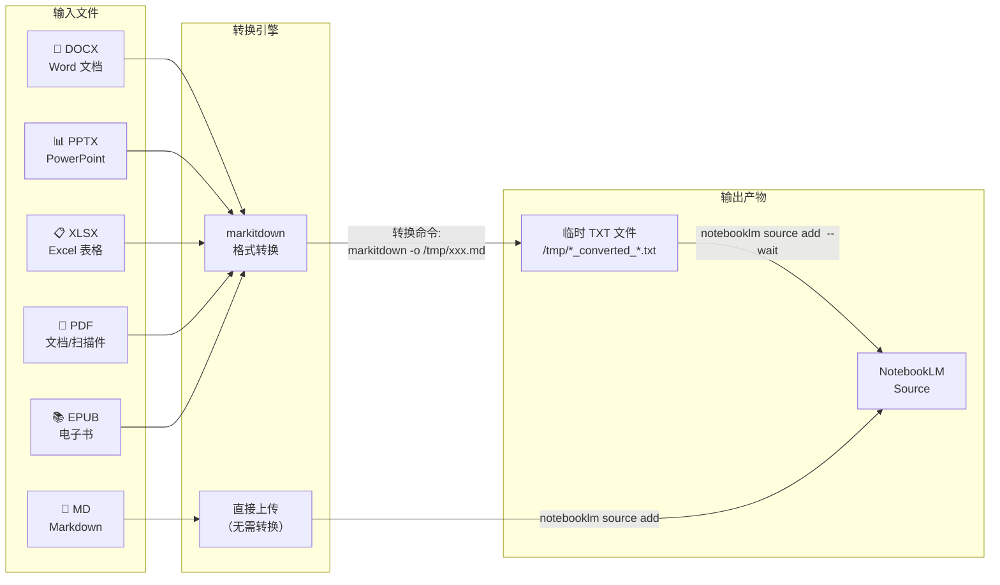
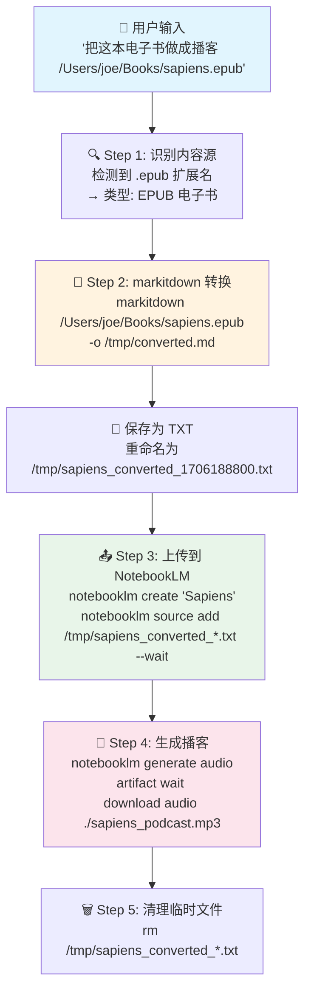

本文聚焦于项目中 **Office 文档与电子书文件**（DOCX、PPTX、XLSX、PDF、EPUB）如何通过 [Microsoft markitdown](https://github.com/microsoft/markitdown) 库完成格式转换，最终上传至 NotebookLM 的完整链路。你将理解每种文件类型的转换路径、核心命令行参数，以及转换在整体架构中的位置。

Sources: [SKILL.md](SKILL.md#L27-L44), [README.md](README.md#L77)

## markitdown 在整体架构中的角色

在 [整体技术架构](5-zheng-ti-ji-zhu-jia-gou-cong-zi-ran-yu-yan-dao-wen-jian-sheng-cheng-de-shu-ju-liu) 中，markitdown 扮演的是 **"本地文件 → 文本内容"** 的桥梁。它是一个由微软开源的 Python 库，能够将 15+ 种文件格式统一转换为 Markdown 文本，是本项目处理本地文档的核心引擎。通过 `pip3 install markitdown[all]` 安装时，`[all]` 参数会拉取所有可选依赖（如 pdf 解析器、docx 解析器等），确保开箱即用。

Sources: [requirements.txt](requirements.txt#L8-L9), [install.sh](install.sh#L64-L69)

下面这张流程图展示了 Office 与电子书文档从用户输入到 NotebookLM 上传的完整数据流：



**核心要点**：Markdown 文件是唯一直接上传到 NotebookLM 的本地文件类型，其余所有文档类型都必须先经过 markitdown 转换为 Markdown → TXT 中间产物，再执行上传。这条"两跳"链路保证了 NotebookLM 接收到的始终是纯文本格式，最大程度避免格式兼容性问题。

Sources: [SKILL.md](SKILL.md#L148-L156)

## 支持的 5 种 Office 与电子书格式

下面的表格汇总了本项目通过 markitdown 处理的 5 种文档类型，以及每种类型的转换特点和输出命名规则：

| 文件类型 | 扩展名 | markitdown 处理能力 | 输出文件命名 | NotebookLM 上传方式 |
|---------|--------|-------------------|------------|-------------------|
| **Word 文档** | `.docx` | 保留表格和文本格式 | `/tmp/{filename}_converted_{timestamp}.txt` | `notebooklm source add` |
| **PowerPoint** | `.pptx` | 提取幻灯片内容和备注 | `/tmp/{filename}_converted_{timestamp}.txt` | `notebooklm source add` |
| **Excel 表格** | `.xlsx` | 表格数据转为 Markdown 表格 | `/tmp/{filename}_converted_{timestamp}.txt` | `notebooklm source add` |
| **PDF 文档** | `.pdf` | 全文提取（含扫描件 OCR） | `/tmp/{filename}_converted_{timestamp}.txt` | `notebooklm source add` |
| **EPUB 电子书** | `.epub` | 电子书全文提取 | `/tmp/{filename}_converted_{timestamp}.txt` | `notebooklm source add` |

**关键差异**：PDF 的处理包含了 OCR 能力——当 PDF 为扫描件时，markitdown 会自动调用 OCR 引擎识别图片中的文字。这意味着即使是扫描的纸质文档，也能被完整提取为文本。

Sources: [SKILL.md](SKILL.md#L27-L44), [SKILL.md](SKILL.md#L148-L153)

## 转换命令详解

### 核心命令格式

markitdown 的命令行接口非常简洁，统一的调用模式如下：

```bash
# 基本格式
markitdown <输入文件路径> -o <输出文件路径>

# 实际示例：Word 文档转换
markitdown /path/to/report.docx -o /tmp/converted.md
```

整个转换过程分为 **三个阶段**：

1. **markitdown 转换**：将原始文档转换为 Markdown 格式，输出到 `/tmp/converted.md`
2. **重命名为 TXT**：将 `.md` 文件保存为 `/tmp/{filename}_converted_{timestamp}.txt`，统一使用 `.txt` 后缀
3. **上传到 NotebookLM**：调用 `notebooklm source add /tmp/{filename}_converted_{timestamp}.txt --wait`

Sources: [SKILL.md](SKILL.md#L170-L174)

### 各类型转换示例

以下是针对每种文件类型的具体命令和触发方式：

| 用户自然语言输入 | 识别文件类型 | 执行的转换命令 |
|----------------|-----------|-------------|
| "把这个 PDF 上传到 NotebookLM `/docs/paper.pdf`" | PDF | `markitdown /docs/paper.pdf -o /tmp/converted.md` |
| "这个 Word 文档做成思维导图 `/docs/report.docx`" | DOCX | `markitdown /docs/report.docx -o /tmp/converted.md` |
| "这个 PowerPoint 生成 Quiz `/slides/training.pptx`" | PPTX | `markitdown /slides/training.pptx -o /tmp/converted.md` |
| "把这个 Excel 做成报告 `/data/sales.xlsx`" | XLSX | `markitdown /data/sales.xlsx -o /tmp/converted.md` |
| "这本电子书做成播客 `/books/sapiens.epub`" | EPUB | `markitdown /books/sapiens.epub -o /tmp/converted.md` |

**注意**：无论输入文件类型是什么，markitdown 的调用命令格式完全一致——这正是使用统一转换引擎的优势。Claude 只需识别文件扩展名，就能确定使用 markitdown 处理。

Sources: [SKILL.md](SKILL.md#L107-L112), [SKILL.md](SKILL.md#L146-L156)

## 完整转换链路示例

以"EPUB 电子书 → 播客"这个典型场景为例，展示从用户输入到最终产物的全链路执行过程：



**执行输出示例**：

```
✅ EPUB 电子书已转换为播客！

📚 电子书：Sapiens: A Brief History of Humankind
📄 页数：约 450 页
📊 字数：约 15 万字

🎙️ 播客已生成：
📁 文件：/tmp/sapiens_podcast.mp3
⏱️ 时长：约 45 分钟（精华版）
📊 大小：48.2 MB
```

Sources: [SKILL.md](SKILL.md#L353-L379)

## 环境依赖与安装

markitdown 的安装和验证分布在项目的多个脚本中，形成了一套完整的依赖保障机制。

### 安装方式

markitdown 通过 `requirements.txt` 以 `markitdown[all]` 的形式声明依赖，`[all]` 标志确保安装所有格式支持的子依赖。安装脚本 `install.sh` 在第 3 步自动执行 `pip3 install -r requirements.txt`：

```bash
# install.sh 第 64-69 行的安装逻辑
if [ -f "$SKILL_DIR/requirements.txt" ]; then
    echo "安装 Skill 依赖（包括 markitdown 文件转换工具）..."
    pip3 install -r "$SKILL_DIR/requirements.txt" -q
    echo "✅ markitdown 已安装（支持 15+ 文件格式转换）"
fi
```

### 环境验证

`check_env.py` 脚本对 markitdown 执行了两层检查：

| 检查项 | 检查方式 | 所在位置 | 说明 |
|-------|---------|---------|------|
| **Python 模块** | `import markitdown` | 第 150 行 | 验证 Python 包已正确安装 |
| **CLI 命令** | `shutil.which("markitdown")` | 第 171 行 | 验证命令行工具可执行 |

如果两项检查都通过，说明 markitdown 已正确安装，可以同时作为 Python 库和命令行工具使用。

Sources: [requirements.txt](requirements.txt#L8-L9), [install.sh](install.sh#L64-L69), [check_env.py](check_env.py#L148-L172)

## 与 Markdown 直接上传的差异

理解 markitdown 转换链路的关键，是区分"需要转换的文件"和"直接上传的文件"两种路径：

| 维度 | Markdown 直接上传 | Office / 电子书（markitdown 转换） |
|------|-----------------|-------------------------------|
| **支持的格式** | `.md` | `.docx` `.pptx` `.xlsx` `.pdf` `.epub` |
| **是否需要转换** | ❌ 不需要 | ✅ 需要 markitdown |
| **临时文件** | 无 | `/tmp/{filename}_converted_{timestamp}.txt` |
| **上传命令** | `notebooklm source add /path/to/file.md` | `notebooklm source add /tmp/xxx.txt --wait` |
| **是否需要清理** | 否 | 是（上传后需 `rm /tmp/*.txt`） |
| **`--wait` 参数** | 非必须 | **必须**（等待处理完成，否则后续生成会失败） |

**`--wait` 参数的重要性**：转换后的 TXT 文件上传时必须附加 `--wait` 参数，确保 NotebookLM 完成内容解析后再执行下一步操作。跳过等待可能导致后续的 `generate` 命令因内容尚未就绪而失败。

Sources: [SKILL.md](SKILL.md#L148-L156), [SKILL.md](SKILL.md#L200-L208)

## 常见问题与注意事项

| 问题 | 可能原因 | 解决方案 |
|------|---------|---------|
| `markitdown: command not found` | markitdown CLI 未安装 | 运行 `pip3 install markitdown[all]` 或执行 `./install.sh` |
| `markitdown` 模块导入失败 | Python 包未安装 | 检查 `pip3 list | grep markitdown` |
| 转换后内容为空 | 文件损坏或格式不标准 | 尝试用其他工具打开确认文件完整性 |
| 扫描 PDF OCR 识别率低 | 图片质量差 | 提高扫描分辨率（建议 300 DPI 以上） |
| 上传后生成失败 | 未使用 `--wait` 参数 | 确保上传命令包含 `--wait` |
| 大文件转换超时 | EPUB 或大型 PDF | NotebookLM 限制单次内容不超过 50 万字 |

Sources: [SKILL.md](SKILL.md#L496-L522)

## 延伸阅读

- 了解内容源识别的整体机制，参见 [内容源智能识别：URL 与文件类型自动判断机制](6-nei-rong-yuan-zhi-neng-shi-bie-url-yu-wen-jian-lei-xing-zi-dong-pan-duan-ji-zhi)
- 了解 markitdown 在更广泛的内容获取链路中的位置，参见 [内容获取与转换：MCP 抓取、markitdown 转换与直接传递](7-nei-rong-huo-qu-yu-zhuan-huan-mcp-zhua-qu-markitdown-zhuan-huan-yu-zhi-jie-chuan-di)
- 图片 OCR 和音频转录也使用 markitdown，但属于不同的转换能力，参见 [图片 OCR、音频转录与结构化数据处理](12-tu-pian-ocr-yin-pin-zhuan-lu-yu-jie-gou-hua-shu-ju-chu-li)
- 了解 markitdown 依赖安装的完整流程，参见 [requirements.txt 依赖清单与各库职责](17-requirements-txt-yi-lai-qing-dan-yu-ge-ku-zhi-ze) 和 [install.sh 安装流程解析：6 步自动化安装](16-install-sh-an-zhuang-liu-cheng-jie-xi-6-bu-zi-dong-hua-an-zhuang)