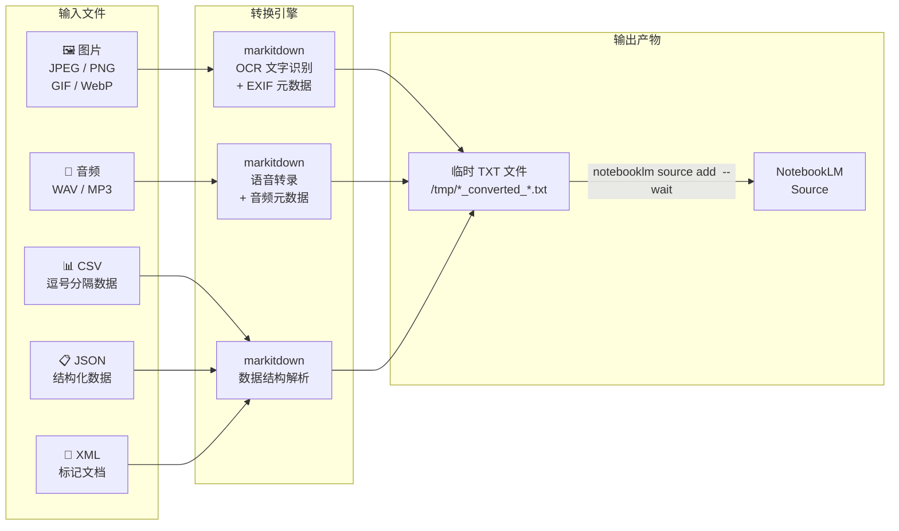
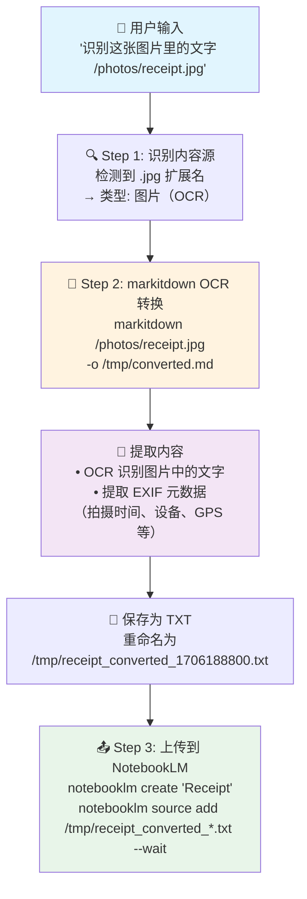
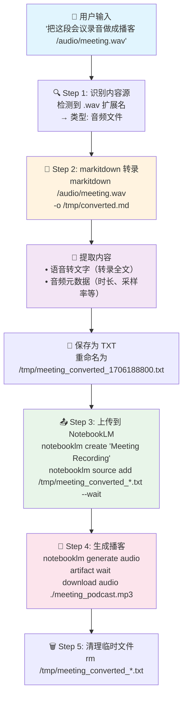

本文聚焦于项目中三类"非文档"内容源——**图片 OCR 识别**、**音频语音转录**和**结构化数据（CSV/JSON/XML）解析**——如何通过 markitdown 统一转换引擎完成文本提取，最终上传至 NotebookLM 的完整链路。这三种内容源看似形态各异，但共享同一条 markitdown → TXT → NotebookLM 的处理管道，理解这条管道的关键在于认识 markitdown 的多模态转换能力。

Sources: [SKILL.md](SKILL.md#L33-L44), [README.md](README.md#L65-L71)

## 三类内容源在整体架构中的位置

在 [整体技术架构](5-zheng-ti-ji-zhu-jia-gou-cong-zi-ran-yu-yan-dao-wen-jian-sheng-cheng-de-shu-ju-liu) 中，图片、音频和结构化数据都属于**本地文件类型**，与 [Office 文档和电子书](11-office-yu-dian-zi-shu-wen-dang-markitdown-ge-shi-zhuan-huan-lian-lu) 走的是同一条 markitdown 转换通道。但它们有一个显著区别：这三种类型的输入本身**不是文本文档**，而是需要额外的"解译"步骤（图像识别、语音识别、数据结构化）才能转化为有意义的文本内容。

Sources: [SKILL.md](SKILL.md#L139-L158)

下面的流程图展示了三类内容源从用户输入到 NotebookLM 上传的完整数据流：



**核心要点**：三类内容源尽管输入形态截然不同，但最终都会被 markitdown 统一转换为纯文本 TXT 文件，再通过 `notebooklm source add` 命令上传。这种"统一出口"的设计意味着 Claude 只需根据文件扩展名选择对应的处理方式，而后续的上传与生成流程完全一致。

Sources: [SKILL.md](SKILL.md#L146-L156), [SKILL.md](SKILL.md#L177-L186)

## 支持的 7 种文件格式总览

下面的表格汇总了三类内容源共 7 种具体文件格式的处理方式、转换特点和输出规范：

| 内容类型 | 扩展名 | markitdown 处理能力 | 提取内容 | 输出文件命名 |
|---------|--------|-------------------|---------|------------|
| **图片** | `.jpg` `.jpeg` | OCR 文字识别 | 图片中的文字 + EXIF 元数据 | `/tmp/{filename}_converted_{timestamp}.txt` |
| **图片** | `.png` | OCR 文字识别 | 图片中的文字 + EXIF 元数据 | `/tmp/{filename}_converted_{timestamp}.txt` |
| **图片** | `.gif` | OCR 文字识别 | 图片中的文字 + EXIF 元数据 | `/tmp/{filename}_converted_{timestamp}.txt` |
| **图片** | `.webp` | OCR 文字识别 | 图片中的文字 + EXIF 元数据 | `/tmp/{filename}_converted_{timestamp}.txt` |
| **音频** | `.wav` | 语音转文字 | 转录文本 + 音频元数据 | `/tmp/{filename}_converted_{timestamp}.txt` |
| **音频** | `.mp3` | 语音转文字 | 转录文本 + 音频元数据 | `/tmp/{filename}_converted_{timestamp}.txt` |
| **结构化数据** | `.csv` | 表格数据解析 | 逗号分隔的结构化内容 | `/tmp/{filename}_converted_{timestamp}.txt` |
| **结构化数据** | `.json` | JSON 数据解析 | 层级化的键值对内容 | `/tmp/{filename}_converted_{timestamp}.txt` |
| **结构化数据** | `.xml` | XML 文档解析 | 标签结构的文档内容 | `/tmp/{filename}_converted_{timestamp}.txt` |

**注意**：所有格式的输出文件统一采用 `_converted_{timestamp}.txt` 命名规则，存放在 `/tmp/` 目录下，上传完成后需要清理。这与 [Office 文档的转换链路](11-office-yu-dian-zi-shu-wen-dang-markitdown-ge-shi-zhuan-huan-lian-lu) 完全一致。

Sources: [SKILL.md](SKILL.md#L33-L44), [SKILL.md](SKILL.md#L146-L156)

## 图片 OCR：从像素到文字

### 工作原理

图片处理是 markitdown 最具"多模态"特征的能力之一。当用户提交一张图片（如扫描的文档、截图、照片中的文字）时，markitdown 会执行两个步骤：**OCR 文字识别**（提取图片中可见的文字内容）和 **EXIF 元数据提取**（提取拍摄时间、设备信息、GPS 坐标等图像元信息）。两项内容合并后保存为 TXT 文件。

Sources: [SKILL.md](SKILL.md#L177-L180)

### 典型使用场景

| 场景 | 用户输入示例 | 预期输出 |
|------|-----------|---------|
| **扫描文档数字化** | "把这个扫描图片做成文档 `/Users/joe/scan.jpg`" | OCR 识别文字，准确率 95%+ |
| **截图提取文字** | "把这张截图的内容上传 `/tmp/screenshot.png`" | 提取截图中的文字内容 |
| **照片中的文档** | "识别这张照片里的文字 `/photos/receipt.webp`" | 提取收据或文档的文字 |
| **扫描 PDF** | "把这个扫描 PDF 做成报告 `/docs/scan.pdf`" | 自动 OCR 提取文字（PDF 也支持） |

### OCR 转换流程



**关键提示**：OCR 识别的准确率与图片质量直接相关。建议扫描分辨率不低于 300 DPI，避免模糊、倾斜或低对比度的图片。对于手写文字，识别率可能显著低于印刷体。

Sources: [SKILL.md](SKILL.md#L112-L113), [SKILL.md](SKILL.md#L177-L180), [README.md](README.md#L189-L200)

## 音频转录：从声波到文字

### 工作原理

音频文件处理利用 markitdown 内置的**语音转文字**能力。当用户提交一个音频文件（WAV 或 MP3）时，markitdown 会自动执行语音转录，将音频中的人声内容转化为文本，同时提取音频的**元数据**（时长、采样率、比特率等）。转录文本与元数据合并后保存为 TXT 文件。

Sources: [SKILL.md](SKILL.md#L181-L186)

### 转换命令与流程

音频文件的转换命令与其他文件类型完全一致，仍然是 markitdown 的统一接口：

```bash
# 音频转换命令
markitdown /path/to/recording.mp3 -o /tmp/converted.md

# 转换后保存为 TXT
# /tmp/recording_converted_{timestamp}.txt
```

### 典型使用场景

| 场景 | 用户输入示例 | 预期输出 |
|------|-----------|---------|
| **会议录音转文字** | "把这个会议录音做成报告 `/audio/meeting.wav`" | 转录会议中的发言内容 |
| **播客笔记** | "这段音频生成思维导图 `/podcasts/ep42.mp3`" | 提取播客内容要点 |
| **采访整理** | "把这段采访上传 `/interviews/q1.mp3`" | 转录采访对话 |
| **语音备忘录** | "这个音频转成文字 `/voice/note.wav`" | 将语音备忘录转为可搜索文本 |

**注意事项**：音频转录的质量取决于音频的清晰度、背景噪声水平和说话人的口音。建议使用信噪比高的录音文件，避免多人同时说话的场景。

Sources: [SKILL.md](SKILL.md#L37-L39), [SKILL.md](SKILL.md#L154-L155), [SKILL.md](SKILL.md#L181-L186)

## 结构化数据：从表格和树到文本

### 工作原理

结构化数据（CSV、JSON、XML）的处理相对"简单"——这些格式本身就是有结构的数据，markitdown 的任务是将它们**解析并格式化**为人类可读的 Markdown 文本。CSV 数据会被转为 Markdown 表格，JSON 数据会保留其层级缩进结构，XML 数据则会提取标签内的文本内容并保留文档的层次关系。

Sources: [SKILL.md](SKILL.md#L40-L44)

### 三种结构化格式对比

| 维度 | CSV | JSON | XML |
|------|-----|------|-----|
| **数据组织方式** | 二维表格（行列） | 键值对树结构 | 标签嵌套树结构 |
| **典型场景** | Excel 导出的数据、数据库导出 | API 响应数据、配置文件 | SOAP 响应、传统 Web 数据 |
| **markitdown 输出** | Markdown 表格格式 | 保留缩进的键值对 | 保留标签层次的文本 |
| **支持扩展名** | `.csv` | `.json` | `.xml` |

### 典型使用场景

| 场景 | 用户输入示例 | 预期输出 |
|------|-----------|---------|
| **数据分析报告** | "把这个 CSV 做成报告 `/data/sales.csv`" | 将销售数据转为可分析文本 |
| **API 数据解读** | "这个 JSON 文件生成 PPT `/api/response.json`" | 将 API 响应数据结构化展示 |
| **XML 配置分析** | "把这个 XML 上传 `/config/settings.xml`" | 提取配置项和参数 |

Sources: [SKILL.md](SKILL.md#L40-L44)

## 完整转换链路示例

以"会议录音 → 播客"为例，展示从用户输入到最终产物的全链路执行过程：



**注意**：上传步骤中的 `--wait` 参数是必不可少的——NotebookLM 需要时间解析上传的文本内容，跳过等待会导致后续的 `generate` 命令失败。关于 `--wait` 和 `artifact wait` 的详细用法，请参考 [生成命令与产物下载](15-sheng-cheng-ming-ling-yu-chan-wu-xia-zai-artifact-wait-yu-download-gong-zuo-liu)。

Sources: [SKILL.md](SKILL.md#L200-L208), [SKILL.md](SKILL.md#L220-L238)

## 与 Office 文档转换的差异

虽然图片、音频和结构化数据与 Office 文档共享同一条 markitdown 转换管道，但它们在处理深度上存在关键差异：

| 维度 | Office / 电子书 | 图片（OCR） | 音频（转录） | 结构化数据 |
|------|---------------|------------|------------|-----------|
| **输入本质** | 文档（含文本） | 图像（像素） | 声波（信号） | 数据（结构） |
| **转换复杂度** | 格式解析 | 图像识别 + OCR | 语音识别 + 转录 | 结构化解析 |
| **元数据提取** | 文档属性 | EXIF（拍摄信息） | 音频属性（时长等） | 无额外元数据 |
| **转换耗时** | 快（秒级） | 中（取决于图片复杂度） | 慢（取决于音频长度） | 快（秒级） |
| **准确率因素** | 格式兼容性 | 图片质量 | 音频清晰度 | 数据格式规范 |

Sources: [SKILL.md](SKILL.md#L27-L44), [SKILL.md](SKILL.md#L146-L156)

## 环境依赖与验证

图片 OCR、音频转录和结构化数据解析的能力全部来自 `markitdown[all]` 这个依赖包。`[all]` 标志确保安装所有格式支持的子依赖，包括 OCR 引擎和语音转文字模块。

### 安装方式

markitdown 通过 [requirements.txt](requirements.txt) 声明，由 [install.sh](install.sh) 在第 3 步自动安装：

```bash
# requirements.txt 第 8 行
markitdown[all]>=0.0.1

# install.sh 第 64-69 行的安装逻辑
pip3 install -r "$SKILL_DIR/requirements.txt" -q
echo "✅ markitdown 已安装（支持 15+ 文件格式转换）"
```

### 环境检查

[check_env.py](check_env.py) 脚本在第 2 步和第 5 步分别对 markitdown 执行了 **Python 模块导入检查**（第 150 行）和 **CLI 命令可用性检查**（第 171 行），确保 markitdown 同时作为库和命令行工具正常工作。如果这两项检查都通过，图片 OCR、音频转录和结构化数据解析的功能就可正常使用。

Sources: [requirements.txt](requirements.txt#L8-L9), [install.sh](install.sh#L64-L69), [check_env.py](check_env.py#L148-L172)

## 常见问题与注意事项

| 问题 | 可能原因 | 解决方案 |
|------|---------|---------|
| 图片 OCR 识别率低 | 图片模糊、分辨率低、手写文字 | 提高扫描分辨率至 300 DPI+，使用印刷体 |
| 音频转录内容为空 | 音频无语音、背景噪声过大 | 确认音频包含清晰人声，降低背景噪声 |
| CSV 转换后格式错乱 | 编码问题（如中文 GBK） | 先用 UTF-8 编码重新保存 CSV 文件 |
| JSON 转换后层级丢失 | JSON 结构过于复杂（嵌套过深） | 考虑拆分为多个较小的 JSON 文件 |
| 转换后上传失败 | 未使用 `--wait` 参数 | 确保 `source add` 命令包含 `--wait` |
| 大型音频转录超时 | 音频文件过长（> 60 分钟） | 考虑裁剪音频或分段处理 |
| 临时文件未清理 | 上传后未执行清理 | 运行 `rm /tmp/*.txt` 手动清理 |

关于临时文件清理策略的详细说明，请参考 [频率限制、内容长度约束与文件清理策略](26-pin-lv-xian-zhi-nei-rong-chang-du-yue-shu-yu-wen-jian-qing-li-ce-lue)。

Sources: [SKILL.md](SKILL.md#L496-L522), [SKILL.md](SKILL.md#L579-L597)

## 延伸阅读

- [Office 与电子书文档：markitdown 格式转换链路](11-office-yu-dian-zi-shu-wen-dang-markitdown-ge-shi-zhuan-huan-lian-lu) — 了解 DOCX、PDF、EPUB 等文档类型的转换方式
- [内容获取与转换：MCP 抓取、markitdown 转换与直接传递](7-nei-rong-huo-qu-yu-zhuan-huan-mcp-zhua-qu-markitdown-zhuan-huan-yu-zhi-jie-chuan-di) — 理解所有内容源的转换路径总览
- [内容源智能识别：URL 与文件类型自动判断机制](6-nei-rong-yuan-zhi-neng-shi-bie-url-yu-wen-jian-lei-xing-zi-dong-pan-duan-ji-zhi) — 了解 Claude 如何根据扩展名自动选择处理方式
- [ZIP 压缩包批量解压与搜索关键词汇总](13-zip-ya-suo-bao-pi-liang-jie-ya-yu-sou-suo-guan-jian-ci-hui-zong) — 了解如何批量处理包含图片、音频的 ZIP 文件