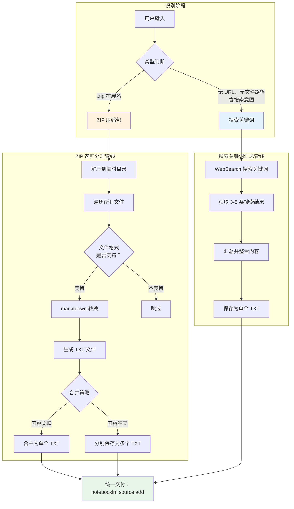
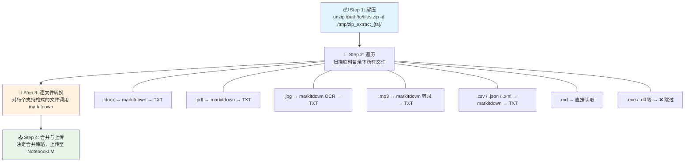
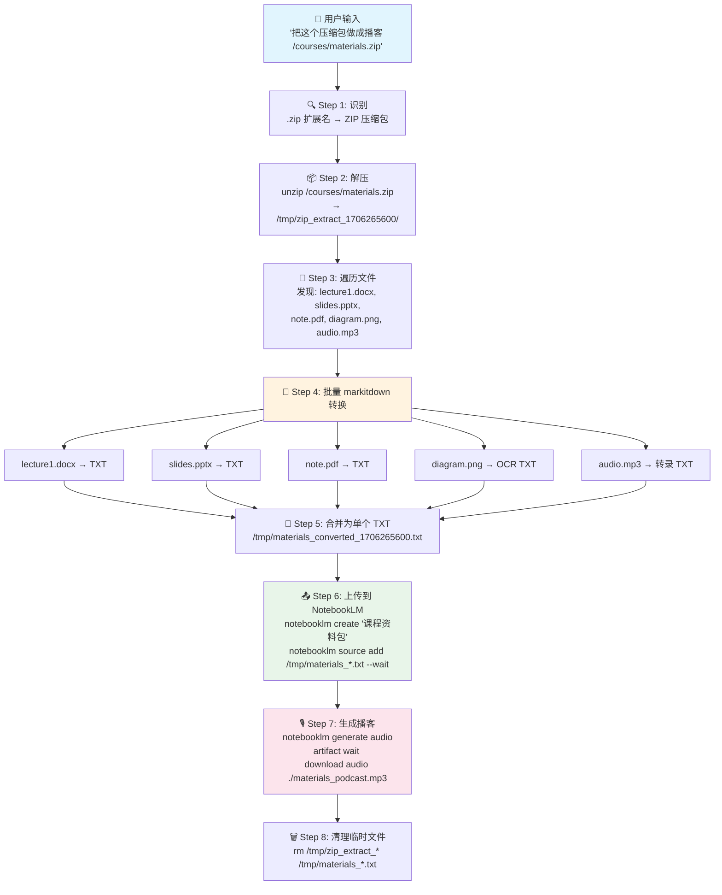
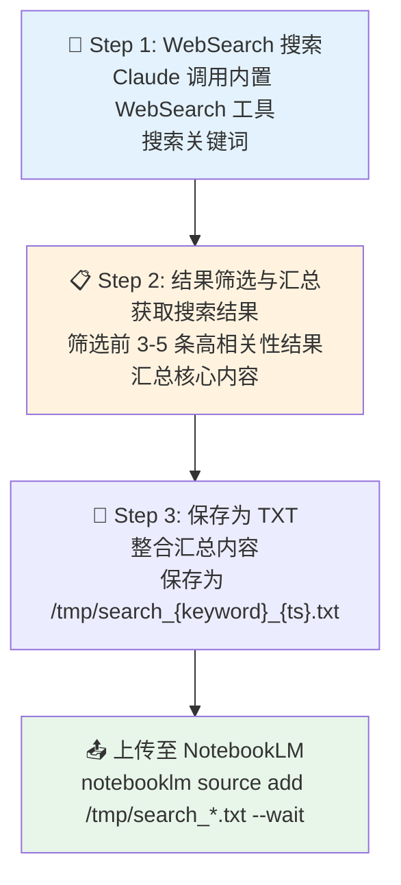
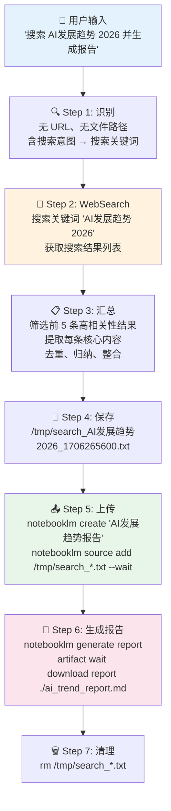

本文深入解析 anything-to-notebooklm Skill 中两种特殊的**批量内容源处理模式**：**ZIP 压缩包的递归解压与批量转换**，以及**搜索关键词的 Web 搜索与多源汇总**。这两种模式在所有 15 种内容源中具有独特性——ZIP 是唯一需要**递归拆解后重新路由**的容器型内容源，而搜索关键词是唯一**从零生成内容**的虚拟型内容源。两者共享同一条 markitdown 转换管线（路径 C），但在数据流方向上截然相反：ZIP 是"一对多拆解"，搜索是"多对一聚合"。

Sources: [SKILL.md](SKILL.md#L45-L52), [SKILL.md](SKILL.md#L186-L196)

## 两种批量模式在架构中的定位

在 [整体技术架构](5-zheng-ti-ji-zhu-jia-gou-cong-zi-ran-yu-yan-dao-wen-jian-sheng-cheng-de-shu-ju-liu) 的五阶段管线中，两种批量模式都属于**阶段②内容获取**中路径 C（markitdown 转换）的特殊子路径。下面的流程图展示了它们在完整数据流中的位置：



从上图可以清晰看到两种模式的**数据流向差异**：ZIP 管线是**扇出型**（一个输入拆解为多个文件，再决定是否合并），搜索管线是**收敛型**（多个搜索结果汇总为一个文件）。两种模式的最终产物都是 `/tmp/` 下的 TXT 文件，通过 `notebooklm source add` 命令统一上传。

Sources: [SKILL.md](SKILL.md#L139-L157), [SKILL.md](SKILL.md#L186-L196)

## ZIP 压缩包：递归批量处理管线

### 触发条件与识别

ZIP 压缩包的识别发生在 [内容源智能识别](6-nei-rong-yuan-zhi-neng-shi-bie-url-yu-wen-jian-lei-xing-zi-dong-pan-duan-ji-zhi) 的**文件扩展名匹配阶段**。当用户输入中包含以 `.zip` 结尾的本地文件路径时，Claude 会将其路由到 ZIP 专用处理管线：

| 识别特征 | 识别结果 | 处理方式 |
|---------|---------|---------|
| 路径以 `.zip` 结尾的本地文件 | ZIP 压缩包 | 解压 → 遍历 → markitdown 批量转换 |
| 用户输入示例 | "把这个压缩包里的所有文档做成播客 `/path/to/files.zip`" | — |

ZIP 是 15 种内容源中唯一的**容器型**源——它本身不包含可直接消费的文本内容，而是作为一个"包装器"包裹了其他类型的文件。这种特性决定了它必须经过**拆解后重新路由**的处理方式。

Sources: [SKILL.md](SKILL.md#L156), [SKILL.md](SKILL.md#L186-L191)

### 四步递归处理流程

ZIP 压缩包的处理分为四个顺序步骤，每一步的输出构成下一步的输入：



**Step 1：解压到临时目录。** ZIP 文件首先被解压到 `/tmp/` 下的一个带有时间戳的临时子目录（如 `/tmp/zip_extract_1706265600/`），避免与 `/tmp/` 中的其他文件产生冲突。

**Step 2：遍历所有文件。** Claude 扫描解压后的目录结构，列出所有文件（包括子目录中的文件），并根据文件扩展名判断是否为支持的格式。

**Step 3：逐文件 markitdown 转换。** 每个支持格式的文件根据其类型被**重新路由**到对应的处理管线——这实际上是一次**递归调用**，复用了 [内容源智能识别](6-nei-rong-yuan-zhi-neng-shi-bie-url-yu-wen-jian-lei-xing-zi-dong-pan-duan-ji-zhi) 的完整规则。以下是 ZIP 内部文件的支持矩阵：

| ZIP 内文件类型 | 扩展名 | 处理方式 | 详细说明参见 |
|-------------|--------|---------|------------|
| Word 文档 | `.docx` | markitdown 转 Markdown → TXT | [Office 文档](11-office-yu-dian-zi-shu-wen-dang-markitdown-ge-shi-zhuan-huan-lian-lu) |
| PowerPoint | `.pptx` | markitdown 转换 → TXT | [Office 文档](11-office-yu-dian-zi-shu-wen-dang-markitdown-ge-shi-zhuan-huan-lian-lu) |
| Excel 表格 | `.xlsx` | markitdown 转换 → TXT | [Office 文档](11-office-yu-dian-zi-shu-wen-dang-markitdown-ge-shi-zhuan-huan-lian-lu) |
| PDF 文档 | `.pdf` | markitdown 全文/OCR 提取 → TXT | [Office 文档](11-office-yu-dian-zi-shu-wen-dang-markitdown-ge-shi-zhuan-huan-lian-lu) |
| EPUB 电子书 | `.epub` | markitdown 按章节提取 → TXT | [Office 文档](11-office-yu-dian-zi-shu-wen-dang-markitdown-ge-shi-zhuan-huan-lian-lu) |
| 图片 | `.jpg/.png/.gif/.webp` | markitdown OCR → TXT | [图片 OCR](12-tu-pian-ocr-yin-pin-zhuan-lu-yu-jie-gou-hua-shu-ju-chu-li) |
| 音频 | `.mp3/.wav` | markitdown 语音转录 → TXT | [音频转录](12-tu-pian-ocr-yin-pin-zhuan-lu-yu-jie-gou-hua-shu-ju-chu-li) |
| 结构化数据 | `.csv/.json/.xml` | markitdown 解析 → TXT | [结构化数据](12-tu-pian-ocr-yin-pin-zhuan-lu-yu-jie-gou-hua-shu-ju-chu-li) |
| Markdown | `.md` | **跳过 markitdown，直接读取** | — |
| 不支持的格式 | 其他 | **跳过** | — |

**Step 4：合并策略与上传。** 转换完成后，Claude 根据内容的关联性选择合并策略：

| 合并策略 | 适用场景 | 上传方式 | 优势 | 劣势 |
|---------|---------|---------|------|------|
| **合并为单个 TXT** | 文件内容主题相关（如一份报告的多个章节） | 作为单个 Source 上传 | NotebookLM 在分析时能看到完整上下文 | 大文件可能接近内容长度上限 |
| **分别保存为多个 TXT** | 文件内容相互独立（如不同主题的论文合集） | 作为多个 Source 上传 | 每个文件独立可管理，无大小压力 | NotebookLM 需要分别处理每个 Source |

Sources: [SKILL.md](SKILL.md#L186-L191), [SKILL.md](SKILL.md#L148-L156)

### 递归设计的核心机制

ZIP 处理管线最值得注意的设计特征是**递归路由**。解压后的每个文件并非走特殊的"ZIP 内部处理逻辑"，而是完全复用 [内容源智能识别](6-nei-rong-yuan-zhi-neng-shi-bie-url-yu-wen-jian-lei-xing-zi-dong-pan-duan-ji-zhi) 的标准规则——根据文件扩展名匹配到对应的处理管线。这意味着：

- ZIP 内的 `.docx` 文件与用户直接提交的 `.docx` 文件走**完全相同的转换路径**
- ZIP 内的 `.jpg` 图片会触发与直接提交图片相同的 **OCR 识别流程**
- ZIP 内的 `.mp3` 音频会经历与直接提交音频相同的**语音转录流程**

这种设计保证了**处理逻辑的一致性**——无论文件是从 ZIP 中提取的还是用户直接提供的，转换行为完全相同。唯一的差异在于最终的合并策略选择。

Sources: [SKILL.md](SKILL.md#L156), [SKILL.md](SKILL.md#L169-L172)

### 典型使用场景

| 场景 | 用户输入示例 | 预期行为 |
|------|-----------|---------|
| **课程资料包** | "把这个压缩包里的所有文档做成播客 `/courses/materials.zip`" | 解压后批量转换 PDF/DOCX/PPT → 合并为单个 TXT → 生成播客 |
| **研究论文集** | "这些论文生成思维导图 `/papers/ai_research.zip`" | 解压后逐篇转换 → 分别上传为多个 Source → 生成思维导图 |
| **混合文件包** | "压缩包里有文档和音频，都传上去 `/data/mixed.zip`" | 解压后按类型分别路由（文档走 markitdown、音频走转录）→ 合并上传 |
| **会议资料归档** | "把会议录音和 PPT 一起上传 `/meetings/2024-Q1.zip`" | 解压后音频转录 + PPT 转换 → 合并为综合内容 |

Sources: [README.md](README.md#L293-L299), [SKILL.md](SKILL.md#L45-L46)

### 完整执行流程示例

以"课程资料包 → 播客"为例，展示从用户输入到最终产物的全链路：



**关键提示**：ZIP 解压后可能产生大量文件，需要注意 NotebookLM 的**内容长度约束**——总字数建议控制在 50 万字以内。如果 ZIP 包含过多文件或超大文件，建议分批处理。

Sources: [SKILL.md](SKILL.md#L186-L191), [SKILL.md](SKILL.md#L200-L216), [SKILL.md](SKILL.md#L504-L505)

## 搜索关键词：WebSearch 多源汇总管线

### 触发条件与识别

搜索关键词的识别发生在内容源智能识别的**第三层判断**（参见 [内容源智能识别](6-nei-rong-yuan-zhi-neng-shi-bie-url-yu-wen-jian-lei-xing-zi-dong-pan-duan-ji-zhi) 的优先级机制）——当用户输入中**既不包含 URL、也不包含本地文件路径**，且 Claude 判断其中包含搜索意图时，触发搜索管线。

搜索关键词的识别依赖 **Claude 的自然语言理解能力**，而非硬编码的触发词列表。用户表达搜索意图的方式可以非常多样：

| 用户表述（识别为搜索） | 识别依据 |
|----------------------|---------|
| "搜索 'AI发展趋势' 并生成报告" | 明确包含"搜索"动词 |
| "搜索关于'量子计算'的资料做成播客" | "搜索关于"句式 |
| "帮我查一下大语言模型的最新进展" | "帮我查一下"隐含搜索意图 |
| "找找关于 RAG 技术的文章" | "找找关于"隐含搜索意图 |

Sources: [SKILL.md](SKILL.md#L157), [SKILL.md](SKILL.md#L114-L116)

### 搜索汇总的三步流程



**Step 1：WebSearch 搜索。** Claude 调用其内置的 **WebSearch 工具**搜索用户指定的关键词。WebSearch 是 Claude Code 自带的能力，不需要额外安装或配置——它与 MCP 服务器、markitdown 等**外部依赖完全解耦**。

**Step 2：结果筛选与汇总。** Claude 从搜索结果中筛选**前 3-5 条高相关性结果**，并汇总每条结果的核心内容。汇总不是简单的结果堆砌，而是 Claude 基于语义理解进行的**信息整合**——去重、归纳、提取关键论点。

**Step 3：保存为 TXT。** 汇总内容被保存为 `/tmp/search_{keyword}_{timestamp}.txt`，命名中包含搜索关键词和时间戳，确保文件可追溯且不冲突。

Sources: [SKILL.md](SKILL.md#L193-L196), [SKILL.md](SKILL.md#L295-L321)

### 搜索关键词的典型使用场景

| 场景 | 用户输入示例 | 预期产出 |
|------|-----------|---------|
| **技术趋势调研** | "搜索 'AI发展趋势 2026' 并生成报告" | 搜索 3-5 篇文章 → 汇总 → 生成综合报告 |
| **知识快速获取** | "搜索关于'量子计算'的资料做成播客" | 搜索量子计算相关资料 → 汇总 → 生成播客 |
| **竞品分析** | "帮我查一下 LLM 框架对比，做个思维导图" | 搜索对比资料 → 汇总 → 生成思维导图 |
| **学习笔记整理** | "找找关于 RAG 技术的最新论文，生成 Quiz" | 搜索 RAG 论文 → 汇总 → 生成测验题 |

Sources: [SKILL.md](SKILL.md#L114-L117), [SKILL.md](SKILL.md#L295-L321)

### 完整执行流程示例

以"搜索 AI 发展趋势 → 报告"为例的全链路：



**示例输出**：

```
✅ 搜索结果已生成报告！

🔍 关键词：AI发展趋势 2026
📊 来源：5 篇文章

📄 报告已生成：
📁 文件：/tmp/search_AI发展趋势2026_report.md
📝 章节：7 个
📊 大小：15.2 KB
```

Sources: [SKILL.md](SKILL.md#L295-L321), [SKILL.md](SKILL.md#L200-L216)

## 两种批量模式的系统对比

ZIP 压缩包和搜索关键词虽然都被归类为"批量处理"，但它们在数据流方向、内容来源、处理机制上存在根本差异：

| 对比维度 | ZIP 压缩包 | 搜索关键词 |
|---------|-----------|-----------|
| **数据流方向** | 一对多拆解（1 个 ZIP → N 个文件） | 多对一聚合（N 条搜索结果 → 1 个 TXT） |
| **内容来源** | 用户提供的本地文件（确定性内容） | WebSearch 搜索结果（动态获取内容） |
| **核心处理引擎** | markitdown CLI（格式转换） | Claude 内置 WebSearch（信息检索） |
| **是否需要外部依赖** | ✅ markitdown + unzip 能力 | ❌ 仅需 Claude 内置 WebSearch |
| **临时文件产出** | 多个 `_converted_*.txt`（可能合并为 1 个） | 单个 `search_{keyword}_{ts}.txt` |
| **内容确定性** | 高（文件内容固定） | 中（搜索结果随时间变化） |
| **用户可控性** | 高（用户选择打包哪些文件） | 中（用户指定关键词，但无法控制搜索结果） |
| **识别层级** | 文件扩展名匹配（第 2 层） | 语义意图分析（第 3 层） |
| **递归处理** | ✅ 解压后文件重新走类型识别 | ❌ 无递归 |
| **适合的内容规模** | 取决于 ZIP 内文件数量和大小 | 取决于搜索结果数量（3-5 条） |

Sources: [SKILL.md](SKILL.md#L139-L157), [SKILL.md](SKILL.md#L186-L196)

## 临时文件命名与生命周期

两种批量模式在 `/tmp/` 目录下的临时文件遵循不同的命名规则，但共享相同的生命周期——上传完成后统一清理：

| 文件来源 | 命名模式 | 示例 | 清理时机 |
|---------|---------|------|---------|
| ZIP 内文件转换产物 | `/tmp/{filename}_converted_{timestamp}.txt` | `/tmp/lecture1_converted_1706265600.txt` | 所有 Source 上传完成后 |
| ZIP 解压临时目录 | `/tmp/zip_extract_{timestamp}/` | `/tmp/zip_extract_1706265600/` | 所有文件转换完成后 |
| 搜索关键词汇总 | `/tmp/search_{keyword}_{timestamp}.txt` | `/tmp/search_AI发展趋势_1706265600.txt` | Source 上传完成后 |

清理命令在 SKILL.md 的 Step 4 中明确定义：`rm /tmp/*.txt`、`rm /tmp/*.pdf`、`rm /tmp/*.json`。对于 ZIP 解压产生的子目录，Claude 在所有内部文件处理完成后会一并删除。由于所有临时文件存放在 `/tmp/` 下，即使 Skill 异常中断未执行清理，操作系统重启后也会自动清除。

Sources: [SKILL.md](SKILL.md#L210-L216), [SKILL.md](SKILL.md#L519-L522)

## 环境依赖与验证

### ZIP 处理的依赖

ZIP 压缩包的批量处理依赖 **markitdown** 工具链。因为 ZIP 内的文件类型多种多样，需要 markitdown 的 `[all]` 扩展来确保所有子格式（包括 OCR 引擎和语音转录模块）都被安装。依赖声明在 `requirements.txt` 中：

```bash
# requirements.txt 第 8 行
markitdown[all]>=0.0.1
```

[install.sh](16-install-sh-an-zhuang-liu-cheng-jie-xi-6-bu-zi-dong-hua-an-zhuang) 在第 3 步通过 `pip3 install -r requirements.txt` 自动安装所有依赖。[check_env.py](18-check_env-py-huan-jing-jian-cha-jiao-ben-9-xiang-jian-ce-luo-ji) 在第 2 步检查 markitdown 的 Python 模块可导入性，在第 5 步检查 markitdown CLI 命令可用性，双重验证确保 ZIP 处理管线畅通。

### 搜索关键词的依赖

搜索关键词处理依赖 **Claude 内置的 WebSearch 工具**，这是 Claude Code 自带的能力，无需任何额外安装或配置。与 ZIP 不同，搜索管线**不依赖 markitdown**——内容汇总由 Claude 直接完成并保存为 TXT 文件。

| 依赖项 | ZIP 压缩包 | 搜索关键词 |
|--------|:---------:|:---------:|
| markitdown CLI | ✅ 必须 | ❌ 不需要 |
| markitdown Python 模块 | ✅ 必须 | ❌ 不需要 |
| WebSearch 工具 | ❌ 不需要 | ✅ 必须（Claude 内置） |
| Python 3.9+ | ✅ 必须 | ❌ 不需要 |

Sources: [requirements.txt](requirements.txt#L8-L9), [check_env.py](check_env.py#L148-L172)

## 常见问题与故障排查

| 问题 | 影响模式 | 可能原因 | 解决方案 |
|------|---------|---------|---------|
| ZIP 解压后无文件被转换 | ZIP | ZIP 内全是不支持的格式（如 `.exe`、`.dll`） | 确认 ZIP 包含项目支持的文件格式 |
| ZIP 内部分文件转换失败 | ZIP | 个别文件损坏或格式不标准 | 检查报错文件是否可正常打开 |
| ZIP 处理后内容过长 | ZIP | 文件过多或单个文件过大 | 控制总字数在 50 万以内，或分批处理 |
| 搜索结果不够相关 | 搜索 | 关键词表述过于模糊或宽泛 | 使用更精确的关键词，添加限定词（如年份、领域） |
| 搜索结果数量少于预期 | 搜索 | 关键词过于小众，网络问题 | 更换关键词，检查网络连接 |
| 搜索汇总内容质量不高 | 搜索 | 搜索结果本身质量参差 | 调整关键词策略，或补充提供具体的参考 URL |
| 临时文件占用磁盘空间 | 两者 | ZIP 解压大量文件或处理中断 | 手动执行 `rm /tmp/*.txt` 和 `rm -rf /tmp/zip_extract_*` |
| 上传后生成失败 | 两者 | 未使用 `--wait` 参数 | 确保所有 `source add` 命令包含 `--wait` |

关于频率限制和内容长度约束的详细说明，请参考 [频率限制、内容长度约束与文件清理策略](26-pin-lv-xian-zhi-nei-rong-chang-du-yue-shu-yu-wen-jian-qing-li-ce-lue)。

Sources: [SKILL.md](SKILL.md#L496-L522), [SKILL.md](SKILL.md#L579-L597)

## 与多源内容混合整合的协同

ZIP 和搜索关键词都可以与 [多源内容混合整合](24-duo-yuan-nei-rong-hun-he-zheng-he) 模式协同工作。例如，用户可以同时提供一个 ZIP 文件和一个搜索关键词：

```
把这些内容一起做成报告：
- /path/to/research_papers.zip
- 搜索 '量子计算最新进展'
```

在这种场景下，Skill 会**并行启动两条管线**：ZIP 解压批量转换管线和搜索关键词汇总管线，最终将所有产物（多个 TXT 文件）上传到同一个 NotebookLM 笔记本中，确保后续的生成操作能基于全部内容进行综合分析。

Sources: [SKILL.md](SKILL.md#L118-L120), [SKILL.md](SKILL.md#L323-L351)

## 延伸阅读

- [内容获取与转换：MCP 抓取、markitdown 转换与直接传递](7-nei-rong-huo-qu-yu-zhuan-huan-mcp-zhua-qu-markitdown-zhuan-huan-yu-zhi-jie-chuan-di) — 理解 ZIP 和搜索在三条路径中的完整定位
- [内容源智能识别：URL 与文件类型自动判断机制](6-nei-rong-yuan-zhi-neng-shi-bie-url-yu-wen-jian-lei-xing-zi-dong-pan-duan-ji-zhi) — 了解 ZIP 扩展名匹配和搜索意图分析的识别规则
- [Office 与电子书文档：markitdown 格式转换链路](11-office-yu-dian-zi-shu-wen-dang-markitdown-ge-shi-zhuan-huan-lian-lu) — 了解 ZIP 内部文件的转换细节
- [图片 OCR、音频转录与结构化数据处理](12-tu-pian-ocr-yin-pin-zhuan-lu-yu-jie-gou-hua-shu-ju-chu-li) — 了解 ZIP 中图片和音频文件的处理方式
- [多源内容混合整合](24-duo-yuan-nei-rong-hun-he-zheng-he) — 了解 ZIP + 搜索关键词的混合使用场景