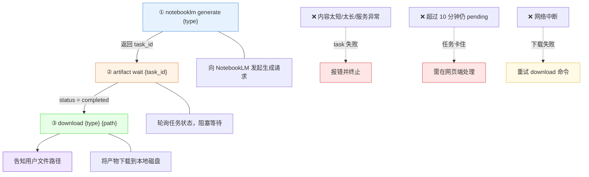
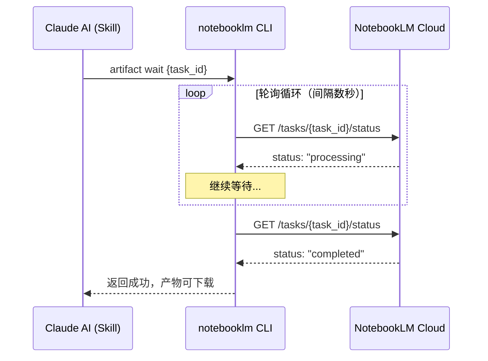
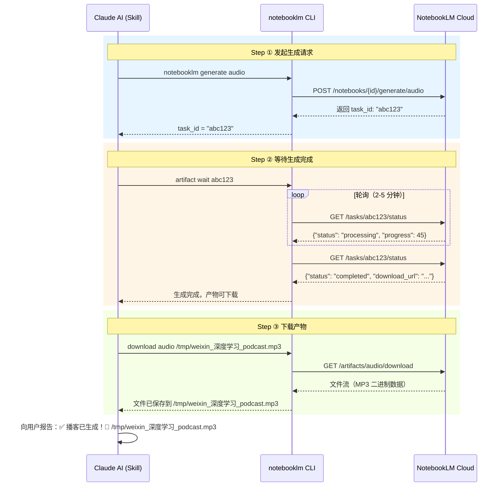

当用户的自然语言输入中包含格式触发词（如"生成播客"、"做成 PPT"），意图识别层（参见 [自然语言意图识别：播客、PPT、思维导图、Quiz 等触发词](14-zi-ran-yu-yan-yi-tu-shi-bie-bo-ke-ppt-si-wei-dao-tu-quiz-deng-hong-fa-ci)）会将其翻译为具体的生成意图关键词。本页聚焦于意图被识别**之后**发生的事情——**三条 CLI 命令构成的同步执行链路**：`notebooklm generate` 发起任务、`artifact wait` 轮询等待完成、`download` 将产物拉取到本地。理解这三步的时序关系、阻塞语义和故障模式，是从"能用"到"能排错"的关键一步。

Sources: [SKILL.md](SKILL.md#L218-L238)

## 生成流程的三步模型

整个生成阶段可以建模为一个严格的**三步顺序模型**——每一步都必须在上一步成功完成后才能执行，不存在跳步或并行的可能性。



**第一步：发起生成请求**。命令 `notebooklm generate {type}` 将意图关键词（如 `audio`、`slide-deck`）转化为对 NotebookLM 云端的 API 调用。NotebookLM 接到请求后，基于当前笔记本中**所有已注册 Source** 的内容进行分析与生成。命令执行后会返回一个 `task_id`——这是后续跟踪该异步任务的唯一句柄，必须妥善保存。

**第二步：等待生成完成**。命令 `artifact wait {task_id}` 以轮询方式持续查询 NotebookLM 的任务状态，直到状态变为 `completed`。这一步是**同步阻塞**的，意味着调用线程（即 Claude Code 的执行上下文）会一直等待，直到 NotebookLM 完成处理或超时。

**第三步：下载生成文件**。命令 `download {type} {local_path}` 将 NotebookLM 生成的产物从云端下载到本地指定路径，完成最终交付。下载完成后，Skill 会向用户报告文件的本地路径和基本信息。

Sources: [SKILL.md](SKILL.md#L233-L238)

## `notebooklm generate`：发起异步生成任务

`generate` 命令是整个链路的起点。它的核心职责是将用户的格式意图（由上游意图识别层确定）转化为一个 NotebookLM 可以执行的云端异步任务。

### 命令语法与参数

```bash
notebooklm generate {type}
```

其中 `{type}` 必须是以下 8 种受支持的生成类型之一：

| 生成类型 | 命令写法 | 产物格式 | 典型耗时 |
|---------|---------|---------|---------|
| `audio` | `notebooklm generate audio` | `.mp3` | 2-5 分钟 |
| `slide-deck` | `notebooklm generate slide-deck` | `.pdf` | 1-3 分钟 |
| `mind-map` | `notebooklm generate mind-map` | `.json` | 1-2 分钟 |
| `quiz` | `notebooklm generate quiz` | `.md` | 1-2 分钟 |
| `video` | `notebooklm generate video` | `.mp4` | 3-8 分钟 |
| `report` | `notebooklm generate report` | `.md` | 2-4 分钟 |
| `infographic` | `notebooklm generate infographic` | `.png` | 2-3 分钟 |
| `flashcards` | `notebooklm generate flashcards` | `.md` | 1-2 分钟 |

命令执行后，NotebookLM 会立即返回一个 `task_id`，但此时**生成任务尚未完成**——NotebookLM 正在云端异步处理。`task_id` 是后续 `artifact wait` 和 `download` 命令的必要输入参数。

Sources: [SKILL.md](SKILL.md#L222-L232), [SKILL.md](SKILL.md#L512-L518)

### 生成失败的三种常见原因

根据 SKILL.md 中的错误处理描述，生成任务可能在发起后失败，三种典型原因如下：

| 失败原因 | 触发条件 | 建议处理 |
|---------|---------|---------|
| **内容太短** | 上传内容 < 100 字 | 补充更多上下文后重新上传 |
| **内容太长** | 上传内容 > 50 万字 | 拆分为多个笔记本分批处理 |
| **NotebookLM 服务异常** | Google 侧服务不稳定 | 稍后重试，或尝试其他格式 |

一个容易被忽略的前置条件：生成命令执行前，**所有 Source 必须已通过 `source add --wait` 完成上传并处理就绪**（参见 [NotebookLM 上传与内容生成流程](8-notebooklm-shang-chuan-yu-nei-rong-sheng-cheng-liu-cheng)）。如果在 Source 尚未就绪时发起 `generate`，NotebookLM 会因找不到可分析的内容而导致生成失败。

Sources: [SKILL.md](SKILL.md#L444-L457)

## `artifact wait`：轮询等待生成完成

`artifact wait` 是三步链路中**耗时最长、最不可控**的一环。它的工作机制是将一个本应是异步的云端任务，通过持续轮询转化为对调用者而言的同步等待体验。

### 阻塞轮询的工作原理



`artifact wait` 的语义非常明确：**调用线程阻塞，直到 NotebookLM 将任务状态更新为 `completed`**。在内部实现上，CLI 会以固定间隔向 NotebookLM API 发送状态查询请求（polling），每次收到 `"processing"` 响应时继续等待，直到收到 `"completed"` 时解除阻塞。

这意味着在等待期间，**Claude Code 会话必须保持活跃**——如果用户在等待过程中关闭终端或中断会话，轮询会被中断，已完成的生成产物也无法自动下载。不过好消息是，`task_id` 仍然有效，你可以在重新启动会话后手动执行 `artifact wait` 和 `download` 来恢复流程。

Sources: [SKILL.md](SKILL.md#L234-L235)

### 各生成类型的等待时长预期

不同格式的生成复杂度差异显著，等待时长从 1 分钟到 8 分钟不等。了解这些预期有助于判断任务是否异常：

| 生成类型 | 典型等待时长 | 复杂度评估 |
|---------|------------|---------|
| `mind-map` / `quiz` / `flashcards` | 1-2 分钟 | 🟢 **快速**——结构化文本生成 |
| `slide-deck` | 1-3 分钟 | 🟡 **中等**——排版与视觉设计 |
| `audio` | 2-5 分钟 | 🟠 **较慢**——语音合成与后期处理 |
| `report` | 2-4 分钟 | 🟡 **中等**——长文本组织与撰写 |
| `infographic` | 2-3 分钟 | 🟡 **中等**——图形化渲染 |
| `video` | 3-8 分钟 | 🔴 **最慢**——视频编码与渲染 |

当等待时间**超过上述典型时长的 2 倍**时（例如播客等待超过 10 分钟），应考虑任务可能已卡住，需要进入排查流程。

Sources: [SKILL.md](SKILL.md#L512-L518)

### 任务卡住的排查与处理

当 `artifact wait` 长时间不返回时，可以通过以下命令诊断任务状态：

```bash
# 查看当前所有任务的状态列表
notebooklm artifact list
```

如果输出中目标任务的状态在**超过 10 分钟后仍为 `pending`**，则任务很可能已卡住。当前 notebooklm CLI **不支持取消任务**的命令，遇到这种情况需要到 [NotebookLM 网页端](https://notebooklm.google.com/) 手动处理。

Sources: [SKILL.md](SKILL.md#L589-L597)

## `download`：产物下载与本地保存

当 `artifact wait` 返回成功后，生成产物已就绪于 NotebookLM 云端，可以通过 `download` 命令将其拉取到本地磁盘。

### 完整下载命令参考

8 种生成类型各自对应独立的下载命令，产物格式也各不相同：

| 生成类型 | 下载命令 | 本地产物格式 | 文件用途 |
|---------|---------|------------|---------|
| `audio` | `download audio ./output.mp3` | MP3 音频 | 通勤收听、离线播放 |
| `slide-deck` | `download slide-deck ./output.pdf` | PDF 文档 | 会议分享、打印 |
| `mind-map` | `download mind-map ./map.json` | JSON 数据 | 可视化工具导入 |
| `quiz` | `download quiz ./quiz.md --format markdown` | Markdown 文本 | 在线查看、编辑 |
| `video` | `download video ./output.mp4` | MP4 视频 | 大屏播放、存档 |
| `report` | `download report ./report.md` | Markdown 文本 | 编辑、二次加工 |
| `infographic` | `download infographic ./infographic.png` | PNG 图片 | 嵌入文档、分享 |
| `flashcards` | `download flashcards ./cards.md --format markdown` | Markdown 文本 | 闪卡应用导入 |

Sources: [SKILL.md](SKILL.md#L222-L232)

### `--format markdown` 参数：文本类产物的格式增强

注意上表中 `quiz` 和 `flashcards` 的下载命令支持额外的 `--format markdown` 参数。这个参数的作用是将 NotebookLM 内部的私有格式转换为**可读性更强的 Markdown 文本**，便于在编辑器中直接查看和修改。如果不指定此参数，下载的文件可能使用 NotebookLM 的原生格式，可读性较差。

对于其他类型（如 `audio`、`video`、`infographic`），产物本身就是标准的二进制格式（MP3、MP4、PNG），不需要也不支持 `--format` 参数。

Sources: [SKILL.md](SKILL.md#L227-L231)

### 文件保存路径的约定

默认情况下，所有下载产物保存到 `/tmp/` 目录，文件名遵循 `{来源描述}_{生成类型}.{扩展名}` 的命名模式。例如：

- 微信文章生成播客：`/tmp/weixin_深度学习的未来趋势_podcast.mp3`
- YouTube 视频生成思维导图：`/tmp/youtube_quantum_computing_mindmap.json`
- 搜索关键词生成报告：`/tmp/search_AI发展趋势2026_report.md`

用户也可以在 `download` 命令中指定自定义路径（如 `./output.mp3`），将产物保存到任意位置。需要注意的是，`/tmp/` 目录的内容在**系统重启后会被自动清理**，重要产物应及时移动到持久化存储路径。

Sources: [SKILL.md](SKILL.md#L519-L522)

## 端到端时序图：从 generate 到 download

下面的时序图展示了以播客生成为例的完整三步执行过程，包括每一步与 NotebookLM 云端的交互细节：



这个时序图揭示了三个关键的工程细节：

**第一，task_id 的传递链**。`generate` 返回的 `task_id` 必须原封不动地传递给 `artifact wait`——任何字符截断或格式错误都会导致等待命令找不到对应任务。

**第二，轮询的透明性**。对 Claude Skill 而言，`artifact wait` 是一个单一的黑盒调用；但 CLI 内部实际执行了多次 HTTP 轮询。这种封装将异步复杂性完全屏蔽在 CLI 层。

**第三，下载是流式传输**。产物文件可能很大（播客数十 MB，视频可能上百 MB），CLI 通过流式下载避免内存溢出，同时直接写入磁盘。

Sources: [SKILL.md](SKILL.md#L233-L238), [SKILL.md](SKILL.md#L239-L268)

## 多意图场景下的顺序执行策略

当用户一次性指定多个生成意图时（如"把这篇文章生成播客和 PPT"，参见 [多意图处理：一次性生成多种格式](22-duo-yi-tu-chu-li-ci-xing-sheng-cheng-duo-chong-ge-shi)），Skill 会**依次串行执行**多条 generate → wait → download 链路，而非并行发起。

串行策略的设计考量基于三个约束：

| 约束因素 | 说明 |
|---------|------|
| **NotebookLM 并发限制** | 最多允许 3 个生成任务同时进行，但串行执行可完全避免触发限制 |
| **task_id 管理复杂度** | 并行场景下需要同时管理多个 task_id 的状态，增加出错概率 |
| **错误隔离** | 串行执行中任一步失败可立即中断并报告，无需处理部分成功的复杂回滚逻辑 |

串行执行的代价是总耗时等于各类型耗时之和（如播客 3 分钟 + PPT 2 分钟 = 5 分钟），而非取最大值。对于大多数使用场景，这个代价是可接受的。

Sources: [SKILL.md](SKILL.md#L498-L501), [SKILL.md](SKILL.md#L462-L472)

## 常见问题排查速查表

| 现象 | 可能原因 | 排查命令 | 解决方案 |
|------|---------|---------|---------|
| `generate` 报错"内容不足" | Source 内容 < 100 字 | 检查上传文件大小 | 补充内容后重新上传 |
| `generate` 报错"内容过长" | Source 内容 > 50 万字 | 检查上传文件大小 | 拆分为多个笔记本 |
| `artifact wait` 超过 10 分钟 | 任务卡住 | `notebooklm artifact list` | 到网页端手动处理 |
| `download` 失败 | task_id 无效或已过期 | 确认 `artifact wait` 已返回成功 | 重新执行 generate → wait → download |
| 下载的文件为空 | 生成完成但产物损坏 | 检查文件大小是否为 0 | 重试 generate |
| `artifact list` 无任务 | generate 未成功发起 | 检查 Source 是否就绪 | 先 `source add --wait` |

Sources: [SKILL.md](SKILL.md#L444-L457), [SKILL.md](SKILL.md#L566-L597)

## 延伸阅读

- **上游：意图如何被识别**——从自然语言到 generate 命令的映射过程，参见 [自然语言意图识别：播客、PPT、思维导图、Quiz 等触发词](14-zi-ran-yu-yan-yi-tu-shi-bie-bo-ke-ppt-si-wei-dao-tu-quiz-deng-hong-fa-ci)
- **上游：上传如何完成**——Source 添加与 `--wait` 的可靠性保障，参见 [NotebookLM 上传与内容生成流程](8-notebooklm-shang-chuan-yu-nei-rong-sheng-cheng-liu-cheng)
- **高级：一次生成多种格式**——多意图串行执行策略的完整说明，参见 [多意图处理：一次性生成多种格式](22-duo-yi-tu-chu-li-ci-xing-sheng-cheng-duo-chong-ge-shi)
- **高级：自定义生成指令**——为 generate 命令注入自定义 instructions，参见 [自定义 Notebook：指定已有笔记本或添加自定义生成指令](23-zi-ding-yi-notebook-zhi-ding-yi-you-bi-ji-ben-huo-tian-jia-zi-ding-yi-sheng-cheng-zhi-ling)
- **故障排查完整指南**——URL 格式错误、认证失败、生成卡住等综合排障，参见 [常见错误与解决方案：URL 格式、认证失败、生成卡住](25-chang-jian-cuo-wu-yu-jie-jue-fang-an-url-ge-shi-ren-zheng-shi-bai-sheng-cheng-qia-zhu)