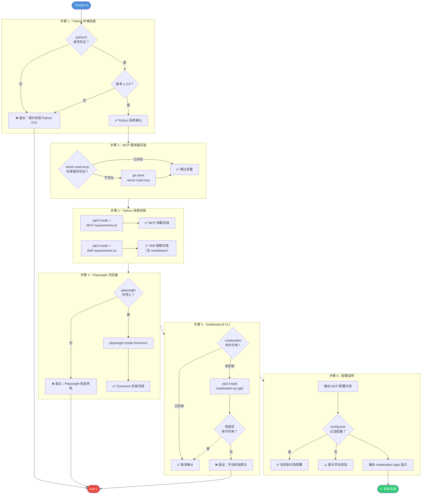

`install.sh` 是 anything-to-notebooklm Skill 的**一键式环境初始化入口**，它将 Python 运行时检查、MCP 服务器部署、Python 依赖安装、Playwright 浏览器引擎下载、NotebookLM CLI 安装以及 Claude Code 配置指导这六项关键任务编排为一条线性流水线。脚本采用 `set -e` 实现快速失败策略——任何一步出错立即终止，确保不会在残缺环境下继续执行后续步骤。本文将从整体架构出发，逐步骤拆解其检测逻辑、安装策略和边界处理，帮助你在需要定制安装或排查故障时快速定位问题节点。

Sources: [install.sh](install.sh#L1-L168)

## 整体流程架构

安装脚本遵循**「检测 → 安装 → 验证 → 指导」**的四段式结构。每个步骤先用条件判断探测当前系统状态，仅当不满足要求时才执行实际安装操作——这种**幂等设计**意味着你可以反复运行 `install.sh` 而不会重复安装已有组件。下方的流程图展示了六个步骤之间的数据依赖与失败路径。



Sources: [install.sh](install.sh#L1-L168)

## 脚本基础设置与安全策略

脚本在进入实际安装逻辑之前，首先完成三项基础配置：**错误退出策略**（`set -e`）、**工作目录定位**、**颜色输出常量**。

`set -e` 是整个脚本的**安全锚点**——它确保任何命令返回非零退出码时，脚本立即终止执行，避免在部分失败的状态下继续运行而产生不可预期的副作用。例如，步骤 3 的 `pip3 install` 如果因网络问题失败，`set -e` 会在该行直接中断，不会继续到步骤 4 的 Playwright 安装。

工作目录通过 `$(cd "$(dirname "${BASH_SOURCE[0]}")" && pwd)` 获取脚本自身所在目录的绝对路径，存入 `SKILL_DIR` 变量。这一写法比 `$(pwd)` 更可靠，因为后者取的是调用者的当前工作目录，而非脚本所在目录——当你从其他路径执行 `bash /path/to/install.sh` 时，两者可能不同。

Sources: [install.sh](install.sh#L1-L21)

## 步骤 1：Python 环境检查

| 检测项 | 实现方式 | 失败行为 |
|--------|----------|----------|
| Python3 是否存在 | `command -v python3` | 退出并提示安装 Python 3.9+ |
| 版本是否 ≥ 3.9 | `sort -V` 版本比较 | 退出并显示当前版本与需求 |

版本比较使用了 Shell 排序技巧：将 `REQUIRED_VERSION`（"3.9"）和实际版本号通过 `sort -V`（版本排序）取最小值，若最小值不是 3.9 则说明当前版本低于 3.9。这种方法虽然不如 Python 内部的 `sys.version_info` 精确，但避免了在版本检测阶段就要求 Python 可导入的循环依赖。

```
PYTHON_VERSION=$(python3 -c 'import sys; print(".".join(map(str, sys.version_info[:2])))')
```

该命令提取主版本号和次版本号（如 `3.11`），忽略补丁版本，因为最低要求只定义到次版本级别。

Sources: [install.sh](install.sh#L23-L38)

## 步骤 2：MCP 服务器安装

步骤 2 负责将微信文章抓取所需的 MCP 服务器克隆到本地。脚本通过**目录存在性检测**实现幂等——如果 `wexin-read-mcp/` 目录已经存在，直接跳过 `git clone`，避免每次运行都进行无意义的网络操作。

```
MCP_DIR="$SKILL_DIR/wexin-read-mcp"
if [ -d "$MCP_DIR" ]; then
    echo "✅ MCP 服务器已存在"
else
    git clone https://github.com/monkeychen/wexin-read-mcp.git "$MCP_DIR"
fi
```

需要注意的是，此处仅检测目录是否存在，**不检查目录内容的完整性**。如果上一次 `git clone` 因网络中断只拉取了部分文件，脚本不会自动修复。此时需要手动删除 `wexin-read-mcp/` 目录后重新运行安装。关于 MCP 服务器内部的 Playwright 浏览器模拟机制，详见 [wexin-read-mcp 服务器：Playwright 浏览器模拟与内容抓取](21-wexin-read-mcp-fu-wu-qi-playwright-liu-lan-qi-mo-ni-yu-nei-rong-zhua-qu)。

Sources: [install.sh](install.sh#L40-L51)

## 步骤 3：Python 依赖安装

步骤 3 是依赖管理的核心，它按**两个来源**分别安装 Python 包：

| 依赖来源 | 文件路径 | 主要内容 |
|----------|----------|----------|
| MCP 服务器依赖 | `$MCP_DIR/requirements.txt` | MCP 框架所需库 |
| Skill 自身依赖 | `$SKILL_DIR/requirements.txt` | fastmcp、playwright、beautifulsoup4、lxml、markitdown[all] |

两个文件的存在性都用 `if [ -f ... ]` 进行了守卫——如果文件不存在则静默跳过该部分。`-q` 标志让 pip 以静默模式运行，减少控制台输出噪音。

特别值得说明的是 `markitdown[all]>=0.0.1` 这一项：`[all]` 是 Python extras 语法，它会安装 markitdown 的全部可选依赖（包括 PDF、DOCX、PPTX、XLSX 等格式的解析库），这是实现 [Office 与电子书文档：markitdown 格式转换链路](11-office-yu-dian-zi-shu-wen-dang-markitdown-ge-shi-zhuan-huan-lian-lu) 中 15+ 格式支持的关键。

Sources: [install.sh](install.sh#L53-L70), [requirements.txt](requirements.txt#L1-L12)

## 步骤 4：Playwright 浏览器安装

Playwright 的安装分为**两层**：Python 包（在步骤 3 通过 `pip3 install` 完成）和浏览器二进制文件（在步骤 4 完成）。这是 Playwright 的设计特点——Python 绑定和 Chromium 浏览器引擎是分开部署的。

脚本先用 `python3 -c "from playwright.sync_api import sync_playwright"` 验证 Python 包确实可导入，然后才执行 `playwright install chromium`。这个预检查能捕获步骤 3 中 pip 安装了但导入路径有问题的情况（例如多个 Python 版本冲突）。如果预检查失败，脚本直接退出并提示检查安装。

Sources: [install.sh](install.sh#L72-L83)

## 步骤 5：NotebookLM CLI 安装

步骤 5 处理 NotebookLM CLI 的安装，采用与步骤 2 类似的**先检测后安装**模式。关键区别在于：NotekbookLM CLI 是从 GitHub 的 Git 仓库直接安装的（`pip3 install git+https://...`），而非 PyPI，这意味着安装需要 `git` 命令可用且网络可以访问 GitHub。

```
if command -v notebooklm &> /dev/null; then
    # 已安装：显示版本
else
    # 未安装：从 git 安装
    pip3 install git+https://github.com/monkeychen/notebooklm-py.git
    # 安装后二次验证
fi
```

安装完成后，脚本执行了**二次验证**——再次检查 `notebooklm` 命令是否可用。如果安装后仍不可用（可能因为 PATH 未包含 pip 安装路径），则输出手动安装命令并退出。这种「安装 + 验证」的双重检查模式在步骤 1 和 4 中也有体现，是脚本处理外部依赖的统一策略。

Sources: [install.sh](install.sh#L85-L103)

## 步骤 6：配置指导与最终输出

与其他五个步骤不同，步骤 6 **不执行任何安装操作**，而是输出配置指引信息，帮助用户完成最后的两个手动配置：

| 配置项 | 所需操作 | 涉及文件 |
|--------|----------|----------|
| MCP 服务器注册 | 编辑 `~/.claude/config.json` 添加 `weixin-reader` 条目 | Claude Code 配置文件 |
| NotebookLM 认证 | 运行 `notebooklm login` | NotebookLM 凭证存储 |

脚本动态生成 MCP 配置片段，其中 `args` 字段包含 `$MCP_DIR/src/server.py` 的完整路径——这个路径是根据步骤 2 中的 `SKILL_DIR` 变量拼接的绝对路径，确保无论从哪里运行安装脚本，路径都能正确指向 MCP 服务器入口文件。

脚本还会读取现有的 `config.json` 文件，检查是否已包含 `weixin-reader` 配置。如果已配置则显示确认信息，否则显示警告。这是一种**非侵入式检测**——只读取不修改，将最终修改权留给用户。详细配置方法参见 [Claude Code config.json 中 weixin-reader MCP 配置方法](20-claude-code-config-json-zhong-weixin-reader-mcp-pei-zhi-fang-fa)。

最终输出包含两个关键提醒：配置 MCP 后需要**重启 Claude Code**，以及首次使用前必须运行 **`notebooklm login`** 完成认证。

Sources: [install.sh](install.sh#L105-L168)

## 设计模式总结

整个脚本体现了几项可复用的 Shell 脚本设计模式：

| 模式 | 应用位置 | 作用 |
|------|----------|------|
| **幂等检测** | 步骤 2、5 | 检测已有组件，避免重复安装 |
| **快速失败** | 全局 `set -e` + 每步的 `exit 1` | 错误立即终止，不传播失败状态 |
| **安装后验证** | 步骤 1、4、5 | 安装/检测后二次确认可用性 |
| **非侵入式指导** | 步骤 6 | 输出配置模板，不自动修改用户文件 |
| **文件存在守卫** | 步骤 3 | 用 `if [ -f ... ]` 防止缺失文件导致错误 |

安装完成后，建议运行 [check_env.py 环境检查脚本：9 项检测逻辑](18-check_env-py-huan-jing-jian-cha-jiao-ben-9-xiang-jian-ce-luo-ji) 来验证所有组件的完整性——它提供了比 install.sh 更细致的 9 项独立检测，包括 NotebookLM 认证状态和 Playwright 可导入性等 install.sh 未覆盖的维度。如需了解打包分发相关逻辑，参见 [package.sh 打包分发脚本](19-package-sh-da-bao-fen-fa-jiao-ben)。