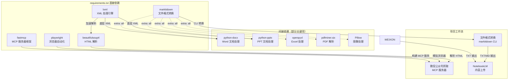
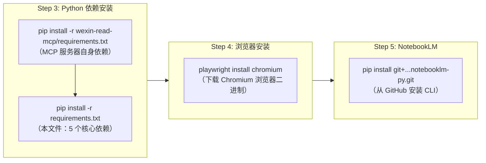

`requirements.txt` 是本项目 Python 依赖的**唯一定义源**，声明了 4 个直接依赖包及其最低版本约束。整个文件按职责分为两个逻辑分组：**Core MCP dependencies**（MCP 服务器核心依赖）和 **File format conversion**（文件格式转换依赖）。此外，NotebookLM CLI 工具虽未在此文件中声明（已注释掉），但在安装流程中通过 [install.sh](install.sh) 独立安装。本文将逐一解析每个依赖的版本约束、核心职责、在本项目中的实际应用场景以及它们之间的依赖关系。

Sources: [requirements.txt](requirements.txt#L1-L12)

## 依赖全景：从声明到用途

`requirements.txt` 文件仅 12 行，但支撑着项目从内容抓取到格式转换的完整数据链路。下方表格汇总了所有声明的直接依赖及其在项目架构中的定位。

| 依赖包 | 版本约束 | 分组 | 核心职责 | 对应内容源 |
|--------|---------|------|---------|-----------|
| **fastmcp** | `>=0.1.0` | Core MCP | MCP 服务器框架，构建 weixin-reader MCP 服务 | 微信公众号文章 |
| **playwright** | `>=1.40.0` | Core MCP | 无头浏览器自动化，模拟真实用户浏览行为 | 微信公众号文章（反爬虫绕过） |
| **beautifulsoup4** | `>=4.12.0` | Core MCP | HTML/XML 解析与内容提取 | 微信公众号文章（DOM 解析） |
| **lxml** | `>=4.9.0` | Core MCP | 高性能 XML/HTML 处理引擎 | HTML 解析加速 + Office 文档底层依赖 |
| **markitdown[all]** | `>=0.0.1` | Format Conversion | 15+ 种文件格式到 Markdown 的统一转换 | PDF/EPUB/DOCX/PPTX/XLSX/图片/音频等 |

Sources: [requirements.txt](requirements.txt#L1-L12)

## 依赖关系与数据流

下图展示了这 5 个依赖包在项目核心工作流中的位置和相互关系。**蓝色节点**为 `requirements.txt` 直接声明的依赖，**灰色节点**为被间接拉入的子依赖。



Sources: [requirements.txt](requirements.txt#L1-L12), [SKILL.md](SKILL.md#L139-L197)

## 逐项详解

### fastmcp — MCP 服务器构建框架

**声明**：`fastmcp>=0.1.0`（当前环境安装版本 3.1.0）

**核心职责**：fastmcp 是构建 MCP（Model Context Protocol）服务器的 Python 框架。在本项目中，它负责构建 **weixin-reader MCP 服务器**——该服务器向 Claude Code 暴露 `read_weixin_article` 和 `save_weixin_article_to_pdf` 两个工具，使 Claude 能够通过标准化协议调用微信公众号文章的抓取能力。

**在项目中的角色**：当用户传入微信公众号链接（`https://mp.weixin.qq.com/s/...`）时，Claude Code 通过 MCP 协议调用 weixin-reader 服务器暴露的工具，由该工具执行文章内容的抓取和解析。fastmcp 提供了服务注册、工具声明、参数校验和协议通信的完整基础设施，使得整个抓取能力可以被当作一个标准化的"工具"集成到 Claude 的工作流中。

**关键子依赖**：fastmcp 自身拉入了 `mcp`（MCP 协议核心库）、`pydantic`（数据校验）、`httpx`（HTTP 客户端）等 19 个子依赖，构成了 MCP 服务器的完整运行时。

Sources: [requirements.txt](requirements.txt#L2), [SKILL.md](SKILL.md#L56-L78), [install.sh](install.sh#L40-L51)

### playwright — 浏览器自动化引擎

**声明**：`playwright>=1.40.0`（当前环境安装版本 1.58.0）

**核心职责**：Playwright 是 Microsoft 开源的跨浏览器自动化库，提供真实浏览器环境的程序化控制能力。在本项目中，它是 weixin-reader MCP 服务器的**反爬虫绕过核心**：微信公众号文章页面设有 JavaScript 渲染、Cookie 校验等反爬机制，普通 HTTP 请求无法获取完整内容。Playwright 通过启动一个真实的 Chromium 浏览器实例，模拟人类用户的浏览行为（包括页面加载、滚动、等待动态内容渲染），从而绕过这些防护措施获取文章的完整 HTML。

**安装特殊性**：Playwright 的安装分两步——`pip install playwright` 仅安装 Python 库，还需要执行 `playwright install chromium` 下载浏览器二进制文件（约 150MB）。这一步在 [install.sh](install.sh) 的第 4 步中自动完成。如果缺少浏览器二进制文件，Python 库能正常导入但运行时会抛出异常。

**版本约束含义**：`>=1.40.0` 确保使用支持 Python 3.9+ 的稳定版本，该版本引入了改进的等待机制和更可靠的反检测能力。

Sources: [requirements.txt](requirements.txt#L3), [install.sh](install.sh#L72-L83)

### beautifulsoup4 — HTML 内容解析器

**声明**：`beautifulsoup4>=4.12.0`（当前环境安装版本 4.14.3）

**核心职责**：Beautiful Soup 是 Python 生态中最广泛使用的 HTML/XML 解析库，提供简洁的 API 用于从网页文档中提取特定元素。在本项目中，当 Playwright 完成微信公众号页面的加载和渲染后，beautifulsoup4 接手解析返回的 HTML 文档，精准提取文章标题、作者、发布时间、正文内容等结构化信息，同时过滤掉导航栏、广告、评论区等无关元素。

**与 lxml 的协作**：beautifulsoup4 支持多种解析器后端，其中 `lxml` 是性能最优的选择（比内置的 `html.parser` 快约 10 倍）。在本项目的依赖链中，lxml 同时作为 beautifulsoup4 的解析引擎和 python-docx/python-pptx 的底层 XML 处理库，承担了双重职责。

**子依赖**：`soupsieve`（CSS 选择器引擎）、`typing-extensions`（类型标注兼容）。值得注意的是，beautifulsoup4 同时也是 markitdown 的子依赖（用于 HTML 到 Markdown 的转换），因此即使不直接声明也会被间接安装，但显式声明确保了版本可控。

Sources: [requirements.txt](requirements.txt#L4), [requirements.txt](requirements.txt#L5)

### lxml — 高性能 XML/HTML 处理引擎

**声明**：`lxml>=4.9.0`（当前环境安装版本 6.0.2）

**核心职责**：lxml 是基于 C 库 libxml2/libxslt 的 Python 绑定，提供高性能的 XML 和 HTML 处理能力。在本项目中，它扮演**基础设施层**的角色，不直接被 Skill 代码调用，而是作为两个关键链路的底层引擎：一是作为 beautifulsoup4 的高性能 HTML 解析后端（用于微信文章解析），二是作为 python-docx 和 python-pptx 的 XML 处理底层（用于 Office 文档的读写操作，由 markitdown[all] 间接引入）。

**版本约束含义**：`>=4.9.0` 确保使用修复了已知安全漏洞的稳定版本。lxml 无 Python 子依赖（直接封装 C 库），这使得它成为项目依赖树中最轻量的组件之一。

Sources: [requirements.txt](requirements.txt#L5)

### markitdown[all] — 多格式统一转换工具

**声明**：`markitdown[all]>=0.0.1`（当前环境安装版本 0.1.5）

**核心职责**：markitdown 是 Microsoft 开源的文件格式转换工具，能将 15+ 种文件格式统一转换为 Markdown。方括号中的 `[all]` 是 pip 的 **extras 语法**，表示安装所有可选格式支持模块，而非仅安装最小核心。这是本项目支持 Office 文档、PDF、电子书、图片 OCR、音频转录等丰富内容源的**技术基石**。

**`[all]` extras 拉入的关键子依赖**：

| 子依赖包 | 格式支持 | 说明 |
|---------|---------|------|
| `python-docx` | DOCX（Word 文档） | 依赖 lxml，提取文本、表格、样式 |
| `python-pptx` | PPTX（PowerPoint） | 依赖 lxml + Pillow，提取幻灯片和备注 |
| `openpyxl` | XLSX（Excel 表格） | 读取单元格数据和公式 |
| `pdfminer.six` | PDF 文档 | 全文提取，支持中文 PDF |
| `Pillow` | 图片 OCR / 元数据 | 图像预处理，EXIF 信息提取 |

**在项目中的使用方式**：markitdown 安装后会提供 `markitdown` CLI 命令。在 Skill 工作流中，Claude 通过 Shell 调用该命令完成格式转换，例如 `markitdown /path/to/file.docx -o /tmp/converted.md`。转换后的 Markdown 文件再保存为 TXT 格式上传至 NotebookLM。

**版本约束含义**：`>=0.0.1` 是一个极度宽松的约束，因为 markitdown 是较新的项目（当前仍处于 0.x 版本），这个约束实际上等同于"安装最新可用版本"。

Sources: [requirements.txt](requirements.txt#L8), [SKILL.md](SKILL.md#L169-L175)

## 被注释的依赖：notebooklm-py

`requirements.txt` 第 11 行存在一条被注释掉的依赖声明：`# notebooklm-py`。NotebookLM CLI 工具并未通过 pip 从 PyPI 安装，而是在 [install.sh](install.sh) 的第 5 步中从 GitHub 仓库直接安装：

```bash
pip3 install git+https://github.com/monkeychen/notebooklm-py.git
```

这种处理方式的原因在于：notebooklm-py 可能尚未发布到 PyPI，或者需要使用特定的 Git 分支版本。将其注释在 requirements.txt 中起到了**文档标注**的作用，提醒开发者该项目存在这一关键依赖。

Sources: [requirements.txt](requirements.txt#L10-L11), [install.sh](install.sh#L85-L103)

## 依赖版本约束策略分析

本项目在版本约束上采用了**宽松最低版本**策略，所有依赖均使用 `>=` 操作符。这是一种务实的选择：

| 策略类型 | 优点 | 风险 |
|---------|------|------|
| **宽松最低版本（本项目）** | 确保能获取最新功能和修复；减少版本冲突 | 上游 breaking change 可能导致兼容性问题 |
| 严格锁定（`==`） | 可复现构建环境 | 阻止安全更新，维护成本高 |
| 兼容范围（`~=` / `^=`） | 平衡安全更新与兼容性 | 语义化版本不总是可靠 |

对于本项目这种 Claude Code Skill 而言，宽松策略是合理的——Skill 运行在用户的本地环境中，使用系统已安装的最新库版本能最大化兼容性。

Sources: [requirements.txt](requirements.txt#L1-L12)

## install.sh 中的依赖安装流程

虽然本文聚焦于 requirements.txt 的内容，但理解这些依赖在安装流程中的位置有助于形成完整认知。[install.sh](install.sh) 按 6 个步骤执行安装，其中依赖安装涉及第 3 步和第 4 步：



注意安装顺序的设计意图：先安装 Python 库（Step 3），再下载 Playwright 浏览器（Step 4），因为 Step 4 需要先验证 Python 库能否正常导入。Step 5 的 NotebookLM CLI 独立于 requirements.txt 安装，因其安装源不同。

Sources: [install.sh](install.sh#L53-L103)

## 环境验证：check_env.py 的依赖检查

[check_env.py](check_env.py) 在其第 2 项检查中逐一验证 requirements.txt 中声明的所有依赖是否可正常导入：

```python
# check_env.py 第 146-150 行
results.append(check_module("fastmcp"))
results.append(check_module("playwright"))
results.append(check_module("beautifulsoup4", "bs4"))
results.append(check_module("lxml"))
results.append(check_module("markitdown"))
```

值得注意的是 `beautifulsoup4` 的导入名检测使用了 `bs4` 而非包名——这是因为该包的 PyPI 发布名（`beautifulsoup4`）与其 Python 导入名（`bs4`）不一致，这是 Python 生态中常见的"包名 ≠ 导入名"陷阱。如果此处直接使用 `check_module("beautifulsoup4")`，检查将永远失败，因为 `import beautifulsoup4` 是无效语句。

Sources: [check_env.py](check_env.py#L144-L151)

## 相关阅读

- **安装流程全景**：了解这些依赖如何被自动化安装，请参阅 [install.sh 安装流程解析：6 步自动化安装](16-install-sh-an-zhuang-liu-cheng-jie-xi-6-bu-zi-dong-hua-an-zhuang)
- **环境检查机制**：理解依赖安装后的验证逻辑，请参阅 [check_env.py 环境检查脚本：9 项检测逻辑](18-check_env-py-huan-jing-jian-cha-jiao-ben-9-xiang-jian-ce-luo-ji)
- **内容格式转换实战**：了解 markitdown 在文档处理链路中的具体用法，请参阅 [Office 与电子书文档：markitdown 格式转换链路](11-office-yu-dian-zi-shu-wen-dang-markitdown-ge-shi-zhuan-huan-lian-lu)
- **MCP 服务器架构**：深入理解 fastmcp 和 Playwright 如何协同工作，请参阅 [wexin-read-mcp 服务器：Playwright 浏览器模拟与内容抓取](21-wexin-read-mcp-fu-wu-qi-playwright-liu-lan-qi-mo-ni-yu-nei-rong-zhua-qu)