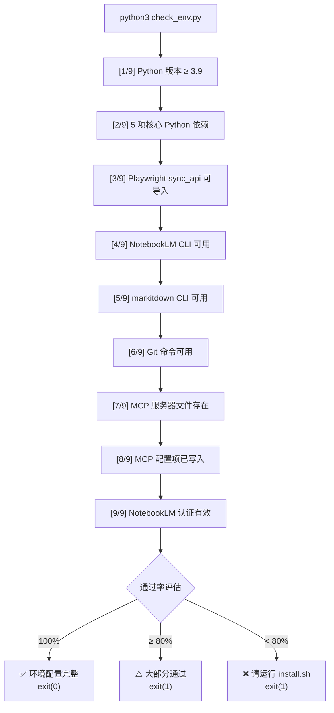

`check_env.py` 是 anything-to-notebooklm Skill 的**环境完整性自检工具**。它在安装后或运行前对 Python 运行时、核心依赖包、CLI 工具链、MCP 服务器及 NotebookLM 认证状态进行 9 大类系统性检测，并以带颜色的终端输出直观呈现通过/警告/失败状态。最终汇总通过率，输出修复建议并以退出码（0=全部通过，1=存在失败）反馈结果——这使得它可以嵌入 CI 流水线或安装脚本做自动化门禁检查。

Sources: [check_env.py](check_env.py#L1-L4)

## 整体执行流程

脚本采用**顺序执行 + 结果收集**模式：`main()` 函数按序调用 9 个检测步骤，每一步将布尔结果追加到 `results` 列表，最终通过 `sum(results) / len(results)` 计算通过率。这种设计使得任何单步失败都不会中断后续检查，保证用户能一次性看到所有问题。



Sources: [check_env.py](check_env.py#L132-L218)

## 5 个检测工具函数

脚本在 `main()` 之前定义了 5 个可复用的检测工具函数，分别负责**颜色化输出、Python 版本比较、模块导入探测、命令行工具查找、配置文件解析**。它们是 9 项检测逻辑的基础积木。

### `print_status` — 统一颜色化输出

通过 ANSI 转义序列将终端输出分为 4 种状态：`ok`（绿色 ✅）、`warning`（黄色 ⚠️）、`error`（红色 ❌）、默认（蓝色 ℹ️）。所有检测函数都通过它输出结果，确保视觉一致性。常量 `RED`、`GREEN`、`YELLOW`、`BLUE`、`NC`（重置颜色）定义在脚本头部。

Sources: [check_env.py](check_env.py#L12-L27)

### `check_python_version` — Python 版本门限

读取 `sys.version_info` 三元组（major.minor.micro），要求主版本 ≥ 3 且次版本 ≥ 9。这个门限与 [install.sh 安装流程解析](16-install-sh-an-zhuang-liu-cheng-jie-xi-6-bu-zi-dong-hua-an-zhuang) 中第 1 步的版本要求一致，确保诸如 `typing` 泛型语法、`str.removeprefix()` 等现代特性可用。

Sources: [check_env.py](check_env.py#L29-L39)

### `check_module` — Python 包导入探测

接受 `module_name`（显示名）和可选的 `import_name`（实际导入名），使用 Python 内置 `__import__()` 尝试动态导入。例如 `beautifulsoup4` 包的导入名是 `bs4`，这种解耦设计让显示名称与实际模块路径可以不同。检测的 5 个核心依赖与 [requirements.txt 依赖清单](17-requirements-txt-yi-lai-qing-dan-yu-ge-ku-zhi-ze) 完全对应：`fastmcp`、`playwright`、`beautifulsoup4`、`lxml`、`markitdown`。

Sources: [check_env.py](check_env.py#L41-L52)

### `check_command` — 系统命令可用性检查

使用 `shutil.which(cmd)` 探测命令是否在 `PATH` 中。如果找到命令，还会尝试执行 `cmd --version` 获取版本号并截取首行输出显示，超时设为 5 秒以防止阻塞。这个函数用于检测 `notebooklm`、`markitdown`、`git` 三个 CLI 工具。

Sources: [check_env.py](check_env.py#L54-L73)

### `check_mcp_config` 与 `check_mcp_server` — MCP 配置验证

这两个函数从**文件存在**和**配置注册**两个维度验证 MCP 服务器状态。`check_mcp_server` 检查 `wexin-read-mcp/src/server.py` 文件是否存在；`check_mcp_config` 读取 `~/.claude/config.json`，验证 `mcpServers.weixin-reader` 键是否已配置。这与 [Claude Code config.json 配置方法](20-claude-code-config-json-zhong-weixin-reader-mcp-pei-zhi-fang-fa) 中描述的配置结构直接对应。

Sources: [check_env.py](check_env.py#L75-L107)

### `check_notebooklm_auth` — NotebookLM 认证状态验证

执行 `notebooklm list` 命令（超时 10 秒），通过返回码判断认证是否有效。`returncode == 0` 表示已认证，否则提示用户运行 `notebooklm login`。这是 9 项检测中唯一涉及**网络请求**的步骤，因此设置了超时保护。详细认证流程参见 [NotebookLM 认证与首次使用](3-notebooklm-ren-zheng-yu-shou-ci-shi-yong)。

Sources: [check_env.py](check_env.py#L109-L130)

## 9 项检测逻辑详解

| 编号 | 检测项 | 检测方法 | 失败影响 | 修复方式 |
|:---:|:---|:---|:---|:---|
| 1 | Python 版本 ≥ 3.9 | `sys.version_info` 比较 | 脚本无法运行 | 升级 Python |
| 2 | 5 项核心依赖 | `__import__()` 动态导入 | MCP 服务器 / 格式转换不可用 | `pip3 install -r requirements.txt` |
| 3 | Playwright 可导入性 | `from playwright.sync_api import sync_playwright` | 浏览器模拟抓取失败 | `playwright install chromium` |
| 4 | NotebookLM CLI | `shutil.which("notebooklm")` | 无法操作 NotebookLM | `pip3 install notebooklm-py` |
| 5 | markitdown CLI | `shutil.which("markitdown")` | 文件格式转换失败 | `pip3 install markitdown[all]` |
| 6 | Git 命令 | `shutil.which("git")` | 无法克隆 MCP 服务器 | 安装 Git |
| 7 | MCP 服务器文件 | `Path.exists()` 检查 `server.py` | 微信公众号抓取不可用 | 运行 `install.sh` 克隆仓库 |
| 8 | MCP 配置 | 解析 `~/.claude/config.json` | Claude Code 无法调用 MCP | 手动编辑 config.json |
| 9 | NotebookLM 认证 | 执行 `notebooklm list` | 无法创建 / 操作 Notebook | `notebooklm login` |

> **注意**：脚本第 140 行显示 `[1/8]`，但实际共有 9 个检测步骤（第 2 步对应 [2/9] 至第 9 步对应 [9/9]）。这是源码中的一个显示序号小问题，不影响检测逻辑本身。

Sources: [check_env.py](check_env.py#L137-L192)

## 结果汇总与退出策略

所有检测步骤完成后，脚本进入结果汇总阶段。`results` 列表中的布尔值被求和得到通过数 `passed`，与总数 `total` 进行比较后给出三档评估：

| 通过率 | 输出 | 退出码 |
|:---:|:---|:---:|
| 100% | ✅ 所有检查通过！环境配置完整 | 0 |
| ≥ 80% | ⚠️ 大部分检查通过，但有些问题需要修复 | 1 |
| < 80% | ❌ 检查失败，请运行 install.sh 重新安装 | 1 |

当通过率未达 100% 时，脚本还会输出 3 条修复建议：(1) 运行 `./install.sh`、(2) 编辑 `~/.claude/config.json` 配置 MCP、(3) 运行 `notebooklm login` 完成认证。这 3 条建议恰好覆盖了 [快速安装与环境配置](2-kuai-su-an-zhuang-yu-huan-jing-pei-zhi) 中需要手动操作的步骤。

Sources: [check_env.py](check_env.py#L194-L218)

## 使用方式

在项目根目录直接执行即可：

```bash
python3 check_env.py
```

典型全通过输出如下：

```
========================================
  环境检查 - anything-to-notebooklm
========================================

[1/9] Python 版本
✅ Python 3.12.1

[2/9] 核心 Python 依赖
✅ fastmcp 已安装
✅ playwright 已安装
✅ beautifulsoup4 已安装
✅ lxml 已安装
✅ markitdown 已安装

[3/9] Playwright 可导入性
✅ Playwright 可以正常导入

...

========================================
✅ 所有检查通过 (13/13)！环境配置完整。
========================================
```

> **提示**：注意 `results` 列表的实际长度为 13（第 2 步的 5 个依赖各自产生一个独立结果），而非 9。9 是检测步骤的分类数，13 是独立检测项的总数。

Sources: [check_env.py](check_env.py#L132-L218)

## 相关页面

- **安装流程**：若环境检查发现问题，首先参考 [install.sh 安装流程解析：6 步自动化安装](16-install-sh-an-zhuang-liu-cheng-jie-xi-6-bu-zi-dong-hua-an-zhuang) 重新安装
- **依赖细节**：各项 Python 库的具体作用参见 [requirements.txt 依赖清单与各库职责](17-requirements-txt-yi-lai-qing-dan-yu-ge-ku-zhi-ze)
- **MCP 配置**：第 8 项检测涉及的配置结构详见 [Claude Code config.json 中 weixin-reader MCP 配置方法](20-claude-code-config-json-zhong-weixin-reader-mcp-pei-zhi-fang-fa)
- **认证流程**：第 9 项检测的认证操作参考 [NotebookLM 认证与首次使用](3-notebooklm-ren-zheng-yu-shou-ci-shi-yong)
- **故障排查**：若某项检测反复失败，可查阅 [常见错误与解决方案](25-chang-jian-cuo-wu-yu-jie-jue-fang-an-url-ge-shi-ren-zheng-shi-bai-sheng-cheng-qia-zhu)