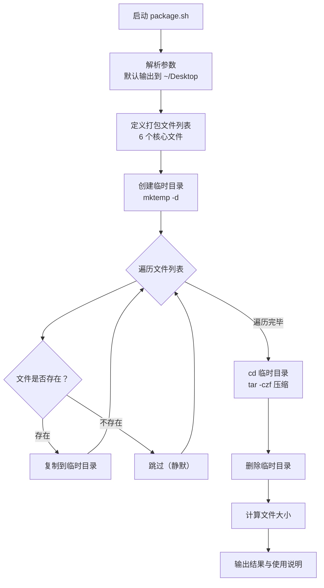
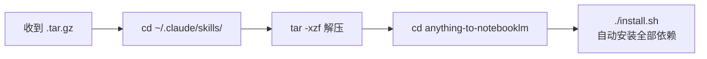
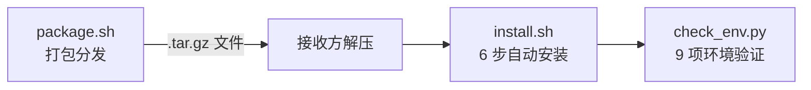

`package.sh` 是项目的**轻量化分发工具**，负责将 Skill 的核心文件打包为一个可移植的 `tar.gz` 压缩包，供其他用户解压安装。它的核心设计思想是"**只打包元数据与脚本，不打包运行时依赖**"——体积庞大的 `wexin-read-mcp` 服务器在接收方执行 [install.sh](16-install-sh-an-zhuang-liu-cheng-jie-xi-6-bu-zi-dong-hua-an-zhuang) 时通过 `git clone` 自动获取，从而将分发包控制在极小的体积。

Sources: [package.sh](package.sh#L1-L5)

## 脚本执行流程总览

整个脚本只有 72 行，遵循"准备 → 复制 → 压缩 → 清理 → 报告"的五段式结构。下面的流程图展示了完整的执行路径：



Sources: [package.sh](package.sh#L6-L71)

## 核心配置参数

脚本顶部定义了三个关键变量，决定了打包行为的输入与输出：

| 变量 | 值 | 说明 |
|------|-----|------|
| `SKILL_DIR` | `$(cd "$(dirname "${BASH_SOURCE[0]}")" && pwd)` | 脚本所在目录的绝对路径，作为文件源 |
| `SKILL_NAME` | `anything-to-notebooklm` | 压缩包内的顶层目录名 |
| `OUTPUT_DIR` | `${1:-$HOME/Desktop}` | 第一个命令行参数，缺省为桌面 |
| `TIMESTAMP` | `$(date +%Y%m%d_%H%M%S)` | 精确到秒的时间戳，嵌入文件名 |
| `OUTPUT_FILE` | `$OUTPUT_DIR/${SKILL_NAME}_${TIMESTAMP}.tar.gz` | 最终产物的完整路径 |

其中 `BASH_SOURCE[0]` 的使用确保了脚本无论从哪个目录调用，都能正确定位项目根目录。时间戳格式 `YYYYMMDD_HHMMSS` 既保证排序友好，又避免文件名冲突。

Sources: [package.sh](package.sh#L6-L10)

## 文件选择策略：打包什么、排除什么

脚本通过一个显式的数组 `FILES` 定义了需要打包的文件清单，这是整个脚本最重要的设计决策：

| 打包文件 | 在安装/运行中的角色 | 是否必须 |
|---------|-------------------|---------|
| `SKILL.md` | Skill 元数据与完整功能说明，Claude 读取的核心配置 | ✅ 必须 |
| `README.md` | 项目文档 | ✅ 必须 |
| `install.sh` | 自动化安装脚本，接收方执行入口 | ✅ 必须 |
| `check_env.py` | [环境检查脚本](18-check_env-py-huan-jing-jian-cha-jiao-ben-9-xiang-jian-ce-luo-ji)，安装后验证环境 | ✅ 必须 |
| `requirements.txt` | [Python 依赖清单](17-requirements-txt-yi-lai-qing-dan-yu-ge-ku-zhi-ze) | ✅ 必须 |
| `.gitignore` | 版本控制忽略规则 | ⚠️ 可选 |

Sources: [package.sh](package.sh#L23-L30)

**刻意排除的内容**及其原因：

| 排除项 | 排除原因 |
|-------|---------|
| `wexin-read-mcp/` | 体积大（含 Playwright 浏览器驱动），安装时通过 `git clone` 自动拉取 |
| `.claude/` | 本地 Claude 配置，属于用户私有环境 |
| `.git/` | 版本控制元数据，分发无意义 |
| `.omc/` | 本地工具缓存 |
| `LICENSE` | 许可证文件（注意：当前 FILES 数组中未包含，但文件存在） |

这种"白名单"模式（显式列出要打包的文件）比"黑名单"模式（排除不需要的文件）更安全——任何新增文件不会被意外打包进去。

Sources: [package.sh](package.sh#L39-L45), [.gitignore](.gitignore#L28-L29)

## 临时目录打包模式

脚本采用经典的 **临时目录 → 原子复制 → 压缩 → 清理** 模式来构建分发包，这一模式有三个关键设计点值得注意：

**第一，`mktemp -d` 保证隔离性。** 每次执行都在系统临时目录（如 `/var/folders/...`）创建一个独立的工作空间，多次并发执行不会互相干扰。

**第二，文件存在性检查。** 循环内的 `if [ -f "$SKILL_DIR/$file" ]` 确保缺失文件不会导致脚本报错——它只是静默跳过。这意味着即使某个可选文件（如 `.gitignore`）不存在，打包仍能成功完成。

**第三，压缩前切换工作目录。** `cd "$TEMP_DIR"` 后执行 `tar -czf`，确保压缩包内部的目录结构是 `anything-to-notebooklm/SKILL.md`，而不是绝对路径嵌套。

Sources: [package.sh](package.sh#L32-L52)

## 使用方式

### 执行打包

```bash
# 默认输出到桌面
./package.sh

# 指定输出目录
./package.sh /path/to/output
```

### 输出示例

```
========================================
  打包 anything-to-notebooklm Skill
========================================

📦 正在打包文件...
  ✓ SKILL.md
  ✓ README.md
  ✓ install.sh
  ✓ check_env.py
  ✓ requirements.txt
  ✓ .gitignore

✅ 打包完成！

📦 文件：/Users/username/Desktop/anything-to-notebooklm_20250403_160700.tar.gz
📊 大小：28K

📤 分享说明：
  用户收到文件后，执行：
    cd ~/.claude/skills/
    tar -xzf anything-to-notebooklm_20250403_160700.tar.gz
    cd anything-to-notebooklm
    ./install.sh
```

Sources: [package.sh](package.sh#L17-L71)

## 接收方的安装流程

打包脚本在输出末尾印出了完整的安装指引。接收方的操作链路如下：



关键点在于 `~/.claude/skills/` 这个路径——这是 Claude Code 识别自定义 Skill 的标准目录。解压后的目录名由 `SKILL_NAME` 变量决定，必须与 [SKILL.md](SKILL.md#L1-L6) 中的 `name` 字段保持一致，才能被 Claude Code 正确加载。

Sources: [package.sh](package.sh#L63-L68)

## 设计亮点与局限

| 维度 | 分析 |
|------|------|
| **白名单文件选择** | 安全可控，新增文件不会意外混入分发包 |
| **时间戳文件名** | 支持版本保留，多次打包不会覆盖 |
| **临时目录隔离** | 并发安全，不污染工作目录 |
| **静默跳过缺失文件** | 容错性好，但不会提示哪些文件缺失 |
| **无签名校验** | 分发包不含 checksum，无法验证传输完整性 |
| **缺少 LICENSE** | `FILES` 数组未包含 `LICENSE`，接收方看不到许可信息 |

Sources: [package.sh](package.sh#L23-L30)

## 与项目安装体系的关系

`package.sh` 在项目的"分发 → 安装 → 验证"链路中处于最上游位置，与另外两个脚本形成完整闭环：



三者职责清晰划分：[package.sh](package.sh#L1-L5) 只管"精简打包"，[install.sh](16-install-sh-an-zhuang-liu-cheng-jie-xi-6-bu-zi-dong-hua-an-zhuang) 管"从零搭建"，[check_env.py](18-check_env-py-huan-jing-jian-cha-jiao-ben-9-xiang-jian-ce-luo-ji) 管"验证达标"。这种分离使得每个脚本保持单一职责、可独立维护。

Sources: [package.sh](package.sh#L1-L5)

---

**相关阅读**：
- [install.sh 安装流程解析：6 步自动化安装](16-install-sh-an-zhuang-liu-cheng-jie-xi-6-bu-zi-dong-hua-an-zhuang) — 接收方解压后执行的安装脚本详解
- [check_env.py 环境检查脚本：9 项检测逻辑](18-check_env-py-huan-jing-jian-cha-jiao-ben-9-xiang-jian-ce-luo-ji) — 安装完成后的环境验证工具
- [requirements.txt 依赖清单与各库职责](17-requirements-txt-yi-lai-qing-dan-yu-ge-ku-zhi-ze) — 打包内含的依赖文件内容解析