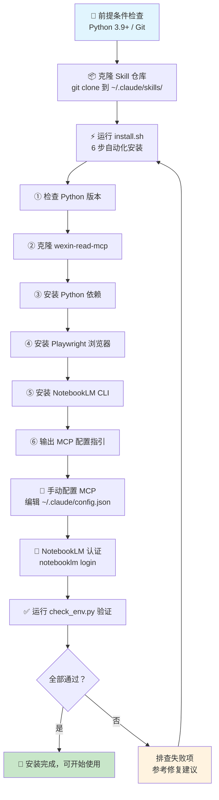

本文档是 **anything-to-notebooklm** Skill 的安装与环境配置完整指南。从系统前提条件验证、一键安装脚本执行、MCP 服务器配置，到环境健康检查，覆盖从零到可用的全流程。安装完成后，你将能够通过 Claude Code 用自然语言将任意内容源转换为播客、PPT、思维导图等 8 种输出格式。

Sources: [README.md](README.md#L1-L13)

## 系统前提条件

安装前，请确认你的系统满足以下最低要求：

| 前提条件 | 最低版本 | 用途 | 验证命令 |
|---------|---------|------|---------|
| **Python** | 3.9+ | 运行 MCP 服务器、markitdown 转换、环境检查脚本 | `python3 --version` |
| **Git** | 任意稳定版 | 克隆 Skill 仓库及 MCP 服务器 | `git --version` |
| **操作系统** | macOS / Linux | 当前仅支持 Unix-like 系统 | `uname -s` |
| **Claude Code** | 最新版 | Skill 的运行宿主环境 | — |

整个 Skill 的自动化安装脚本会处理其余所有依赖——包括 **fastmcp**（MCP 协议实现）、**Playwright**（浏览器自动化，用于微信公众号抓取）、**markitdown**（15+ 种文件格式转换）、**notebooklm-py**（NotebookLM CLI 工具）等，无需手动逐一安装。

Sources: [README.md](README.md#L96-L102), [install.sh](install.sh#L23-L38), [requirements.txt](requirements.txt#L1-L12)

## 安装流程总览

整个安装过程可以用以下流程图概括——从克隆仓库到最终可用，分为**自动化安装**（步骤 1-2）和**手动配置**（步骤 3-4）两大阶段：



Sources: [README.md](README.md#L94-L127), [install.sh](install.sh#L1-L168)

## 步骤 1：克隆 Skill 仓库

将 Skill 克隆到 Claude Code 的 skills 目录中。如果 `~/.claude/skills/` 目录不存在，需要先手动创建：

```bash
# 创建 skills 目录（如果不存在）
mkdir -p ~/.claude/skills/

# 克隆仓库
cd ~/.claude/skills/
git clone https://github.com/joeseesun/anything-to-notebooklm
cd anything-to-notebooklm
```

克隆完成后，目录结构如下所示。其中 `wexin-read-mcp/` 目录由安装脚本自动克隆，无需预先准备：

```
anything-to-notebooklm/
├── SKILL.md              # Skill 定义文件（触发规则与工作流程）
├── README.md             # 项目说明文档
├── install.sh            # 一键自动化安装脚本
├── check_env.py          # 环境检查脚本（9 项检测）
├── requirements.txt      # Python 依赖清单
├── package.sh            # 打包分发脚本
├── .gitignore
├── LICENSE
└── wexin-read-mcp/       # ← 安装时自动克隆，不在仓库中
    └── src/server.py     # MCP 服务器入口
```

Sources: [README.md](README.md#L105-L115), [.gitignore](.gitignore#L28-L29)

## 步骤 2：运行一键安装脚本

执行 `install.sh`，脚本将自动完成 **6 步安装**。整个过程通常需要 3-8 分钟，其中 Playwright 浏览器下载耗时最长：

```bash
chmod +x install.sh
./install.sh
```

以下是安装脚本 6 个步骤的详细说明与预期输出：

| 步骤 | 操作 | 说明 | 失败时的处理 |
|-----|------|------|------------|
| **[1/6]** | 检查 Python 版本 | 验证 Python ≥ 3.9，不满足则直接退出 | 需自行安装或升级 Python |
| **[2/6]** | 克隆 MCP 服务器 | 从 GitHub 克隆 `wexin-read-mcp` 到 Skill 目录下；如已存在则跳过 | 检查网络连接或 Git 配置 |
| **[3/6]** | 安装 Python 依赖 | 分别为 MCP 服务器和 Skill 安装 `requirements.txt` 中的依赖 | 检查 pip 是否正常、网络是否通畅 |
| **[4/6]** | 安装 Playwright 浏览器 | 下载 Chromium 浏览器二进制文件，用于微信文章抓取时的浏览器模拟 | 检查磁盘空间和网络 |
| **[5/6]** | 安装 NotebookLM CLI | 从 GitHub 安装 `notebooklm-py`，提供 `notebooklm` 命令行工具 | 按提示手动 `pip3 install git+...` |
| **[6/6]** | 输出配置指引 | 打印 MCP 配置 JSON 片段，提示下一步手动操作 | — |

脚本使用 `set -e` 模式运行，任何步骤失败都会立即终止并显示错误信息，不会继续执行后续步骤。

Sources: [install.sh](install.sh#L1-L168)

## 步骤 3：配置 MCP 服务器

安装脚本完成后，需要手动将 MCP 服务器配置添加到 Claude Code 的配置文件中。这一步是**微信公众号文章抓取功能**正常工作的关键前提。

编辑 `~/.claude/config.json` 文件，在 `mcpServers` 字段中添加 `weixin-reader` 配置。完整的配置文件结构如下：

```json
{
  "primaryApiKey": "any",
  "mcpServers": {
    "weixin-reader": {
      "command": "python",
      "args": [
        "/Users/你的用户名/.claude/skills/anything-to-notebooklm/wexin-read-mcp/src/server.py"
      ]
    }
  }
}
```

> ⚠️ **重要**：`args` 中的路径必须是 `server.py` 的**绝对路径**。安装脚本会在第 6 步自动打印你系统上的正确路径，直接复制即可。如果配置文件中已有其他 MCP 服务器，只需在 `mcpServers` 对象中追加 `weixin-reader` 条目，不要覆盖已有配置。

**配置完成后必须重启 Claude Code**，新的 MCP 服务器配置才会生效。如果安装脚本检测到你已有配置文件，会自动判断其中是否包含 `weixin-reader` 条目，并给出相应提示。

Sources: [install.sh](install.sh#L106-L143), [SKILL.md](SKILL.md#L56-L78)

## 步骤 4：NotebookLM 认证

首次使用前，需要通过 `notebooklm` CLI 完成一次 Google 账户认证。认证成功后会保存在本地，后续使用无需重复操作：

```bash
# 发起认证（会打开浏览器，登录 Google 账户）
notebooklm login

# 验证认证是否成功（应返回笔记本列表）
notebooklm list
```

如果 `notebooklm list` 成功返回了你的笔记本列表，说明认证已完成。详细的认证流程与常见问题，请参阅 [NotebookLM 认证与首次使用](3-notebooklm-ren-zheng-yu-shou-ci-shi-yong)。

Sources: [install.sh](install.sh#L146-L151), [SKILL.md](SKILL.md#L80-L87)

## 环境验证：check_env.py

安装和配置全部完成后，运行环境检查脚本来验证所有组件是否就绪：

```bash
python3 check_env.py
```

该脚本会逐一检测 **9 个关键项**，每项给出 ✅（通过）、⚠️（警告）或 ❌（失败）的状态：

| # | 检测项 | 检测内容 | 影响范围 |
|---|-------|---------|---------|
| 1/9 | **Python 版本** | Python ≥ 3.9 | 全局 |
| 2/9 | **核心 Python 依赖** | fastmcp、playwright、beautifulsoup4、lxml、markitdown 是否可导入 | MCP 服务器、文件转换 |
| 3/9 | **Playwright 可导入性** | `from playwright.sync_api import sync_playwright` | 微信文章抓取 |
| 4/9 | **NotebookLM CLI** | `notebooklm` 命令是否可用 | 上传与生成 |
| 5/9 | **markitdown CLI** | `markitdown` 命令是否可用 | 文件格式转换 |
| 6/9 | **Git 命令** | `git` 是否可用 | 安装过程 |
| 7/9 | **MCP 服务器文件** | `wexin-read-mcp/src/server.py` 是否存在 | MCP 功能 |
| 8/9 | **MCP 配置** | `~/.claude/config.json` 中是否包含 `weixin-reader` | MCP 功能 |
| 9/9 | **NotebookLM 认证** | `notebooklm list` 是否能成功执行 | NotebookLM 功能 |

脚本最终的判定标准为：**全部通过** → 绿色成功提示；**80% 以上通过** → 黄色警告，部分功能受限；**不足 80%** → 红色失败，建议重新运行 `install.sh`。如果检测到失败项，脚本会给出三条核心修复建议：运行安装脚本、配置 MCP、认证 NotebookLM。

Sources: [check_env.py](check_env.py#L1-L219)

## 常见安装问题排查

以下是安装过程中最常遇到的问题及其解决方案：

| 问题现象 | 可能原因 | 解决方案 |
|---------|---------|---------|
| `❌ 未找到 Python3` | 系统未安装 Python | macOS: `brew install python@3.11`；或从 [python.org](https://python.org) 下载 |
| `❌ Python 版本过低` | 系统 Python 为旧版本 | 升级到 3.9+，或使用 `pyenv` 管理多版本 |
| `git clone` 超时 | 网络问题或 GitHub 访问受限 | 检查网络代理配置，或设置 `https_proxy` 环境变量 |
| `pip3 install` 失败 | pip 版本过旧或权限不足 | 运行 `pip3 install --upgrade pip`，或使用 `--user` 参数 |
| Playwright 安装卡住 | Chromium 下载慢 | 设置 `PLAYWRIGHT_DOWNLOAD_HOST` 环境变量使用镜像源 |
| `notebooklm` 命令找不到 | PATH 未包含 pip 安装目录 | 将 Python 的 bin 目录添加到 PATH，或使用 `python3 -m notebooklm` |
| MCP 服务器不生效 | 未重启 Claude Code | 修改 `config.json` 后**必须重启** Claude Code |
| `⚠️ 未检测到 weixin-reader 配置` | config.json 中缺少配置 | 按步骤 3 手动添加配置并重启 |
| `check_env.py` 多项失败 | 安装不完整 | 重新运行 `./install.sh`，或按脚本输出的错误信息逐项排查 |

Sources: [install.sh](install.sh#L23-L103), [check_env.py](check_env.py#L208-L213)

## 手动安装（替代方案）

如果自动安装脚本在你的环境中遇到问题，可以按以下步骤手动完成安装：

```bash
# 1. 安装 Skill 的 Python 依赖
pip3 install -r requirements.txt

# 2. 克隆并安装 MCP 服务器依赖
git clone https://github.com/monkeychen/wexin-read-mcp.git
pip3 install -r wexin-read-mcp/requirements.txt

# 3. 安装 Playwright 浏览器
playwright install chromium

# 4. 安装 NotebookLM CLI
pip3 install git+https://github.com/monkeychen/notebooklm-py.git

# 5. 验证安装
python3 check_env.py
```

手动安装完成后，仍需按步骤 3 配置 MCP 服务器、按步骤 4 完成 NotebookLM 认证。

Sources: [install.sh](install.sh#L23-L103), [requirements.txt](requirements.txt#L1-L12)

## 下一步

安装完成并通过环境验证后，建议按以下顺序继续阅读：

1. **[NotebookLM 认证与首次使用](3-notebooklm-ren-zheng-yu-shou-ci-shi-yong)** — 完成 Google 账户认证，确保核心功能可用
2. **[自然语言触发方式与使用示例](4-zi-ran-yu-yan-hong-fa-fang-shi-yu-shi-yong-shi-li)** — 用自然语言体验第一次内容转换

如需深入了解安装脚本的每一步实现细节，可参阅：
- [install.sh 安装流程解析：6 步自动化安装](16-install-sh-an-zhuang-liu-cheng-jie-xi-6-bu-zi-dong-hua-an-zhuang)
- [requirements.txt 依赖清单与各库职责](17-requirements-txt-yi-lai-qing-dan-yu-ge-ku-zhi-ze)
- [check_env.py 环境检查脚本：9 项检测逻辑](18-check_env-py-huan-jing-jian-cha-jiao-ben-9-xiang-jian-ce-luo-ji)