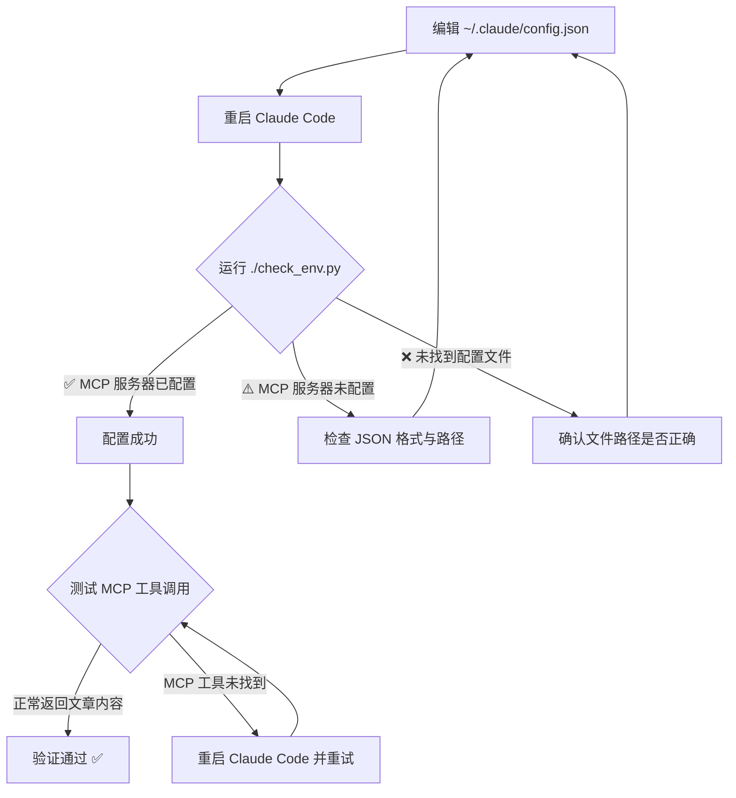
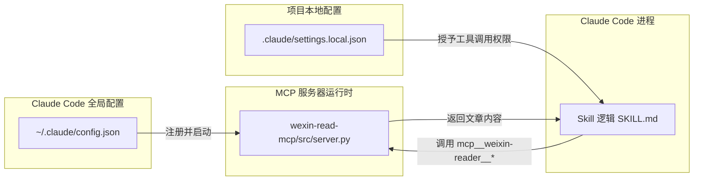

本文详细讲解如何在 Claude Code 的 `config.json` 中正确配置 `weixin-reader` MCP 服务器，使 Claude Code 能够通过 MCP 协议调用 Playwright 浏览器模拟功能，从而抓取微信公众号文章内容并绕过反爬虫机制。内容涵盖配置文件定位、JSON 结构解析、路径自动生成机制、配置验证方法以及常见故障排查。

## 为什么需要手动配置 MCP

本项目采用 **Skill + MCP 分层架构**：Skill 逻辑（即 [SKILL.md](SKILL.md)）定义了从内容源识别到 NotebookLM 生成的完整工作流，而 MCP 服务器（即 `wexin-read-mcp/`）作为独立进程，专门负责微信公众号文章的浏览器级抓取。Claude Code 不会自动发现 Skill 目录下的 MCP 服务器——它需要通过 `~/.claude/config.json` 中的 `mcpServers` 字段显式注册，才能在运行时启动该服务器并暴露 `read_weixin_article` 等工具函数。安装脚本 [install.sh](install.sh) 只负责克隆 MCP 仓库和安装依赖，第 6 步输出的配置片段需要用户**手动写入**配置文件。

Sources: [SKILL.md](SKILL.md#L56-L78), [install.sh](install.sh#L105-L131)

## 配置文件定位与结构

### 目标文件路径

Claude Code 的全局 MCP 配置文件位于用户主目录下：

| 操作系统 | 配置文件路径 |
|---------|------------|
| macOS | `~/.claude/config.json` |
| Linux | `~/.claude/config.json` |

**注意**：该文件是 Claude Code 的全局配置，并非项目目录内的文件。如果文件不存在，需要手动创建。环境检查脚本 [check_env.py](check_env.py) 的 `check_mcp_config()` 函数会通过 `Path.home() / ".claude" / "config.json"` 定位并验证此文件。

Sources: [check_env.py](check_env.py#L75-L95), [SKILL.md](SKILL.md#L62-L63)

### JSON 配置结构详解

完整的 `config.json` 最小配置如下：

```json
{
  "primaryApiKey": "any",
  "mcpServers": {
    "weixin-reader": {
      "command": "python",
      "args": [
        "/Users/你的用户名/.claude/skills/anything-to-notebooklm/wexin-read-mcp/src/server.py"
      ]
    }
  }
}
```

下表逐字段解析每个配置项的含义与要求：

| 字段 | 层级 | 值 | 说明 |
|------|------|---|------|
| `primaryApiKey` | 根级 | `"any"` | Claude Code 的启动必需字段，值可填任意字符串；实际 API 密钥由 Claude Code 自身的认证机制管理 |
| `mcpServers` | 根级 | `{...}` | MCP 服务器注册表，可包含多个 MCP 服务器定义 |
| `weixin-reader` | `mcpServers` 下 | `{...}` | MCP 服务器的注册名称，Claude Code 将以 `mcp__weixin-reader__` 为前缀暴露该服务器的工具 |
| `command` | 服务器级 | `"python"` | 启动 MCP 服务器的可执行命令，使用 `python` 而非 `python3`，确保兼容不同环境 |
| `args` | 服务器级 | `["..."]` | 传递给 command 的参数数组，此处为 MCP 服务器入口脚本的**绝对路径** |

Sources: [SKILL.md](SKILL.md#L64-L76), [SKILL.md](SKILL.md#L536-L548)

### 工具名称映射关系

配置完成后，Claude Code 会自动将 MCP 服务器注册的工具映射为内部工具名。本项目的权限配置文件 [.claude/settings.local.json](.claude/settings.local.json) 中可以看到这一映射：

```json
{
  "permissions": {
    "allow": [
      "Bash(claude mcp:*)",
      "mcp__weixin-reader__read_weixin_article"
    ]
  }
}
```

其中 `mcp__weixin-reader__read_weixin_article` 遵循命名规则 `mcp__{服务器名}__{工具名}`，即在 `config.json` 中注册的服务器名 `weixin-reader` 被用作中间段。这意味着如果你更改了 `mcpServers` 中的键名，权限配置中的工具名前缀也必须同步修改。

Sources: [.claude/settings.local.json](.claude/settings.local.json#L1-L8)

## 路径自动生成与手动替换

### install.sh 的动态路径生成

[install.sh](install.sh) 在第 6 步"配置指导"中，会根据当前安装位置动态生成包含实际绝对路径的配置片段。其核心逻辑如下：

```bash
MCP_DIR="$SKILL_DIR/wexin-read-mcp"

CONFIG_SNIPPET="    \"weixin-reader\": {
      \"command\": \"python\",
      \"args\": [
        \"$MCP_DIR/src/server.py\"
      ]
    }"
```

`SKILL_DIR` 在脚本开头通过 `$(cd "$(dirname "${BASH_SOURCE[0]}")" && pwd)` 获取，即 install.sh 所在目录的绝对路径。这意味着——如果你按照推荐方式将项目克隆到 `~/.claude/skills/anything-to-notebooklm/`，那么生成的路径将类似：

```
/Users/你的用户名/.claude/skills/anything-to-notebooklm/wexin-read-mcp/src/server.py
```

Sources: [install.sh](install.sh#L8-L9), [install.sh](install.sh#L110-L116)

### 路径替换注意事项

SKILL.md 中的示例路径使用了硬编码的 `/Users/joe/`，这是一个**示例用户名**，需要替换为你自己的系统用户名。以下是获取正确路径的方法：

| 方法 | 命令 | 输出示例 |
|------|------|---------|
| 获取主目录 | `echo $HOME` | `/Users/chenzhian` |
| 获取安装目录 | 在项目根目录执行 `pwd` | `/Users/chenzhian/.claude/skills/anything-to-notebooklm` |
| 拼接完整路径 | `$HOME/.claude/skills/anything-to-notebooklm/wexin-read-mcp/src/server.py` | 完整绝对路径 |

**关键约束**：`args` 数组中的路径**必须是绝对路径**。相对路径（如 `./wexin-read-mcp/src/server.py`）会导致 Claude Code 无法定位并启动 MCP 服务器。

Sources: [SKILL.md](SKILL.md#L69-L72)

## 已有配置的合并策略

如果你的 `~/.claude/config.json` 已经存在并包含其他配置项（如其他 MCP 服务器或 Claude Code 设置），需要采用**合并策略**而非覆盖：

```json
{
  "primaryApiKey": "any",
  "mcpServers": {
    "existing-server": {
      "command": "...",
      "args": ["..."]
    },
    "weixin-reader": {
      "command": "python",
      "args": [
        "/Users/你的用户名/.claude/skills/anything-to-notebooklm/wexin-read-mcp/src/server.py"
      ]
    }
  }
}
```

**合并原则**：保留所有已有的 `mcpServers` 条目，仅在 `mcpServers` 对象中追加 `weixin-reader` 键值对。install.sh 脚本会通过 `grep -q "weixin-reader"` 检测配置文件中是否已存在该条目，如果存在则提示"检测到已有 weixin-reader 配置"。

Sources: [install.sh](install.sh#L134-L143)

## 配置验证三步流程

配置完成后，建议按以下流程验证 MCP 服务器是否正确注册：



### 步骤 1：运行环境检查脚本

[check_env.py](check_env.py) 的第 8 项检查（`check_mcp_config()`）会验证三个条件：配置文件是否存在、`mcpServers` 键是否存在、`weixin-reader` 子键是否存在。如果三项均通过，输出 `✅ MCP 服务器已配置`。

Sources: [check_env.py](check_env.py#L75-L95)

### 步骤 2：重启 Claude Code

**这是必须的步骤**。Claude Code 在启动时读取 `config.json`，运行期间不会热加载配置变更。修改配置后必须完全退出并重新启动 Claude Code 进程。

Sources: [SKILL.md](SKILL.md#L78), [install.sh](install.sh#L161-L163)

### 步骤 3：功能验证

重启后在 Claude Code 中尝试执行一个简单的微信文章抓取任务（提供一篇公开的微信公众号文章链接），观察是否能成功调用 `mcp__weixin-reader__read_weixin_article` 工具。如果 Claude Code 的工具列表中出现该 MCP 工具，说明配置成功。

Sources: [README.md](README.md#L303-L313)

## 故障排查

### 常见错误与解决方案

| 错误现象 | 可能原因 | 解决方案 |
|---------|---------|---------|
| `⚠️ MCP 服务器未配置（需要手动添加）` | config.json 中缺少 `weixin-reader` 条目 | 按上述 JSON 结构添加配置 |
| `❌ 未找到 Claude 配置文件` | `~/.claude/config.json` 文件不存在 | 手动创建该文件 |
| MCP 工具未出现在 Claude Code 工具列表 | 修改配置后未重启 Claude Code | 完全退出并重启 Claude Code |
| MCP 服务器启动失败 / Python 报错 | MCP 服务器依赖未安装 | 执行 `pip install -r wexin-read-mcp/requirements.txt` 和 `playwright install chromium` |
| 权限被拒绝 | settings.local.json 中未授权 | 确认 `.claude/settings.local.json` 包含 `mcp__weixin-reader__read_weixin_article` 权限 |
| JSON 解析错误 | config.json 格式不合法 | 使用 `python -m json.tool ~/.claude/config.json` 验证 JSON 语法 |

### 手动测试 MCP 服务器

在终端中直接运行 MCP 服务器入口脚本，可以验证服务器本身是否正常：

```bash
python ~/.claude/skills/anything-to-notebooklm/wexin-read-mcp/src/server.py
```

如果服务器正常启动且无报错，说明 MCP 服务器代码和依赖安装正确；问题应从 config.json 配置或 Claude Code 连接层面排查。

Sources: [README.md](README.md#L303-L313), [SKILL.md](SKILL.md#L552-L564)

## 配置在整个架构中的位置



配置文件 `~/.claude/config.json` 负责告诉 Claude Code "去哪里找 MCP 服务器"，项目内的 `.claude/settings.local.json` 负责告诉 Claude Code "允许调用哪些 MCP 工具"，两者配合才能完成从注册到授权的完整链路。

Sources: [.claude/settings.local.json](.claude/settings.local.json#L1-L8), [SKILL.md](SKILL.md#L530-L550)

## 下一步

配置完成后，建议继续阅读以下页面以深入理解 MCP 服务器的内部工作机制和后续使用方法：

- [wexin-read-mcp 服务器：Playwright 浏览器模拟与内容抓取](21-wexin-read-mcp-fu-wu-qi-playwright-liu-lan-qi-mo-ni-yu-nei-rong-zhua-qu) — 了解 MCP 服务器如何通过 Playwright 绕过微信反爬虫
- [微信公众号文章：MCP 服务器抓取与反爬虫绕过](9-wei-xin-gong-zhong-hao-wen-zhang-mcp-fu-wu-qi-zhua-qu-yu-fan-pa-chong-rao-guo) — 从用户视角理解微信文章抓取的完整链路
- [常见错误与解决方案：URL 格式、认证失败、生成卡住](25-chang-jian-cuo-wu-yu-jie-jue-fang-an-url-ge-shi-ren-zheng-shi-bai-sheng-cheng-qia-zhu) — 配置正确但使用中遇到问题时的排查指南