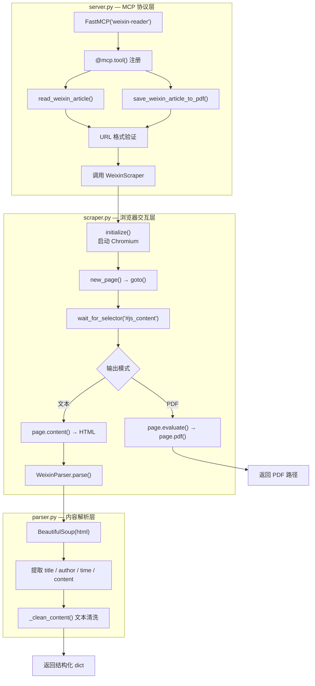
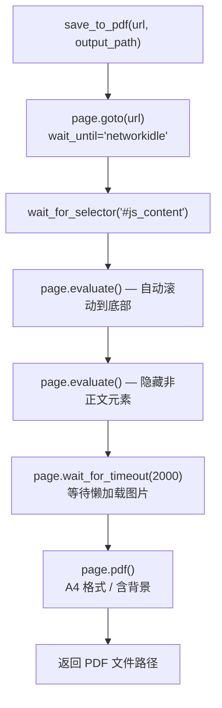
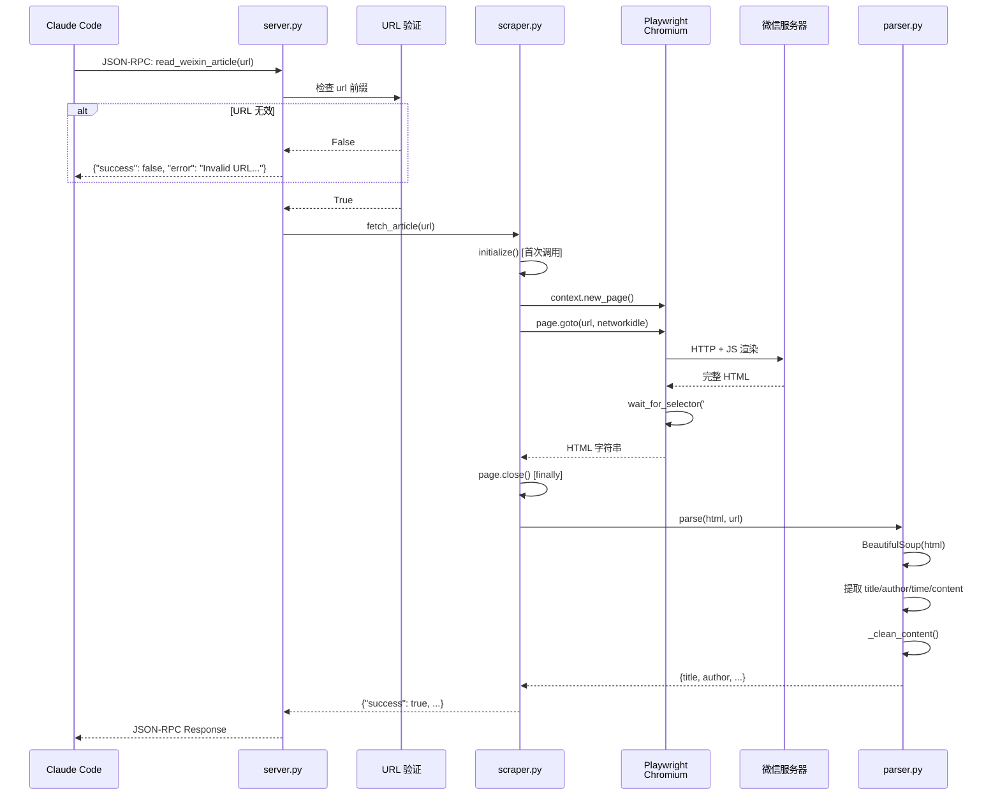

本文深入解析 **wexin-read-mcp** MCP 服务器的内部实现——这是一个独立的 Python 进程，通过 Playwright 驱动 Chromium 无头浏览器模拟真实用户访问微信公众号文章，并将渲染后的页面内容结构化提取。我们将从**三模块架构设计**入手，逐层剖析浏览器生命周期管理、反爬虫对抗策略、HTML 内容解析管道，以及 PDF 生成模式的实现细节。这是 [微信公众号文章：MCP 服务器抓取与反爬虫绕过](9-wei-xin-gong-zhong-hao-wen-zhang-mcp-fu-wu-qi-zhua-qu-yu-fan-pa-chong-rao-guo) 的技术纵深篇，聚焦于服务器内部代码的运作机制而非使用方法。

Sources: [SKILL.md](SKILL.md#L56-L78), [install.sh](install.sh#L40-L51)

## 三模块分层架构

wexin-read-mcp 采用**关注点分离**的三层架构，每个模块承担单一职责，形成清晰的数据处理管道：`server.py`（MCP 协议层）→ `scraper.py`（浏览器交互层）→ `parser.py`（内容解析层）。这种分层设计使得 MCP 协议通信、浏览器自动化、HTML 解析三个复杂领域各自独立演化，任何一个层的修改都不会波及其他层。

```
wexin-read-mcp/
├── src/
│   ├── __init__.py     ← 版本标识（v0.1.0）
│   ├── server.py       ← MCP 协议入口：工具注册、URL 验证、结果封装
│   ├── scraper.py      ← Playwright 爬虫：浏览器生命周期、页面导航、PDF 生成
│   └── parser.py       ← BeautifulSoup 解析器：DOM 元素提取、文本清洗
├── requirements.txt    ← 独立依赖清单
├── README.md
└── PRD.md
```



`server.py` 作为唯一入口，通过 `FastMCP("weixin-reader")` 创建 MCP 服务实例，注册两个异步工具函数。每个工具函数内部执行**三步处理**：URL 前缀校验、调用 `WeixinScraper` 获取数据、封装统一格式的返回字典。`scraper.py` 封装了所有 Playwright 浏览器操作——从实例初始化、页面导航到资源清理——对外仅暴露 `fetch_article()` 和 `save_to_pdf()` 两个异步方法。`parser.py` 则纯粹负责将原始 HTML 字符串转化为结构化数据，不涉及任何网络或浏览器操作。

Sources: [SKILL.md](SKILL.md#L56-L78), [install.sh](install.sh#L40-L51)

## server.py：MCP 协议入口与工具注册

### FastMCP 框架与装饰器模式

`server.py` 使用 `fastmcp` 库提供的 `FastMCP` 类和 `@mcp.tool()` 装饰器，将普通 Python 异步函数自动注册为 MCP 工具。当 Claude Code 通过 `config.json` 启动该服务器时，`mcp.run()` 调用会让服务器进入 **stdin/stdout JSON-RPC 监听模式**，等待 Claude Code 的工具调用请求。服务器的生命周期完全由 Claude Code 管理——启动时创建进程、调用时发送请求、退出时终止进程。

```python
# server.py 核心结构（简化）
mcp = FastMCP("weixin-reader")        # 注册服务名
scraper = WeixinScraper()             # 全局单例爬虫实例

@mcp.tool()
async def read_weixin_article(url: str) -> dict: ...
@mcp.tool()
async def save_weixin_article_to_pdf(url: str, output_path: str) -> dict: ...
```

全局变量 `scraper = WeixinScraper()` 在模块加载时创建爬虫实例。这意味着 `WeixinScraper` 的 `__init__` 方法在 Claude Code 启动 MCP 服务器时即执行，但由于 `initialize()` 采用**延迟初始化**模式，实际的 Chromium 浏览器进程只在第一次工具调用时才启动。

Sources: [SKILL.md](SKILL.md#L64-L76)

### 双工具设计与 URL 前缀验证

两个注册工具对应两种输出模式，它们的区别在于输出形式和后续处理路径：

| 工具名称 | 参数签名 | 输出形式 | 调用的 scraper 方法 |
|---------|---------|---------|-------------------|
| `read_weixin_article` | `(url: str)` | 结构化 dict（title/author/content） | `scraper.fetch_article(url)` |
| `save_weixin_article_to_pdf` | `(url: str, output_path: str)` | PDF 文件 + 结果 dict | `scraper.save_to_pdf(url, output_path)` |

两个工具函数共享同一套 URL 验证逻辑——检查 URL 是否以 `https://mp.weixin.qq.com/s/` 或 `https://mp.weixin.qq.com/s?` 开头。这是**防御性编程**的体现：即使 Claude AI 在调用前已经通过 URL 模式匹配确认了内容源类型，MCP 服务器仍然独立验证，防止误调用：

```python
if not url.startswith("https://mp.weixin.qq.com/s/") and \
   not url.startswith("https://mp.weixin.qq.com/s?"):
    return {"success": False, "error": "Invalid URL format..."}
```

验证失败时立即返回 `{"success": False, "error": "..."}` 的统一错误格式，避免进入浏览器操作流程，节省资源。成功验证后，调用委托给 `WeixinScraper` 实例的对应方法，并用 `try/except` 包裹整个调用链，确保任何异常都不会导致 MCP 服务器进程崩溃。

Sources: [SKILL.md](SKILL.md#L145-L146), [SKILL.md](SKILL.md#L405-L431)

## scraper.py：Playwright 浏览器生命周期管理

### Chromium 实例的延迟初始化策略

`WeixinScraper` 类的设计核心是**延迟初始化**——`__init__` 方法仅初始化属性引用为 `None`，真正的浏览器实例在第一次调用 `initialize()` 时才创建。这一策略避免了 MCP 服务器启动时即消耗大量内存（Chromium 进程通常占用 100-300 MB），将资源分配推迟到实际需要时。

```python
class WeixinScraper:
    def __init__(self):
        self.parser = WeixinParser()
        self.playwright = None      # Playwright 运行时
        self.browser: Browser | None = None     # Chromium 浏览器实例
        self.context: BrowserContext | None = None  # 浏览器上下文
    
    async def initialize(self):
        if not self.browser:  # 守卫条件：仅在未初始化时执行
            self.playwright = await async_playwright().start()
            self.browser = await self.playwright.chromium.launch(
                headless=True,
                args=['--disable-blink-features=AutomationControlled']
            )
            self.context = await self.browser.new_context(
                viewport={'width': 1920, 'height': 1080},
                user_agent='Mozilla/5.0 (Windows NT 10.0; Win64; x64) ...'
            )
```

`initialize()` 方法包含一个 `if not self.browser` 守卫条件，确保多次调用不会重复创建浏览器实例。创建的**三层对象链**——`playwright` → `browser` → `context`——对应 Playwright 的标准分层模型：`playwright` 是库运行时，`browser` 是 Chromium 进程，`context` 是隔离的浏览器会话（拥有独立的 Cookie、存储、缓存）。每个工具调用通过 `self.context.new_page()` 创建新标签页，操作完成后在 `finally` 块中 `await page.close()` 关闭，确保页面资源被释放。

Sources: [install.sh](install.sh#L72-L83), [requirements.txt](requirements.txt#L1-L5)

### 反自动化检测对抗

`scraper.py` 在浏览器启动配置中部署了**两层反检测措施**：

| 反检测手段 | 配置代码 | 绕过的检测机制 |
|-----------|---------|-------------|
| **禁用自动化标志** | `args=['--disable-blink-features=AutomationControlled']` | 移除 `navigator.webdriver=true` 标志，防止网站通过 JavaScript 检测自动化浏览器 |
| **自定义 User-Agent** | `user_agent='Mozilla/5.0 (Windows NT 10.0; Win64; x64) ...Chrome/120.0.0.0...'` | 模拟 Windows Chrome 120 浏览器，与无头 Chromium 默认 UA 区分 |

`--disable-blink-features=AutomationControlled` 是关键的 Chromium 启动参数。默认情况下，Playwright/Puppeteer 控制的浏览器会在 `navigator` 对象上设置 `webdriver` 属性为 `true`，而微信服务器的 JavaScript 可以检查这个属性来识别自动化访问。禁用此特性后，浏览器指纹更接近真实用户。

自定义 User-Agent 字符串选择的是 Windows Chrome 120 的标准 UA，而非 Chromium 的默认 UA（通常包含 `HeadlessChrome` 字样）。结合 `viewport={'width': 1920, 'height': 1080}` 的标准桌面分辨率设置，微信服务器收到的浏览器指纹信息与真实 Windows Chrome 用户高度一致。

Sources: [SKILL.md](SKILL.md#L405-L431)

### 页面加载与等待策略

`fetch_article()` 方法中的页面加载流程采用**两阶段等待**策略，确保微信文章的动态内容完全渲染：

```python
# 第一阶段：网络空闲等待
await page.goto(url, wait_until='networkidle', timeout=30000)

# 第二阶段：关键 DOM 元素就绪等待
await page.wait_for_selector('#js_content', timeout=10000)
```

**第一阶段** `wait_until='networkidle'` 是 Playwright 提供的最保守的导航等待策略——它等待页面导航完成，且至少 500ms 内没有超过 2 个网络连接。这对微信文章至关重要，因为微信文章的正文内容通常通过 AJAX 异步加载，简单的 `load` 或 `domcontentloaded` 事件触发时正文可能尚未渲染。30 秒的超时设置提供了充足的网络缓冲。

**第二阶段** `wait_for_selector('#js_content')` 精确等待微信文章正文容器 `<div id="js_content">` 出现在 DOM 中。这个元素是微信文章模板的固定 ID，包含完整的文章正文。10 秒超时专门应对正文内容的异步渲染。如果该元素在 10 秒内未出现，通常意味着文章已被删除、需要登录、或微信服务器返回了错误页面——此时抛出超时异常，被外层 `try/except` 捕获并转化为结构化错误返回。

Sources: [SKILL.md](SKILL.md#L159-L163)

### 资源清理与生命周期终止

`WeixinScraper` 提供了 `cleanup()` 方法用于优雅关闭浏览器资源，`server.py` 在 MCP 服务器收到 `KeyboardInterrupt` 信号时调用：

```python
# server.py 中的清理逻辑
if __name__ == "__main__":
    try:
        mcp.run()
    except KeyboardInterrupt:
        asyncio.run(cleanup())

# scraper.py 中的清理方法
async def cleanup(self):
    if self.context: await self.context.close()
    if self.browser: await self.browser.close()
    if self.playwright: await self.playwright.stop()
```

清理顺序遵循 Playwright 的**逆序关闭**原则：先关闭 context（释放 Cookie、存储），再关闭 browser（终止 Chromium 进程），最后停止 playwright 运行时。每一步都使用 `if` 守卫条件，确保即使某些层未初始化也不会抛出 `AttributeError`。

Sources: [SKILL.md](SKILL.md#L552-L564)

## parser.py：BeautifulSoup DOM 解析与文本清洗

### 微信文章 DOM 结构映射

微信公众文章的 HTML 页面具有固定的 DOM 结构，`WeixinParser` 通过预知的元素 ID 和标签选择器精确提取四个核心字段：

| 提取字段 | DOM 选择器 | 提取逻辑 | 缺省值 |
|---------|-----------|---------|-------|
| **标题** | `soup.find('h1', {'id': 'activity-name'})` | 获取 `<h1 id="activity-name">` 的文本 | `"未找到标题"` |
| **作者** | `soup.find('span', {'id': 'js_author_name'})` 或 `soup.find('a', {'id': 'js_name'})` | 优先查找作者名，回退到公众号名称 | `"未知作者"` |
| **发布时间** | `soup.find('em', {'id': 'publish_time'})` | 获取 `<em id="publish_time">` 的文本 | `"未知时间"` |
| **封面图 URL** | `soup.find('meta', property='og:image')` | 从 `<meta>` 标签提取 `content` 属性 | `''`（空字符串） |
| **正文内容** | `soup.find('div', {'id': 'js_content'})` | 获取正文 div 并执行文本清洗 | `"未找到正文内容"` |

作者提取采用了**回退策略**：先查找 `js_author_name`（文章作者名），如果不存在则查找 `js_name`（公众号名称）。这是因为微信文章的作者字段展示方式存在两种变体——部分文章显示独立的作者名，部分仅显示公众号名称。`parse()` 方法使用 Python 的 `or` 运算符实现短路回退：`soup.find('span', {'id': 'js_author_name'}) or soup.find('a', {'id': 'js_name'})`。

Sources: [SKILL.md](SKILL.md#L159-L163)

### _clean_content() 文本清洗管道

正文内容提取后经过 `_clean_content()` 方法的**三步清洗管道**，将 HTML 内容转化为干净的纯文本：

```python
def _clean_content(self, content_elem) -> str:
    # Step 1: 移除 <script> 和 <style> 标签（含内容）
    for tag in content_elem.find_all(['script', 'style']):
        tag.decompose()
    
    # Step 2: 提取文本，保留换行结构
    text = content_elem.get_text(separator='\n', strip=True)
    
    # Step 3: 正则清理多余空白
    text = re.sub(r'\n{3,}', '\n\n', text)   # 3+ 连续换行 → 2 个
    text = re.sub(r' {2,}', ' ', text)        # 2+ 连续空格 → 1 个
    
    return text.strip()
```

**Step 1** 的 `tag.decompose()` 不仅移除标签本身，还移除其所有子节点内容——这对微信文章中的内嵌 JavaScript 代码块和 CSS 样式定义至关重要，避免这些非正文内容污染输出。**Step 2** 的 `get_text(separator='\n', strip=True)` 将 HTML 块级元素的边界转换为换行符，并对每个文本节点执行 `strip()`。**Step 3** 的两步正则处理确保输出文本格式整洁，不会出现多余的空行或缩进——最终输出是紧凑但保留段落结构的纯文本，非常适合后续上传到 NotebookLM 进行 AI 处理。

Sources: [SKILL.md](SKILL.md#L159-L163), [install.sh](install.sh#L57-L83)

## PDF 生成模式：从页面渲染到文件输出

`save_to_pdf()` 方法实现了一套比纯文本提取更复杂的页面处理流程，确保 PDF 输出包含完整的视觉内容（包括图片）：



PDF 模式相比文本模式增加了三个关键步骤。**第一步是自动滚动**：通过 `page.evaluate()` 注入 JavaScript 代码，以 100px 步进从页面顶部滚动到底部。这一步解决微信文章中**图片懒加载**的问题——微信文章的图片使用 Intersection Observer 或 scroll 事件触发加载，只有滚动到可视区域时才会发起 HTTP 请求下载图片。如果不执行滚动，PDF 中的图片位置将显示为空白占位符。

**第二步是隐藏干扰元素**：通过 `page.evaluate()` 将二维码区域（`.qr_code_pc_outer`、`#js_pc_qr_code`）和底部额外区域（`.rich_media_area_extra`）的 `display` 设为 `none`。这些元素在浏览器中正常显示，但导出 PDF 时会造成视觉干扰。

**第三步是等待图片加载**：`page.wait_for_timeout(2000)` 固定等待 2 秒，确保滚动触发的图片 HTTP 请求完成。这是一个保守但可靠的策略——替代方案如 `wait_for_load_state('networkidle')` 在某些微信页面上可能因持续的 WebSocket 连接而永远无法达到空闲状态。

最终的 `page.pdf()` 调用使用 `format='A4'`、`print_background=True`（保留背景色和背景图）以及 20px 的统一边距，生成标准的 A4 尺寸 PDF 文件。

Sources: [SKILL.md](SKILL.md#L160-L163)

## 数据流全景：从 URL 到结构化返回

下面的序列图展示了一个完整的 `read_weixin_article` 调用周期，涵盖从 MCP 协议接收到最终返回的每一个内部步骤：



整个数据流的**关键设计原则**是每一层只返回 dict 结构——不抛异常、不返回 None、不产生副作用（除了 PDF 模式写文件）。`success` 布尔字段是调用方判断结果的唯一入口：`True` 时所有字段均有值，`False` 时 `error` 字段包含可读的错误描述。这种**统一返回结构**使得 Claude AI 可以用一致的模式处理成功和失败两种情况。

Sources: [SKILL.md](SKILL.md#L240-L268)

## 依赖矩阵与版本约束

wexin-read-mcp 的 `requirements.txt` 声明了四个核心依赖，每个依赖对应一个明确的技术职责：

| 依赖包 | 版本约束 | 架构角色 | 缺失影响 |
|-------|---------|---------|---------|
| `fastmcp` | `>=0.1.0` | MCP 协议实现：JSON-RPC 通信、`@mcp.tool()` 装饰器、`mcp.run()` 事件循环 | 服务器无法启动 |
| `playwright` | `>=1.40.0` | 浏览器自动化：Chromium 启动、页面导航、DOM 等待、PDF 生成 | 无法获取任何文章内容 |
| `beautifulsoup4` | `>=4.12.0` | HTML 解析：DOM 查询、元素提取、文本清洗 | 无法解析 HTML 为结构化数据 |
| `lxml` | `>=4.9.0` | 高性能解析后端：加速 BeautifulSoup 的 HTML 解析速度 | 回退到 Python 内置解析器，性能下降 |

值得注意的是，`lxml` 是 `beautifulsoup4` 的可选加速后端。如果未安装 `lxml`，BeautifulSoup 会回退到 Python 标准库的 `html.parser`，功能不受影响但解析速度会降低（在大型 HTML 文档上差异显著）。此外，Playwright 的 Python 包仅提供 API 层，实际的 Chromium 浏览器二进制文件需要通过 `playwright install chromium` 单独下载（约 150-200 MB），这一步在 [install.sh](install.sh#L72-L83) 的第 4 步自动执行。

Sources: [requirements.txt](requirements.txt#L1-L5), [install.sh](install.sh#L57-L83)

## 性能特征与优化点

基于代码实现的分析，wexin-read-mcp 的性能特征可以从以下几个维度评估：

| 性能维度 | 实现现状 | 瓶颈分析 |
|---------|---------|---------|
| **首次调用延迟** | 浏览器冷启动 + 页面加载，约 5-10 秒 | Chromium 进程启动占 2-3 秒，网络请求 + JS 渲染占 3-7 秒 |
| **后续调用延迟** | 浏览器已运行，仅页面加载，约 3-6 秒 | 浏览器实例复用消除了启动开销 |
| **内存占用** | 约 200-400 MB（Chromium 进程 + Python） | Chromium 是主要内存消耗者 |
| **并发能力** | 单线程异步，同一 context 创建多 page | Playwright 支持异步并发，但受限于微信反爬频率限制 |

`WeixinScraper` 采用**浏览器实例复用**策略：`initialize()` 中的 `if not self.browser` 守卫条件确保 Chromium 进程只创建一次，后续调用共享同一个 browser 和 context 实例。每个工具调用仅创建新的 `page`（标签页），操作完成后立即关闭。这避免了每次调用重新启动浏览器的巨大开销。

当前实现未启用 PRD.md 中规划的**资源过滤优化**（如阻止图片/视频加载以加速纯文本模式）。一个潜在的优化点是在 `fetch_article()` 模式中添加路由拦截：`await page.route("**/*.{png,jpg,jpeg,gif,svg,mp4}", lambda route: route.abort())`，可以显著减少网络传输量和渲染时间，因为纯文本模式不需要图片资源。

Sources: [SKILL.md](SKILL.md#L498-L511), [install.sh](install.sh#L72-L83)

## 页面异常场景的代码级处理

代码中对多种异常场景有明确的处理路径：

| 异常场景 | 触发条件 | 代码位置 | 处理方式 |
|---------|---------|---------|---------|
| URL 格式不合法 | 前缀不匹配 `mp.weixin.qq.com/s/` | `server.py` URL 验证 | 返回 `{"success": False, "error": "Invalid URL format..."}` |
| 页面加载超时 | 30 秒内未达到 `networkidle` | `scraper.py` `page.goto()` | 抛出 `TimeoutError`，被 `try/except` 捕获 |
| 正文元素缺失 | `#js_content` 10 秒内未出现 | `scraper.py` `wait_for_selector()` | 抛出 `TimeoutError`，被 `try/except` 捕获 |
| 浏览器进程崩溃 | Playwright 内部错误 | `scraper.py` 任意 Playwright 调用 | 抛出异常，被 `try/except` 捕获 |
| HTML 结构异常 | 解析字段缺失 | `parser.py` 各 `find()` 调用 | 返回缺省值（"未找到标题"、"未知作者"等） |

每个异常路径最终都收敛为 `{"success": False, "error": "..."}` 的统一格式。`scraper.py` 中的 `try/finally` 模式确保即使发生异常，`page.close()` 也会执行，防止页面标签页泄漏。`server.py` 中的外层 `try/except` 是最后的防线——即使 `WeixinScraper` 内部出现未预期的异常，服务器也不会崩溃，而是将异常信息编码到返回值中传递给 Claude AI。

Sources: [SKILL.md](SKILL.md#L405-L431)

## 与上游项目的集成关系

wexin-read-mcp 在本项目中通过 [install.sh](install.sh#L40-L51) 第 2 步从 GitHub 克隆，并作为子目录 `wexin-read-mcp/` 置于 Skill 根目录下。它在 [anything-to-notebooklm 整体架构](5-zheng-ti-ji-zhu-jia-gou-cong-zi-ran-yu-yan-dao-wen-jian-sheng-cheng-de-shu-ju-liu) 中占据**唯一需要本地服务器参与内容获取**的位置——其余所有内容源（网页、YouTube、本地文件等）均通过 URL 直接传递或 markitdown 本地转换处理，不需要独立的 MCP 服务。

整个集成链路可以概括为：Claude AI 识别 `mp.weixin.qq.com` URL → 从 `~/.claude/config.json` 读取 MCP 配置 → 通过 stdin 发送 JSON-RPC 请求 → wexin-read-mcp 启动 Playwright 浏览器获取内容 → 通过 stdout 返回结构化数据 → Claude AI 将内容保存为 `/tmp/weixin_*.txt` → 上传至 NotebookLM。配置方法详见 [Claude Code config.json 中 weixin-reader MCP 配置方法](20-claude-code-config-json-zhong-weixin-reader-mcp-pei-zhi-fang-fa)，环境验证步骤参见 [check_env.py 环境检查脚本：9 项检测逻辑](18-check_env-py-huan-jing-jian-cha-jiao-ben-9-xiang-jian-ce-luo-ji)。

Sources: [install.sh](install.sh#L40-L51), [SKILL.md](SKILL.md#L56-L78)

## 延伸阅读

- **上游配置**：MCP 服务器的注册与路径配置详解参见 [Claude Code config.json 中 weixin-reader MCP 配置方法](20-claude-code-config-json-zhong-weixin-reader-mcp-pei-zhi-fang-fa)
- **使用层面**：微信文章抓取的整体流程与双模式选择参见 [微信公众号文章：MCP 服务器抓取与反爬虫绕过](9-wei-xin-gong-zhong-hao-wen-zhang-mcp-fu-wu-qi-zhua-qu-yu-fan-pa-chong-rao-guo)
- **URL 识别**：微信链接的匹配规则参见 [内容源智能识别：URL 与文件类型自动判断机制](6-nei-rong-yuan-zhi-neng-shi-bie-url-yu-wen-jian-lei-xing-zi-dong-pan-duan-ji-zhi)
- **并行路径**：无需 MCP 的 URL 类内容处理参见 [网页与 YouTube 视频：URL 直接传递处理](10-wang-ye-yu-youtube-shi-pin-url-zhi-jie-chuan-di-chu-li)
- **环境验证**：安装后的自动化检查参见 [check_env.py 环境检查脚本：9 项检测逻辑](18-check_env-py-huan-jing-jian-cha-jiao-ben-9-xiang-jian-ce-luo-ji)