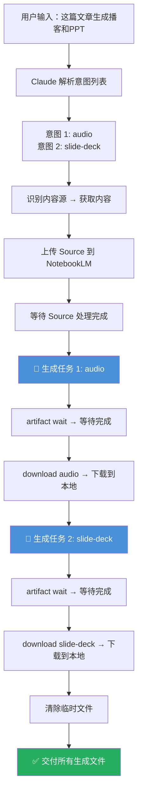

多意图处理是 anything-to-notebooklm Skill 的一项**高级能力**——允许用户在一条自然语言指令中同时指定多个输出意图，Skill 会按顺序依次完成所有生成任务。例如，你可以说"把这篇文章生成播客和PPT"，系统会先完成播客生成，再完成 PPT 生成，最终交付两个不同格式的文件。本文将深入解析多意图的识别机制、执行流程、并发限制以及实用的组合策略。

Sources: [SKILL.md](SKILL.md#L461-L471)

## 什么是多意图处理

在日常使用中，用户往往希望对同一份内容同时获得多种形态的产出——既要播客方便通勤收听，又要 PPT 用于团队分享，还想有一份思维导图辅助理解。如果每次只生成一种格式，用户需要反复输入指令、等待完成、再输入下一条，体验割裂且低效。

**多意图处理**的设计初衷正是解决这一痛点：用户只需在一条指令中并列多个意图关键词，Skill 会自动识别所有意图，并在同一个 Notebook（笔记本）上下文中按顺序依次执行每个生成任务。这意味着所有生成任务共享同一批已上传的 Source（内容源），NotebookLM 会基于相同的原始内容为每种格式独立生成内容。

Sources: [SKILL.md](SKILL.md#L461-L471)

## 意图识别：Claude 如何从自然语言中解析多个意图

多意图识别的核心依赖于 [自然语言意图识别：播客、PPT、思维导图、Quiz 等触发词](14-zi-ran-yu-yan-yi-tu-shi-bie-bo-ke-ppt-si-wei-dao-tu-quiz-deng-hong-fa-ci) 中定义的触发词映射表。Claude 在接收到用户指令后，会从文本中提取所有匹配的意图关键词，而非仅取第一个。以下是系统支持的 8 种意图及其触发词：

| 意图标识 | 触发词示例 | NotebookLM 命令 | 生成时间 |
|---------|-----------|----------------|---------|
| `audio` | "生成播客"、"做成音频"、"转成语音" | `generate audio` | 2-5 分钟 |
| `slide-deck` | "做成PPT"、"生成幻灯片"、"做个演示" | `generate slide-deck` | 1-3 分钟 |
| `mind-map` | "画个思维导图"、"生成脑图"、"做个导图" | `generate mind-map` | 1-2 分钟 |
| `quiz` | "生成Quiz"、"出题"、"做个测验" | `generate quiz` | 1-2 分钟 |
| `video` | "做个视频"、"生成视频" | `generate video` | 3-8 分钟 |
| `report` | "生成报告"、"写个总结"、"整理成文档" | `generate report` | 2-4 分钟 |
| `infographic` | "做个信息图"、"可视化" | `generate infographic` | 2-3 分钟 |
| `flashcards` | "做成闪卡"、"生成记忆卡片" | `generate flashcards` | 1-2 分钟 |

当用户说"这篇文章帮我生成播客和PPT"时，Claude 会从中提取出两个意图关键词——"生成播客"匹配 `audio`，"PPT"匹配 `slide-deck`——形成意图列表 `[audio, slide-deck]`。同理，"画个思维导图再出个Quiz"会被解析为 `[mind-map, quiz]`。

Sources: [SKILL.md](SKILL.md#L121-L134), [SKILL.md](SKILL.md#L222-L231)

## 执行流程：顺序串行的生成链路

多意图处理采用**严格串行**的执行模式——每个生成任务必须等前一个完全结束后才会启动下一个。这是由 NotebookLM 的并发限制决定的：最多同时进行 3 个生成任务。串行执行虽然总耗时更长，但保证了每个任务的资源充足和生成质量。

下面的流程图展示了一个典型的双意图（播客 + PPT）处理全流程：



每个生成任务的内部流程遵循统一的三步模式：**发起生成请求**（返回 `task_id`）→ **等待生成完成**（`artifact wait <task_id>`）→ **下载生成文件到本地**（`download <type> <path>`）。这保证了每个产物的完整性。

Sources: [SKILL.md](SKILL.md#L232-L238), [SKILL.md](SKILL.md#L469-L471)

## 实战示例：多意图组合场景

### 示例 1：播客 + PPT 双格式

**用户输入**：
```
这篇文章帮我生成播客和PPT https://mp.weixin.qq.com/s/abc123xyz
```

**执行过程**：
1. 识别为微信公众号链接 → MCP 抓取文章内容
2. 创建 TXT 临时文件并上传到 NotebookLM
3. **生成播客**：`generate audio` → `artifact wait` → `download audio ./output.mp3`
4. **生成 PPT**：`generate slide-deck` → `artifact wait` → `download slide-deck ./output.pdf`
5. 清除临时文件

**预期输出**：
```
✅ 微信文章已生成 2 种格式！

📄 文章：深度学习的未来趋势

🎙️ 播客已生成：
   📁 文件：/tmp/weixin_深度学习的未来趋势_audio.mp3
   ⏱️ 时长：约 8 分钟

📊 PPT 已生成：
   📁 文件：/tmp/weixin_深度学习的未来趋势_slides.pdf
   📄 页数：15 页
```

Sources: [SKILL.md](SKILL.md#L463-L471)

### 示例 2：思维导图 + Quiz 学习组合

**用户输入**：
```
这个视频帮我画个思维导图，再出个Quiz https://www.youtube.com/watch?v=abc123
```

**执行过程**：
1. 识别为 YouTube 链接 → 直接传递 URL 给 NotebookLM
2. **生成思维导图**：`generate mind-map` → 下载 JSON
3. **生成 Quiz**：`generate quiz` → 下载 Markdown

这种组合非常适合**学习场景**——先用思维导图理清知识框架，再用 Quiz 检验掌握程度。

Sources: [SKILL.md](SKILL.md#L270-L293), [SKILL.md](SKILL.md#L380-L403)

### 示例 3：三意图组合——报告 + 信息图 + 闪卡

**用户输入**：
```
帮我搜索 'AI发展趋势 2026'，生成报告、做个信息图、再做一套闪卡
```

**执行过程**：
1. 识别为搜索查询 → WebSearch 搜索关键词 → 汇总前 3-5 条结果 → 保存 TXT
2. 上传到 NotebookLM
3. **生成报告**：`generate report` → 下载 Markdown（约 2-4 分钟）
4. **生成信息图**：`generate infographic` → 下载 PNG（约 2-3 分钟）
5. **生成闪卡**：`generate flashcards` → 下载 Markdown（约 1-2 分钟）

三意图组合的总耗时预估为 **5-9 分钟**，这是因为串行执行的时间是各任务耗时之和。

Sources: [SKILL.md](SKILL.md#L295-L321), [SKILL.md](SKILL.md#L222-L231)

## 时间预估与组合策略

由于多意图采用串行执行，总耗时等于各意图生成时间之和。下表列出了常见组合的时间预估，帮助你合理安排期望：

| 组合模式 | 意图列表 | 预估总耗时 | 适用场景 |
|---------|---------|-----------|---------|
| 快速学习 | `audio` + `mind-map` | 3-7 分钟 | 通勤收听 + 理清结构 |
| 团队分享 | `slide-deck` + `report` | 3-7 分钟 | 会议演示 + 详细文档 |
| 深度学习 | `mind-map` + `quiz` + `flashcards` | 4-6 分钟 | 知识框架 + 自测 + 记忆 |
| 全覆盖 | `audio` + `slide-deck` + `report` | 5-12 分钟 | 全面了解一个主题 |
| 视觉优先 | `infographic` + `mind-map` | 3-5 分钟 | 快速可视化理解 |

Sources: [SKILL.md](SKILL.md#L512-L517)

## 关键注意事项

### 并发限制

NotebookLM 对生成任务有明确的并发限制——**最多 3 个生成任务同时进行**。anything-to-notebooklm 采用串行执行策略来规避此限制，确保每次只有一个生成任务在运行。如果你手动在 NotebookLM 网页端同时发起了其他生成任务，可能会与 Skill 的串行队列产生冲突，建议在 Skill 执行期间避免在网页端操作同一笔记本。

Sources: [SKILL.md](SKILL.md#L499-L501)

### 内容长度与生成质量

多意图处理对内容长度更加敏感。因为每种格式都会独立消耗 NotebookLM 的分析能力，如果源内容过短（少于 500 字），多个格式的生成质量都可能受影响。建议在使用多意图时，确保源内容至少在 1000 字以上以获得最佳效果。

Sources: [SKILL.md](SKILL.md#L503-L505)

### 临时文件管理

每个生成任务都会在 `/tmp/` 目录下产生对应的输出文件。多意图处理意味着更多的临时文件——例如三意图组合会产生 3 个下载文件加上原始 TXT 源文件。Skill 会在所有生成任务完成后统一清除中间 TXT 文件，但生成的产物文件（MP3、PDF、JSON、MD 等）会保留在 `/tmp/` 目录中，你可以指定自定义保存路径来更好地管理这些文件。

Sources: [SKILL.md](SKILL.md#L210-L216), [SKILL.md](SKILL.md#L519-L522)

## 进阶：多意图与多源内容结合

多意图处理可以与 [多源内容混合整合](24-duo-yuan-nei-rong-hun-he-zheng-he) 能力叠加使用。例如：

```
把这些内容生成播客和PPT：
- https://example.com/article1
- https://youtube.com/watch?v=xyz
- /Users/joe/Documents/research.pdf
```

此时执行流程为：先将三个不同来源的内容全部上传到同一个 Notebook → 等待所有 Source 处理完成 → 依次执行播客生成和 PPT 生成。所有生成任务都基于**全部三个内容源的综合信息**，产出结果更加全面和丰富。

Sources: [SKILL.md](SKILL.md#L323-L351)

## 延伸阅读

- [自然语言意图识别：播客、PPT、思维导图、Quiz 等触发词](14-zi-ran-yu-yan-yi-tu-shi-bie-bo-ke-ppt-si-wei-dao-tu-quiz-deng-hong-fa-ci)——理解单个意图的触发词映射机制
- [生成命令与产物下载：artifact wait 与 download 工作流](15-sheng-cheng-ming-ling-yu-chan-wu-xia-zai-artifact-wait-yu-download-gong-zuo-liu)——每个生成任务内部的详细命令流程
- [自定义 Notebook：指定已有笔记本或添加自定义生成指令](23-zi-ding-yi-notebook-zhi-ding-yi-you-bi-ji-ben-huo-tian-jia-zi-ding-yi-sheng-cheng-zhi-ling)——为多意图生成添加自定义指令（如"播客风格要轻松幽默"）
- [多源内容混合整合](24-duo-yuan-nei-rong-hun-he-zheng-he)——将多源内容与多意图处理结合使用
- [频率限制、内容长度约束与文件清理策略](26-pin-lu-xian-zhi-nei-rong-chang-du-yue-shu-yu-wen-jian-qing-li-ce-lue)——了解系统的各项限制与清理机制