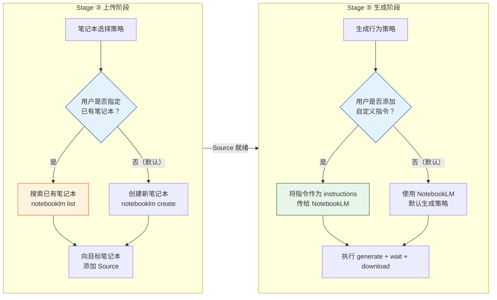
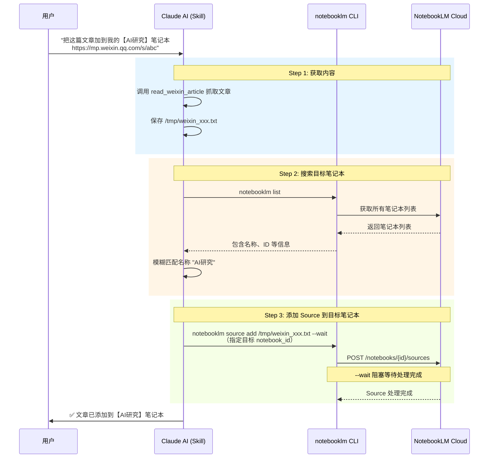
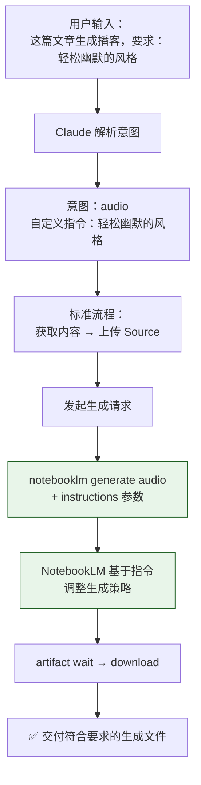

默认情况下，anything-to-notebooklm Skill 每次处理用户请求时都会创建一个**全新的 Notebook（笔记本）**，将内容作为独立 Source 上传后执行生成。这种"一请求一笔记本"的模式保证了任务间的隔离性，但在实际使用中，你往往需要更精细的控制——比如将多篇文章**累积到同一个笔记本**中以便交叉分析，或者对生成结果施加**特定的风格要求**。本页深入解析 Skill 的两项高级能力：**指定已有笔记本**和**自定义生成指令**，它们分别从笔记本容器层面和生成行为层面赋予用户更大的定制空间。

Sources: [SKILL.md](SKILL.md#L472-L494)

## 两项自定义能力的定位

在阅读具体实现之前，先通过下面的关系图理解这两项能力在整个 Skill 工作流中的定位——它们分别作用于**上传阶段**（笔记本选择）和**生成阶段**（指令注入），互不干扰却可以叠加使用：



上图揭示了两个关键设计决策：**笔记本选择**影响的是内容上传的目标容器，而**生成指令**影响的是 NotebookLM 的输出行为。两者可以独立使用，也可以组合使用。

Sources: [SKILL.md](SKILL.md#L198-L237), [SKILL.md](SKILL.md#L472-L494)

## 自定义 Notebook：将内容添加到已有笔记本

### 为什么需要指定已有笔记本

默认行为下，每次用户请求都会触发 `notebooklm create "{title}"` 创建一个全新的笔记本容器。这在单次使用场景下没问题，但以下场景会暴露其局限性：

| 场景 | 默认行为的问题 | 指定已有笔记本的解决方案 |
|------|--------------|----------------------|
| **知识库累积** | 每篇文章分散在独立笔记本中，无法交叉引用 | 所有相关文章集中到同一笔记本，NotebookLM 可基于全部 Sources 综合分析 |
| **增量学习** | 新文章无法利用之前上传的上下文 | 新内容作为额外 Source 加入，与已有内容形成关联 |
| **主题研究** | 多篇相关文章各自为政 | 统一笔记本下的多 Source 生成结果更全面、更有深度 |

核心价值在于：NotebookLM 的生成质量与**笔记本中 Source 的丰富度**直接相关——当同一个笔记本包含多篇相关内容时，生成的播客、PPT、报告等能够综合引用所有 Source 的信息，而非仅基于单篇文章。

Sources: [SKILL.md](SKILL.md#L472-L484)

### 触发方式与识别机制

指定已有笔记本的触发方式完全基于**自然语言**，用户只需在指令中用【】括号标注笔记本名称：

```
把这篇文章加到我的【AI研究】笔记本 https://mp.weixin.qq.com/s/abc123
```

Claude 会从这条自然语言指令中解析出两个关键信息：一是内容源（微信文章链接），二是目标笔记本名称（"AI研究"）。笔记本名称的识别规则是提取 **【】** 括号内的文本——这种语法在中文语境下自然且醒目，不会与正常表述混淆。

Sources: [SKILL.md](SKILL.md#L476-L479), [README.md](README.md#L278-L282)

### 执行流程：搜索 → 匹配 → 添加

当 Claude 识别到用户指定了目标笔记本名称后，Skill 的执行流程会从默认的"创建新笔记本"变为"搜索已有笔记本"。完整的流程如下：



**Step 1：内容获取**。与标准流程一致——根据内容源类型调用对应的获取路径（MCP 抓取、markitdown 转换、URL 直接传递等），将内容准备为可上传的文件或 URL。

**Step 2：笔记本搜索与匹配**。Skill 调用 `notebooklm list` 获取用户账户下所有笔记本的列表，然后在返回结果中**模糊匹配**用户指定的笔记本名称。"AI研究"会匹配到名为"AI研究笔记"、"AI研究报告"或完全同名的笔记本。这种模糊匹配降低了用户记忆精确名称的负担。

**Step 3：向目标笔记本添加 Source**。匹配成功后，Skill 跳过 `notebooklm create` 步骤，直接调用 `notebooklm source add <file_or_url> --wait` 将新内容添加到目标笔记本中。`--wait` 参数依然生效，确保 Source 处理完成后才进入后续步骤。

Sources: [SKILL.md](SKILL.md#L472-L484), [SKILL.md](SKILL.md#L82-L87)

### 笔记本不存在时的降级策略

如果 `notebooklm list` 返回的笔记本列表中找不到与"AI研究"匹配的名称，Claude 的默认行为是**询问用户是否需要创建**一个名为"AI研究"的新笔记本。这种优雅降级避免了命令直接失败，同时保持了用户意图的一致性。用户确认后，流程回到标准的 `notebooklm create` 路径。

Sources: [SKILL.md](SKILL.md#L472-L484)

### 在已有笔记本中生成内容

添加 Source 到已有笔记本后，如果用户同时指定了生成意图（如"加到笔记本并生成播客"），生成命令会基于该笔记本中**所有 Sources** 的内容执行——不仅仅是刚添加的那一篇。这意味着 NotebookLM 会综合笔记本中已有的全部内容进行生成分析，产出结果更具上下文深度。

| 操作模式 | 命令序列 | 生成内容的基础 |
|---------|---------|-------------|
| 默认（新建笔记本） | `create` → `source add` → `generate` | 仅本次上传的内容 |
| 指定已有笔记本 | `list` → `source add` → `generate` | 笔记本中所有 Sources 的内容 |

Sources: [SKILL.md](SKILL.md#L480-L484)

## 自定义生成指令：为输出结果注入个性化要求

### 机制概述

自定义生成指令允许用户在指定生成意图的同时，附加**具体的风格、格式、长度等要求**。这些要求会被 Skill 转换为 `instructions` 参数，传递给 NotebookLM 的生成引擎，从而影响最终输出的内容特征。

```
这篇文章生成播客，要求：轻松幽默的风格，时长控制在5分钟
```

在这条指令中，Claude 解析出：生成意图为 `audio`（播客），自定义要求为"轻松幽默的风格，时长控制在5分钟"。Skill 会将后者作为 instructions 传给 NotebookLM。

Sources: [SKILL.md](SKILL.md#L486-L494)

### 指令注入的执行流程



关键步骤在于 `generate` 命令发起时，Skill 会将用户提出的自定义要求以 **instructions** 的形式附加到请求中。NotebookLM 的生成引擎会参考这些 instructions 来调整输出的语言风格、内容深度、结构安排等维度。

Sources: [SKILL.md](SKILL.md#L486-L494)

### 常见的自定义指令维度

下表总结了用户可以在自然语言中指定的常见指令维度，以及它们对不同生成类型的影响：

| 指令维度 | 自然语言示例 | 适用生成类型 | 效果说明 |
|---------|------------|-----------|---------|
| **语言风格** | "轻松幽默"、"严肃专业"、"口语化" | 全部类型 | 影响 NotebookLM 生成内容的措辞和语调 |
| **时长/篇幅** | "控制在5分钟"、"精简到10页" | audio、video、report | 直接约束输出产物的长度 |
| **目标受众** | "适合初学者"、"面向技术人员" | 全部类型 | NotebookLM 会调整内容的深度和专业术语使用 |
| **重点方向** | "侧重技术实现"、"聚焦商业价值" | 全部类型 | 生成内容会在指定方向上分配更多篇幅 |
| **格式要求** | "用表格呈现"、"多举例" | report、quiz | 影响输出的结构化程度和示例密度 |
| **语言偏好** | "用英文输出"、"中英混合" | 全部类型 | 控制生成内容的语言选择 |

这些维度可以自由组合。例如，你可以同时指定"轻松幽默的风格，适合初学者，控制在5分钟"——Skill 会将完整的复合指令一并传给 NotebookLM。

Sources: [SKILL.md](SKILL.md#L486-L494)

## 实战示例：两项能力叠加使用

指定已有笔记本和自定义生成指令这两项能力可以**叠加使用**，实现高度个性化的工作流。以下是三个典型的组合场景：

### 示例 1：向已有笔记本添加内容并自定义生成

**用户输入**：
```
把这篇文章加到我的【AI研究】笔记本，生成播客，要求：专业严谨的风格，重点讨论技术细节
https://mp.weixin.qq.com/s/abc123
```

**执行过程**：
1. MCP 工具抓取微信文章内容 → 保存 TXT
2. `notebooklm list` → 搜索名为"AI研究"的笔记本 → 匹配到 `notebook_id`
3. `notebooklm source add /tmp/weixin_xxx.txt --wait` → 添加到已有笔记本
4. `notebooklm generate audio` + instructions（"专业严谨的风格，重点讨论技术细节"）→ `artifact wait` → `download audio`
5. 生成的播客基于"AI研究"笔记本中**所有 Sources** 的内容，风格为专业严谨

Sources: [SKILL.md](SKILL.md#L472-L494)

### 示例 2：增量构建主题知识库

**用户输入**：
```
把这份PDF也加到【产品设计】笔记本 /Users/joe/ux_research.pdf
```

**执行过程**：
1. markitdown 转换 PDF 为 TXT
2. `notebooklm list` → 匹配"产品设计"笔记本
3. `notebooklm source add /tmp/ux_research_converted_xxx.txt --wait` → 添加为新的 Source
4. 不执行生成操作（用户未指定生成意图），等待后续指令

这种**累积式**使用模式特别适合长期研究项目——每次发现新资料就添加到同一笔记本中，最终在需要时一次性生成综合性的报告或演示。

Sources: [SKILL.md](SKILL.md#L472-L484)

### 示例 3：自定义指令 + 多意图组合

**用户输入**：
```
把这几个视频加到【机器学习】笔记本，生成报告和PPT，报告要学术风格，PPT要简洁
- https://youtube.com/watch?v=abc
- https://youtube.com/watch?v=def
```

**执行过程**：
1. 两个 YouTube URL 直接传递给 NotebookLM（无需中间转换）
2. `notebooklm list` → 匹配"机器学习"笔记本
3. 依次 `source add` 两个 URL → 等待处理
4. `generate report` + instructions（"学术风格"）→ 下载报告
5. `generate slide-deck` + instructions（"简洁"）→ 下载 PPT

这个示例同时运用了本页的**两项自定义能力**（指定已有笔记本 + 自定义生成指令）和 [多意图处理：一次性生成多种格式](22-duo-yi-tu-chu-li-ci-xing-sheng-cheng-duo-chong-ge-shi) 的能力，展示了 Skill 高级功能的组合潜力。

Sources: [SKILL.md](SKILL.md#L472-L494)

## 注意事项与最佳实践

### 笔记本名称匹配的精确性

`notebooklm list` 返回的是用户账户下的**全部笔记本列表**。Claude 使用模糊匹配来定位目标笔记本，但如果存在多个名称相似的笔记本（如"AI研究"和"AI研究笔记"），可能导致匹配歧义。建议在指定笔记本名称时尽量使用**完整的精确名称**，避免歧义。

### 自定义指令的有效性边界

自定义生成指令通过 instructions 参数传递给 NotebookLM，但 NotebookLM 对 instructions 的**遵从程度并非 100%**——它更像是一个"强烈建议"而非"严格约束"。例如，"时长控制在5分钟"是一个参考值，实际播客时长可能在 4-7 分钟之间浮动。对于精确度要求极高的场景，建议将生成结果下载后做二次编辑。

### 已有笔记本的 Source 数量限制

NotebookLM 对单个笔记本中的 Source 数量有上限（具体限制以 Google 官方文档为准）。在长期使用"指定已有笔记本"功能持续添加内容时，应留意笔记本中的 Source 总数，避免触及限制导致添加失败。

Sources: [SKILL.md](SKILL.md#L496-L522)

## 延伸阅读

- [NotebookLM 上传与内容生成流程](8-notebooklm-shang-chuan-yu-nei-rong-sheng-cheng-liu-cheng)——理解默认的上传与生成管线，是掌握自定义能力的基础
- [多意图处理：一次性生成多种格式](22-duo-yi-tu-chu-li-ci-xing-sheng-cheng-duo-chong-ge-shi)——与自定义生成指令叠加使用，实现更灵活的输出控制
- [多源内容混合整合](24-duo-yuan-nei-rong-hun-he-zheng-he)——多源内容与指定已有笔记本的组合，构建综合性知识库
- [频率限制、内容长度约束与文件清理策略](26-pin-lu-xian-zhi-nei-rong-chang-du-yue-shu-yu-wen-jian-qing-li-ce-lue)——了解系统各项限制，合理规划自定义 Notebook 的使用节奏