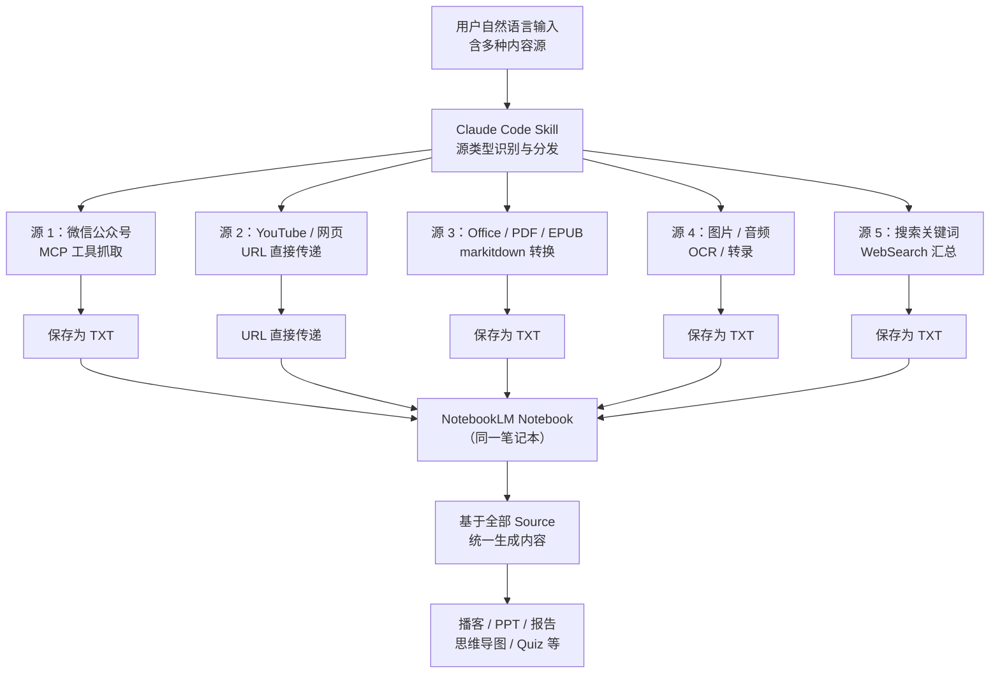
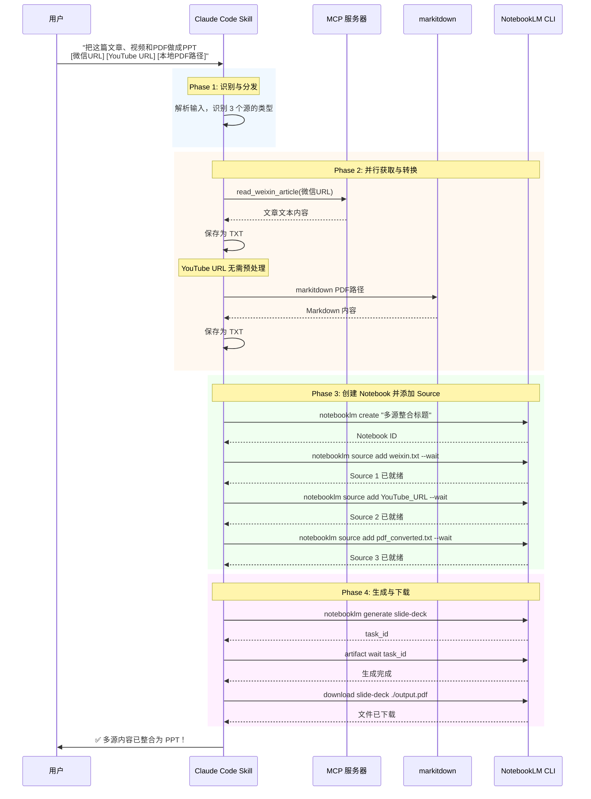

**多源内容混合整合** 是 anything-to-notebooklm Skill 的一项核心高级能力——它允许用户在一条自然语言指令中同时指定多种不同类型的内容源（网页、视频、本地文件、搜索结果等），系统自动识别每个源的类型、分别执行对应的内容获取与转换流程，最终将所有内容汇聚到同一个 NotebookLM Notebook 中，作为一个统一的上下文进行生成。本文将深入解析这一能力的运作机制、技术架构、典型使用模式及实践注意事项。

Sources: [SKILL.md](SKILL.md#L118-L119), [README.md](README.md#L222-L228)

## 核心概念：为什么需要多源混合

在实际知识工作场景中，单一内容源往往无法提供完整的视角。用户可能需要将一篇微信公众号文章的观点、一个 YouTube 视频的演示、一份本地 PDF 的研究数据和一组搜索关键词的最新资讯融合在一起，生成一份综合性报告或演示文稿。多源混合整合正是解决这一需求的设计——它将 **NotebookLM Notebook 作为内容汇聚容器**，不同类型的源经过各自的获取与转换管线后，以 NotebookLM Source 的形式被添加到同一个 Notebook 中。NotebookLM 的 AI 引擎随后基于所有 Source 的联合上下文进行内容生成，从而实现真正的跨源信息整合。

Sources: [SKILL.md](SKILL.md#L323-L351), [README.md](README.md#L172-L187)

## 多源混合的数据流架构

下图展示了多源混合整合的完整数据流。可以看到，每类内容源拥有独立的获取与转换路径，但最终都汇聚到同一个 NotebookLM Notebook：



核心设计要点在于：**每种源类型走各自最优的处理管线**，但最终产物统一进入同一个 Notebook。NotebookLM 的 AI 引擎天然具备多 Source 联合理解能力，这为跨源整合提供了底层支撑。

Sources: [SKILL.md](SKILL.md#L139-L207), [README.md](README.md#L238-L274)

## 源类型处理路径对照

下表汇总了多源混合场景中各类内容源的处理方式差异，理解这些差异有助于合理组织混合输入：

| 内容源类型 | 识别特征 | 获取方式 | 转换方式 | 传递给 NotebookLM 的形式 |
|-----------|---------|---------|---------|----------------------|
| 微信公众号 | `mp.weixin.qq.com` 前缀 | MCP 服务器 `read_weixin_article` | 原文 → TXT | 本地 TXT 文件上传 |
| YouTube 视频 | `youtube.com` / `youtu.be` 域名 | URL 直接传递 | NotebookLM 自动提取字幕 | URL 直接添加 |
| 任意网页 | `https://` / `http://` 前缀 | URL 直接传递 | NotebookLM 自动抓取 | URL 直接添加 |
| PDF / EPUB / DOCX / PPTX / XLSX | 本地文件路径 + 对应扩展名 | 本地文件读取 | `markitdown` 转 Markdown → TXT | 本地 TXT 文件上传 |
| Markdown | 本地文件路径 + `.md` 扩展名 | 本地文件读取 | 无需转换 | 本地 `.md` 文件直接上传 |
| 图片 (JPEG/PNG/GIF/WebP) | 本地文件路径 + 图片扩展名 | 本地文件读取 | `markitdown` OCR | 本地 TXT 文件上传 |
| 音频 (WAV/MP3) | 本地文件路径 + 音频扩展名 | 本地文件读取 | `markitdown` 语音转录 | 本地 TXT 文件上传 |
| ZIP 压缩包 | 本地文件路径 + `.zip` 扩展名 | 解压 → 遍历内部文件 | `markitdown` 批量转换 | 合并为单个或多个 TXT |
| 搜索关键词 | 无 URL、无文件路径的纯文本 | WebSearch 搜索 | 汇总前 3-5 条结果 → TXT | 本地 TXT 文件上传 |
| 纯文本 | 用户直接粘贴的文字 | 直接获取 | 无需转换 | 保存为 TXT 后上传 |

从表中可以归纳出三个关键模式：**URL 类源**（网页、YouTube）直接以 URL 形式添加到 NotebookLM，无需本地中转；**文档类源**（Office、PDF、EPUB）通过 `markitdown` 转换为 TXT 后上传；**文本提取类源**（图片 OCR、音频转录、搜索汇总）同样转换为 TXT。这些路径在多源混合时会并行执行。

Sources: [SKILL.md](SKILL.md#L139-L197), [SKILL.md](SKILL.md#L12-L53)

## 多源混合的执行时序

多源混合并非简单的并行处理，而是遵循一个精确的时序逻辑。以下流程图展示了一个典型的多源混合执行的完整时序：



**时序中的关键约束**：每个 Source 添加后必须调用 `--wait` 参数等待处理完成，再添加下一个 Source 或触发生成。这是因为 NotebookLM 需要对每个上传的源进行解析和索引，如果在前一个 Source 尚未就绪时发起生成，会导致生成结果不完整或失败。

Sources: [SKILL.md](SKILL.md#L200-L207), [SKILL.md](SKILL.md#L222-L238)

## 混合整合的具体示例

### 示例 1：三源混合 → PPT

这是 SKILL.md 中定义的典型多源混合场景。用户将三种完全不同类型的内容源——网页文章、YouTube 视频和本地 PDF——整合为一个 PPT：

**用户输入**：
```
把这篇文章、这个视频和这个PDF一起做成PPT：
- https://example.com/article
- https://youtube.com/watch?v=xyz
- /Users/joe/Documents/research.pdf
```

**系统执行流程**：
1. 创建新 Notebook（`notebooklm create`）
2. 添加 Source 1：网页 URL 直接传递（`notebooklm source add https://example.com/article --wait`）
3. 添加 Source 2：YouTube URL 直接传递（`notebooklm source add https://youtube.com/watch?v=xyz --wait`）
4. 添加 Source 3：PDF 经 markitdown 转换为 TXT 后上传（`markitdown` → TXT → `notebooklm source add /tmp/research_converted.txt --wait`）
5. 基于全部 3 个 Source 生成 PPT（`notebooklm generate slide-deck`）
6. 等待生成完成并下载

**预期输出**：
```
✅ 多源内容已整合为PPT！

📚 内容源：
  1. 网页文章：AI in 2026
  2. YouTube：Future of AI
  3. PDF：Research Notes (12 页)

📊 PPT 已生成：
📁 文件：/tmp/multi_source_slides.pdf
📄 页数：25 页
📦 大小：3.8 MB
```

Sources: [SKILL.md](SKILL.md#L323-L351)

### 示例 2：搜索 + 文件 → 报告

用户可以将搜索到的最新资讯与本地已有的研究材料结合，生成综合报告：

**用户输入**：
```
搜索"量子计算最新进展"，结合我的笔记 /Users/joe/quantum_notes.md，生成一份报告
```

**执行逻辑**：
1. 识别两个源：搜索关键词 + 本地 Markdown 文件
2. 执行 WebSearch 搜索关键词，汇总前 3-5 条结果并保存为 TXT
3. 本地 Markdown 文件直接可上传
4. 创建 Notebook，依次添加两个 Source
5. 生成报告（`generate report`）并下载

### 示例 3：微信文章 + YouTube + 图片 → 播客

```
帮我做一个播客，综合这些内容：
- https://mp.weixin.qq.com/s/abc123（深度学习综述）
- https://youtube.com/watch?v=xyz（技术讲解视频）
- /Users/joe/diagram.png（架构图）
```

此示例中三种源分别走 MCP 抓取、URL 直接传递和 OCR 识别三条不同的处理管线，最终汇聚到同一个 Notebook 中生成音频播客。

Sources: [SKILL.md](SKILL.md#L323-L351), [SKILL.md](SKILL.md#L159-L197)

## 混合整合与自定义 Notebook 的协同

多源混合整合能力与[自定义 Notebook](23-zi-ding-yi-notebook-zhi-ding-yi-you-bi-ji-ben-huo-tian-jia-zi-ding-yi-sheng-cheng-zhi-ling) 功能自然协同。用户可以指定一个已有的 Notebook 作为混合整合的目标容器，将新的内容源添加到其中已有的 Source 集合中，从而实现知识的持续积累和交叉引用：

```
把这些内容加到我的【AI研究】笔记本里，然后生成报告：
- https://mp.weixin.qq.com/s/new_article
- /Users/joe/ai_paper.pdf
```

系统会执行：搜索名为"AI研究"的 Notebook → 将新内容作为新 Source 添加到该 Notebook → 基于原有 Source + 新 Source 的联合上下文生成报告。

Sources: [SKILL.md](SKILL.md#L473-L485)

## 混合整合的约束与最佳实践

### 内容总量约束

NotebookLM 对每个 Notebook 的内容总量有上限约束。在多源混合时需要注意以下限制：

| 约束维度 | 限制范围 | 影响 |
|---------|---------|------|
| 单个 Source 最短 | < 500 字可能效果不佳 | OCR 识别的图片文字可能过短 |
| 单个 Source 最长 | > 50 万字可能超限 | 大型 EPUB 电子书需注意 |
| 推荐单 Source 长度 | 1,000 - 10,000 字 | 生成效果最佳区间 |
| Notebook 生成并发 | 最多 3 个同时进行 | 多源混合后避免同时生成多种格式 |
| Source 添加间隔 | 每个 Source 需 `--wait` 完成后再添加下一个 | 避免生成结果不完整 |

### 频率与时间考虑

多源混合涉及多次网络请求和文件处理，需要注意以下时间因素：

- **每个 Source 的获取与上传**：微信 MCP 抓取约 5-15 秒，markitdown 转换约 2-10 秒，NotebookLM Source 处理约 10-30 秒
- **N 个源的混合总耗时**：大约是 `N × 单源处理时间 + 生成时间`，呈线性增长
- **频率限制**：微信 MCP 请求间隔建议 > 2 秒，避免被反爬虫机制封禁
- **生成等待时间**：播客 2-5 分钟、PPT 1-3 分钟、思维导图 1-2 分钟、报告 2-4 分钟

### 临时文件管理

多源混合会产生多个临时文件（TXT、PDF 等），所有临时文件保存在 `/tmp/` 目录中。建议在全部处理完成后执行清理：

```bash
rm /tmp/*.txt    # 删除所有临时 TXT 文件
rm /tmp/*.pdf    # 删除所有临时 PDF 文件
rm /tmp/*.json   # 删除所有临时 JSON 文件
```

Sources: [SKILL.md](SKILL.md#L496-L522), [SKILL.md](SKILL.md#L210-L216)

## 多源混合与多意图处理的组合

多源混合整合可以与[多意图处理](22-duo-yi-tu-chu-li-ci-xing-sheng-cheng-duo-chong-ge-shi)功能叠加使用。用户既可以在一条指令中指定多个内容源，也可以同时指定多个生成意图：

```
把这些内容上传，同时生成播客和PPT：
- https://mp.weixin.qq.com/s/abc123
- /Users/joe/report.pdf
```

系统执行顺序为：① 获取并转换所有源 → ② 添加到同一 Notebook → ③ 依次执行每个生成意图（先生成播客，再生成 PPT）。需要注意的是，生成意图的执行是串行的（每个意图需要等待前一个完成），且受 NotebookLM 并发限制（最多 3 个同时进行）的约束。

Sources: [SKILL.md](SKILL.md#L461-L471), [SKILL.md](SKILL.md#L496-L501)

## 扩展阅读

- [内容源智能识别：URL 与文件类型自动判断机制](6-nei-rong-yuan-zhi-neng-shi-bie-url-yu-wen-jian-lei-xing-zi-dong-pan-duan-ji-zhi)——深入理解每种源类型的识别规则
- [内容获取与转换：MCP 抓取、markitdown 转换与直接传递](7-nei-rong-huo-qu-yu-zhuan-huan-mcp-zhua-qu-markitdown-zhuan-huan-yu-zhi-jie-chuan-di)——各处理管线的详细技术实现
- [多意图处理：一次性生成多种格式](22-duo-yi-tu-chu-li-ci-xing-sheng-cheng-duo-chong-ge-shi)——多生成意图的串行执行逻辑
- [自定义 Notebook：指定已有笔记本或添加自定义生成指令](23-zi-ding-yi-notebook-zhi-ding-yi-you-bi-ji-ben-huo-tian-jia-zi-ding-yi-sheng-cheng-zhi-ling)——与已有 Notebook 协同使用
- [频率限制、内容长度约束与文件清理策略](26-pin-lv-xian-zhi-nei-rong-chang-du-yue-shu-yu-wen-jian-qing-li-ce-lue)——混合整合的边界条件与资源管理