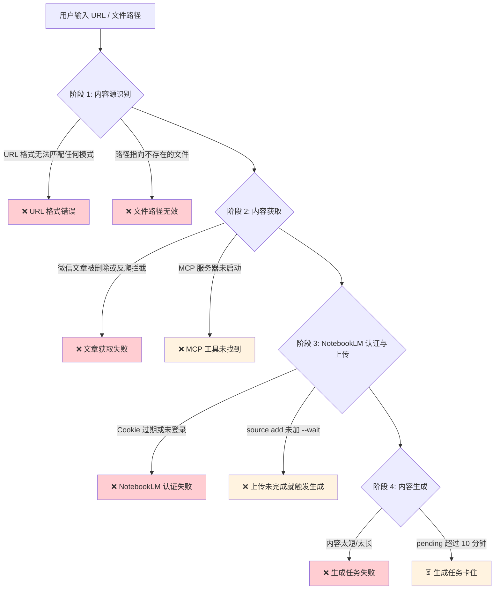
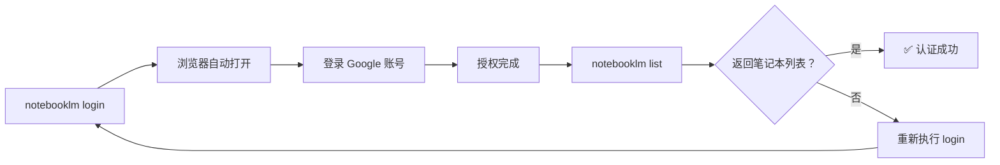
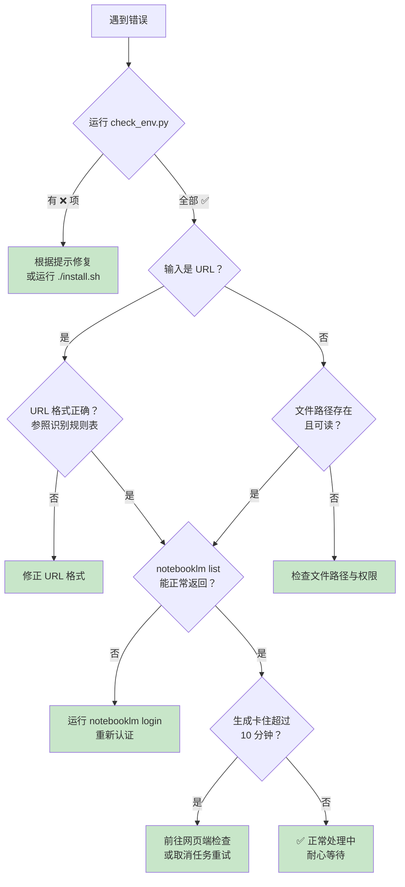

在使用 anything-to-notebooklm 的完整工作流中，错误可能出现在**内容识别**、**内容获取**、**NotebookLM 认证与上传**、以及**内容生成**四个阶段。本文档系统梳理了每个阶段的典型错误表现、根因分析及操作步骤，帮助你快速定位并解决问题。建议先运行 `check_env.py` 做一轮环境基线检查，再根据具体错误类型查阅对应章节。

Sources: [SKILL.md](SKILL.md#L405-L457), [check_env.py](check_env.py#L132-L215)

## 错误全景图：四阶段诊断流程

下面这张流程图展示了从输入到生成的完整链路中，错误可能出现的**四个关键节点**。当你遇到问题时，先确定错误发生在哪个阶段，然后跳转到对应章节。



Sources: [SKILL.md](SKILL.md#L139-L207), [SKILL.md](SKILL.md#L552-L597)

## 阶段 1：URL 格式与文件路径错误

### URL 格式不正确

Skill 通过 URL 前缀模式来自动识别内容源类型。如果你提供的 URL 不符合任何已知模式，系统将无法判断如何处理。

**触发场景**：输入的 URL 既不是微信公众号链接，也不是 YouTube 链接或普通网页链接，可能是拼写错误或复制不完整。

**系统报错示例**：

```
❌ 错误：URL 格式不正确

必须是微信公众号文章链接：
https://mp.weixin.qq.com/s/xxx

你提供的链接：https://example.com
```

**解决方法**：对照下表检查你的 URL 是否匹配正确的模式。

| 内容源类型 | 正确的 URL 格式 | 常见错误示例 |
|-----------|---------------|------------|
| 微信公众号 | `https://mp.weixin.qq.com/s/xxxxx` 或 `https://mp.weixin.qq.com/s?xxxxx` | `https://weixin.qq.com/s/xxx`（缺少 `mp.` 前缀） |
| YouTube 视频 | `https://www.youtube.com/watch?v=xxxxx` 或 `https://youtu.be/xxxxx` | `https://youtube.com/xxx`（缺少 `watch?v=`） |
| 任意网页 | `https://example.com/article` 或 `http://example.com` | `example.com/article`（缺少 `https://` 协议头） |

对于非微信、非 YouTube 的**普通网页 URL**，系统会直接传递给 NotebookLM 处理。这类 URL 不需要特殊格式，但必须包含 `http://` 或 `https://` 协议头。如果你输入的是纯文本关键词（无 URL、无文件路径），系统会将其识别为**搜索查询**，通过 WebSearch 工具汇总信息。

Sources: [SKILL.md](SKILL.md#L407-L415), [SKILL.md](SKILL.md#L139-L158)

### 文件路径无效

当输入指向本地文件时，Skill 使用 markitdown 进行格式转换。如果文件路径不存在或权限不足，处理会直接失败。

**检查方法**：

```bash
# 确认文件存在且可读
ls -la /path/to/your/file.pdf

# 快速测试文件可读性
cat /path/to/your/file.pdf > /dev/null && echo "文件可读" || echo "文件不可读"
```

**常见原因与对策**：

| 错误现象 | 可能原因 | 解决方法 |
|---------|---------|---------|
| `No such file or directory` | 路径拼写错误，或文件被移动/删除 | 使用 `ls` 确认实际路径 |
| `Permission denied` | 文件权限不足 | 运行 `chmod +r /path/to/file` |
| 路径含空格未转义 | Shell 解析错误 | 用引号包裹路径：`"/path/my file.pdf"` |

Sources: [SKILL.md](SKILL.md#L148-L158), [SKILL.md](SKILL.md#L579-L587)

## 阶段 2：内容获取失败

### 微信文章获取失败

微信文章通过 MCP 服务器中的 Playwright 浏览器模拟来抓取内容。这个环节受微信反爬虫机制、文章状态和网络环境影响较大。

**系统报错示例**：

```
❌ 错误：无法获取文章内容

可能原因：
1. 文章已被删除
2. 文章需要登录查看（暂不支持）
3. 网络连接问题
4. 微信反爬虫拦截（请稍后重试）

建议：
- 检查链接是否正确
- 等待 2-3 秒后重试
- 或手动复制文章内容
```

**排查步骤**：

1. **验证文章是否存在**：在浏览器中直接打开该微信文章链接，确认文章未被删除或设为私密。
2. **检查 MCP 服务器是否正常**：

```bash
# 测试 MCP 服务器能否启动
python ~/.claude/skills/anything-to-notebooklm/wexin-read-mcp/src/server.py
```

3. **检查 Playwright 浏览器是否已安装**：

```bash
# 安装 Chromium 浏览器（首次安装或更新后需要执行）
playwright install chromium
```

4. **频率限制**：微信对频繁请求会触发反爬虫拦截。确保**每次请求间隔 > 2 秒**，如果被拦截，等待几分钟后重试。

如果以上步骤均无效，可以手动复制文章正文内容，以**纯文本方式**直接提供给 Skill 处理。

Sources: [SKILL.md](SKILL.md#L417-L431), [SKILL.md](SKILL.md#L552-L564)

### MCP 工具未找到

当 Skill 尝试调用 `read_weixin_article` 或 `save_weixin_article_to_pdf` 工具但找不到时，说明 MCP 服务器配置有问题。

**排查清单**：

| 检查项 | 操作命令 | 预期结果 |
|-------|---------|---------|
| MCP 服务器文件是否存在 | `ls ~/.claude/skills/anything-to-notebooklm/wexin-read-mcp/src/server.py` | 文件存在 |
| Claude 配置文件是否包含配置 | `cat ~/.claude/config.json` | 包含 `weixin-reader` 条目 |
| MCP 依赖是否已安装 | `pip list \| grep -E "fastmcp\|playwright\|beautifulsoup4"` | 三个包均已列出 |
| Claude Code 是否已重启 | 修改配置后必须重启 | 已重启 |

如果 MCP 服务器文件不存在，说明安装不完整，需要重新运行安装脚本：

```bash
cd ~/.claude/skills/anything-to-notebooklm
./install.sh
```

安装完成后，按照输出提示编辑 `~/.claude/config.json` 添加 MCP 配置，然后**重启 Claude Code**。

Sources: [SKILL.md](SKILL.md#L552-L564), [install.sh](install.sh#L105-L143), [check_env.py](check_env.py#L75-L107)

## 阶段 3：NotebookLM 认证失败

### 认证过期或未登录

NotebookLM CLI 使用浏览器 Cookie 进行身份认证。Cookie 会随时间过期，首次使用前也必须手动登录。

**系统报错示例**：

```
❌ 错误：NotebookLM 认证失败

请运行以下命令重新登录：
  notebooklm login

然后验证：
  notebooklm list
```

**修复流程**：



**详细步骤**：

1. 运行 `notebooklm login`，系统会自动打开浏览器到 Google 登录页面。
2. 使用你的 Google 账号登录并授权。
3. 登录成功后回到终端，运行 `notebooklm list` 验证。
4. 如果 `list` 命令成功返回笔记本列表，说明认证正常。

**常见问题**：

| 现象 | 原因 | 解决方案 |
|-----|------|---------|
| `notebooklm` 命令未找到 | CLI 工具未安装 | `pip3 install git+https://github.com/monkeychen/notebooklm-py.git` |
| 浏览器未自动打开 | 系统默认浏览器设置问题 | 手动复制终端中显示的 URL 到浏览器 |
| 登录后 `list` 仍报错 | Cookie 保存失败 | 删除旧 Cookie 后重新 `login` |
| 认证检查超时 | 网络连接 Google 受限 | 检查网络代理设置 |

Sources: [SKILL.md](SKILL.md#L433-L442), [SKILL.md](SKILL.md#L80-L87), [SKILL.md](SKILL.md#L566-L577), [check_env.py](check_env.py#L109-L131)

### source add 后未等待完成

这是一个隐蔽但常见的错误。上传文件到 NotebookLM 后，如果**不等待处理完成**就立即触发生成任务，后续生成会失败。

**正确做法**：在 `source add` 命令中添加 `--wait` 参数：

```bash
# ✅ 正确：等待上传处理完成
notebooklm source add /tmp/weixin_article.txt --wait

# ❌ 错误：不等待就进入下一步
notebooklm source add /tmp/weixin_article.txt
# 紧接着执行 generate...
```

Sources: [SKILL.md](SKILL.md#L200-L207)

## 阶段 4：生成任务失败与卡住

### 生成任务失败

NotebookLM 的生成任务（播客、PPT、思维导图等）对**内容长度**有要求，过短或过长都会导致失败。

**系统报错示例**：

```
❌ 错误：播客生成失败

可能原因：
1. 文章内容太短（< 100 字）
2. 文章内容太长（> 50万字）
3. NotebookLM 服务异常

建议：
- 检查文章长度是否适中
- 稍后重试
- 或尝试其他格式（如生成报告）
```

**内容长度与生成效果对照表**：

| 内容字数 | 生成状态 | 说明 |
|---------|---------|------|
| < 100 字 | ❌ 通常失败 | 内容不足，无法生成有意义的结果 |
| 100 - 500 字 | ⚠️ 可能效果不佳 | 内容偏少，生成质量受限 |
| 500 - 10,000 字 | ✅ 推荐范围 | 微信文章通常在此范围，生成效果最佳 |
| 10,000 - 50,000 字 | ✅ 可用，时间更长 | 长文需要更长生成时间 |
| > 500,000 字 | ❌ 通常失败 | 超出 NotebookLM 处理能力 |

**各格式生成耗时参考**：

| 输出格式 | 典型耗时 | 生成失败时的替代方案 |
|---------|---------|------------------|
| 播客（audio） | 2-5 分钟 | 改用 `generate report` 生成文字报告 |
| PPT（slide-deck） | 1-3 分钟 | 改用 `generate mind-map` 生成思维导图 |
| 思维导图（mind-map） | 1-2 分钟 | 检查内容是否过短 |
| 视频（video） | 3-8 分钟 | 改用 `generate audio` 生成播客 |
| 报告（report） | 2-4 分钟 | 检查内容长度 |

Sources: [SKILL.md](SKILL.md#L444-L457), [SKILL.md](SKILL.md#L496-L523)

### 生成任务卡住

生成任务进入 `pending` 状态后，正常情况下应在几分钟内完成。如果等待超过 10 分钟仍无进展，说明任务可能卡住了。

**诊断命令**：

```bash
# 查看当前所有生成任务的状态
notebooklm artifact list
```

**任务状态解读**：

| 状态值 | 含义 | 建议操作 |
|-------|------|---------|
| `pending` | 排队中或处理中 | 正常，继续等待（通常 < 5 分钟） |
| `completed` | 生成完成 | 运行 `download` 命令下载文件 |
| `failed` | 生成失败 | 检查内容长度，稍后重试 |
| `pending` 超过 10 分钟 | 可能卡住 | 见下方处理方案 |

**卡住时的处理方案**：

1. **确认是否真的卡住**：有些格式（如视频）正常生成需要 3-8 分钟，耐心等待。
2. **并发限制**：NotebookLM 最多允许 **3 个生成任务同时进行**，超过限制的任务会一直排队。检查是否有其他任务占用了配额。
3. **取消重试**：目前 CLI 不支持取消任务，需要前往 [NotebookLM 网页端](https://notebooklm.google.com/) 手动操作。
4. **服务端异常**：如果所有任务都卡住，可能是 NotebookLM 服务本身出现问题，等待一段时间后重试。

Sources: [SKILL.md](SKILL.md#L589-L597), [SKILL.md](SKILL.md#L498-L501)

## 环境级错误：依赖与配置

### Python 版本不满足

项目要求 **Python 3.9+**。低于此版本的 Python 会导致依赖安装失败或运行时出现兼容性错误。

```bash
# 检查当前 Python 版本
python3 --version

# 如果版本低于 3.9，需要升级 Python
# macOS 推荐：
brew install python@3.12
```

Sources: [check_env.py](check_env.py#L29-L39), [install.sh](install.sh#L24-L36)

### Playwright 浏览器未安装

Playwright 的 Python 包安装后，还需要单独安装 Chromium 浏览器二进制文件。如果只执行了 `pip install playwright` 而没有 `playwright install chromium`，运行时会报错。

```bash
# 安装 Chromium 浏览器（MCP 服务器依赖）
playwright install chromium
```

如果安装 Chromium 失败（网络原因），可以设置镜像源后重试：

```bash
# 使用国内镜像（如适用）
PLAYWRIGHT_DOWNLOAD_HOST=https://npmmirror.com/mirrors/playwright playwright install chromium
```

Sources: [check_env.py](check_env.py#L153-L161), [install.sh](install.sh#L74-L83)

### 环境一键检查

当不确定具体哪里出问题时，运行环境检查脚本可以快速定位：

```bash
python3 check_env.py
```

该脚本会执行 **9 项自动检测**，覆盖 Python 版本、核心依赖（fastmcp、playwright、beautifulsoup4、lxml、markitdown）、Playwright 可导入性、NotebookLM CLI 可用性、markitdown CLI 可用性、Git 命令、MCP 服务器文件、MCP 配置、NotebookLM 认证状态。检测结果分三档：

| 结果 | 含义 | 建议操作 |
|-----|------|---------|
| ✅ 所有检查通过 (9/9) | 环境完整 | 可以正常使用 |
| ⚠️ 大部分通过 (≥7/9) | 有小问题 | 根据警告信息修复具体项 |
| ❌ 检查失败 (<7/9) | 环境不完整 | 运行 `./install.sh` 重新安装 |

Sources: [check_env.py](check_env.py#L132-L215)

## 快速排查清单

当遇到问题时，按以下顺序逐项排查，可以覆盖大多数常见错误：



Sources: [check_env.py](check_env.py#L1-L219), [SKILL.md](SKILL.md#L405-L597)

---

本文档覆盖了从输入识别到内容生成的完整错误链路。如果你的问题不在上述范围内，可以前往 [GitHub Issues](https://github.com/joeseesun/anything-to-notebooklm/issues) 提交反馈。

**相关阅读**：如需了解频率限制与内容长度约束的详细参数，请参阅 [频率限制、内容长度约束与文件清理策略](26-pin-lu-xian-zhi-nei-rong-chang-du-yue-shu-yu-wen-jian-qing-li-ce-lue)；如需排查安装阶段的问题，请参阅 [install.sh 安装流程解析：6 步自动化安装](16-install-sh-an-zhuang-liu-cheng-jie-xi-6-bu-zi-dong-hua-an-zhuang) 和 [check_env.py 环境检查脚本：9 项检测逻辑](18-check_env-py-huan-jing-jian-cha-jiao-ben-9-xiang-jian-ce-luo-ji)。