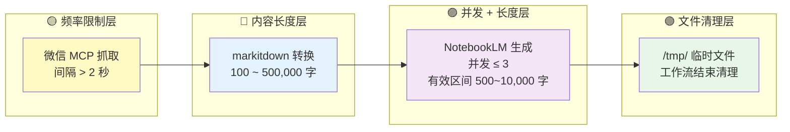
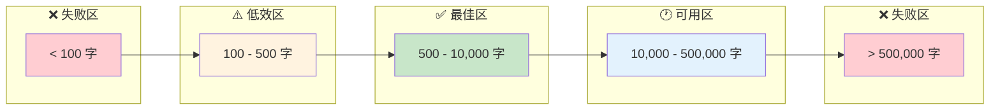

anything-to-notebooklm 的工作流横跨**微信 MCP 抓取**、**本地格式转换**和 **NotebookLM 云端生成**三个异构系统，每个系统各有独立的约束边界。本文档从这三个维度出发，系统阐述频率限制的阈值与规避策略、内容长度的有效区间与生成效果映射、以及临时文件的完整生命周期与清理机制。理解这些约束，是保障工作流稳定运行的前提——如同在三条不同时速的高速公路之间规划出行路线，需要精确掌握每一段的限速、载重和停靠规则。

Sources: [SKILL.md](SKILL.md#L496-L523)

## 三层约束全景图

在深入每个约束维度之前，先通过下图理解整个工作流中**频率、长度、清理**三类约束的分布位置与相互关系。每一层约束以不同颜色标注，帮助你快速定位问题可能发生的位置。



**关键洞察**：频率限制主要作用于**抓取阶段**（防止被封禁），内容长度约束横跨**转换与生成阶段**（影响生成质量），文件清理则作用于整个工作流的**收尾阶段**（释放磁盘空间）。三类约束相互独立但时序串联，任何一个阶段的约束违规都会导致后续阶段无法正常推进。

Sources: [SKILL.md](SKILL.md#L496-L523), [SKILL.md](SKILL.md#L210-L216), [wexin-read-mcp/PRD.md](wexin-read-mcp/PRD.md#L479-L519)

## 频率限制：多层级速率控制

### 微信 MCP 抓取频率

微信公众号的反爬虫机制对高频请求极其敏感。Skill 在 SKILL.md 中明确规定了**每次请求间隔必须大于 2 秒**，否则可能触发微信的频率限制，导致 IP 被临时封禁。这个 2 秒间隔适用于两种 MCP 工具调用场景：`read_weixin_article`（文本抓取）和 `save_weixin_article_to_pdf`（PDF 导出）。

在底层实现中，`WeixinScraper` 类采用**全局单例**模式初始化 Playwright 浏览器实例，这意味着浏览器在整个 MCP 服务器生命周期内保持运行，避免了频繁启动浏览器的开销。每次抓取会创建新的页面（`new_page()`），抓取完成后立即关闭页面（`page.close()`），这一设计既复用了浏览器进程，又避免了页面资源泄漏。

Sources: [SKILL.md](SKILL.md#L498-L500), [wexin-read-mcp/src/scraper.py](wexin-read-mcp/src/scraper.py#L15-L72)

### PRD 中的速率限制设计

虽然当前实际代码未显式实现 Semaphore 并发控制，但 PRD 文档中规划了更完善的速率限制方案，包括**信号量并发控制**（最大 3 个并发请求）和**指数退避重试机制**（2 的幂次方间隔重试，最多 2 次）。这套设计方案为后续版本提供了明确的优化路线图。

| 速率控制策略 | 当前状态 | PRD 规划值 | 适用场景 |
|------------|---------|-----------|---------|
| 请求间隔 | Skill 层建议 > 2 秒 | 同左 | 所有微信文章抓取 |
| 并发控制 | 未实现 | Semaphore(3) | 多篇文章批量抓取 |
| 重试机制 | 未实现 | 指数退避，max_retries=2 | 网络超时或临时封禁 |
| 浏览器复用 | ✅ 已实现全局单例 | 同左 | 所有请求共享浏览器实例 |

Sources: [wexin-read-mcp/PRD.md](wexin-read-mcp/PRD.md#L507-L519), [wexin-read-mcp/PRD.md](wexin-read-mcp/PRD.md#L460-L475), [wexin-read-mcp/src/server.py](wexin-read-mcp/src/server.py#L28-L29)

### NotebookLM 生成并发限制

NotebookLM 的云端生成服务有**最多 3 个任务同时进行**的并发限制。超过限制的生成任务会进入排队状态，表现为 `pending`。当你一次性提交多个生成任务（如同时生成播客和 PPT），或同时处理多篇内容源时，需要注意这个上限。如果第 4 个任务提交后长时间处于 `pending`，很可能是被并发配额阻塞，而非服务异常。

Sources: [SKILL.md](SKILL.md#L498-L501), [SKILL.md](SKILL.md#L589-L597)

### Playwright 超时参数

MCP 服务器中 Playwright 浏览器的超时设置直接影响抓取的成功率与等待体验。以下参数定义了每一层等待的耐心阈值：

| 超时阶段 | 参数 | 阈值 | 说明 |
|---------|------|------|------|
| 页面加载 | `page.goto(..., timeout=30000)` | 30 秒 | 等待网络空闲，微信文章通常 5-10 秒加载完毕 |
| 内容元素 | `wait_for_selector('#js_content', timeout=10000)` | 10 秒 | 等待文章正文 DOM 元素出现 |
| 图片懒加载 | `wait_for_timeout(2000)` | 2 秒 | 滚动到底部后等待图片加载（仅 PDF 模式） |
| PDF 生成 | 无显式超时 | 隐式依赖页面加载 | A4 格式，含背景色，20px 边距 |

Sources: [wexin-read-mcp/src/scraper.py](wexin-read-mcp/src/scraper.py#L53-L57), [wexin-read-mcp/src/scraper.py](wexin-read-mcp/src/scraper.py#L98-L139)

## 内容长度约束：从字数到生成质量

### 五段式长度区间

NotebookLM 对输入内容的长度有明确的上下限。SKILL.md 和 README.md 提供了交叉验证的约束数据，可以归纳为以下五个区间：



| 区间 | 字数范围 | 生成状态 | 典型场景 | 应对建议 |
|------|---------|---------|---------|---------|
| **失败区** | < 100 字 | ❌ 通常直接失败 | 短评、标题、摘要 | 补充上下文或合并多篇内容 |
| **低效区** | 100 - 500 字 | ⚠️ 可能生成但效果不佳 | 微博、短消息、图片 OCR | 建议使用 `report` 而非 `audio` |
| **最佳区** | 500 - 10,000 字 | ✅ 生成效果最佳 | 微信公众号文章（通常 1,000-5,000 字） | 所有格式均适用 |
| **可用区** | 10,000 - 500,000 字 | ✅ 可用，生成时间更长 | 电子书、长篇报告、学术论文 | 播客可能需 5+ 分钟，耐心等待 |
| **失败区** | > 500,000 字 | ❌ 超出处理能力 | 完整书籍合集、巨型数据集 | 分批处理或截取精华部分 |

Sources: [SKILL.md](SKILL.md#L444-L457), [SKILL.md](SKILL.md#L502-L505), [README.md](README.md#L348-L354)

### 不同内容源的典型长度分布

了解各类内容源的输出长度，有助于预判生成效果是否符合预期：

| 内容源 | 处理方式 | 典型输出字数 | 长度区间 |
|-------|---------|------------|---------|
| 微信公众号文章 | MCP 抓取 → TXT | 1,000 - 5,000 字 | ✅ 最佳区 |
| YouTube 视频 | 直接传递 URL | 3,000 - 15,000 字（字幕） | ✅ 最佳区 ~ 可用区 |
| 网页文章 | 直接传递 URL | 500 - 10,000 字 | ✅ 最佳区 |
| Word/PowerPoint | markitdown → TXT | 1,000 - 20,000 字 | ✅ 最佳区 ~ 可用区 |
| PDF 文档 | markitdown → TXT | 2,000 - 100,000 字 | ✅ 最佳区 ~ 可用区 |
| EPUB 电子书 | markitdown → TXT | 50,000 - 200,000 字 | 🕐 可用区 |
| 图片 OCR | markitdown OCR → TXT | 50 - 2,000 字 | ⚠️ 低效区 ~ 最佳区 |
| 音频转录 | markitdown 转录 → TXT | 1,000 - 30,000 字 | ✅ 最佳区 ~ 可用区 |
| 搜索关键词汇总 | WebSearch → TXT | 1,000 - 5,000 字 | ✅ 最佳区 |
| CSV/JSON/XML | markitdown → TXT | 100 - 50,000 字 | 视数据量波动大 |
| ZIP 批量文件 | 解压 → 批量转换 → 合并 | 差异极大 | 需逐文件评估 |

Sources: [SKILL.md](SKILL.md#L159-L196), [SKILL.md](SKILL.md#L502-L505)

### 各格式生成的耗时预期

内容长度不仅影响生成能否成功，还直接影响生成耗时。以下数据基于正常长度的内容源（500 - 10,000 字），超出此范围时耗时会相应增加。

| 输出格式 | 典型耗时 | 命令 | 长文（>10,000 字）耗时预估 |
|---------|---------|------|------------------------|
| 播客（audio） | 2-5 分钟 | `generate audio` | 5-10 分钟 |
| PPT（slide-deck） | 1-3 分钟 | `generate slide-deck` | 3-5 分钟 |
| 思维导图（mind-map） | 1-2 分钟 | `generate mind-map` | 2-4 分钟 |
| Quiz | 1-2 分钟 | `generate quiz` | 2-4 分钟 |
| 闪卡（flashcards） | 1-2 分钟 | `generate flashcards` | 2-3 分钟 |
| 报告（report） | 2-4 分钟 | `generate report` | 4-8 分钟 |
| 视频（video） | 3-8 分钟 | `generate video` | 8-15 分钟 |
| 信息图（infographic） | 2-3 分钟 | `generate infographic` | 3-5 分钟 |

Sources: [SKILL.md](SKILL.md#L222-L232), [SKILL.md](SKILL.md#L512-L517)

## 文件清理策略：临时文件的全生命周期

### 临时文件的生成与存储

Skill 在工作流的各个阶段会在 `/tmp/` 目录下生成不同类型的临时文件。理解这些文件的来源和用途，是制定清理策略的基础。

| 文件类型 | 生成阶段 | 命名规则 | 用途 |
|---------|---------|---------|------|
| TXT 源文件 | 内容获取（Step 2） | `/tmp/weixin_{title}_{timestamp}.txt`<br/>`/tmp/{filename}_converted_{timestamp}.txt`<br/>`/tmp/search_{keyword}_{timestamp}.txt` | 存放从各种来源转换后的纯文本内容 |
| PDF 源文件 | 微信文章 PDF 模式 | `/tmp/weixin_{title}_{timestamp}.pdf` | 微信文章包含图片的完整 PDF |
| 生成产物 | 内容生成（Step 5） | 用户指定路径或 `/tmp/` 默认路径 | MP3、PDF、JSON、MD 等最终输出文件 |

Sources: [SKILL.md](SKILL.md#L159-L196), [SKILL.md](SKILL.md#L519-L522)

### 工作流中的清理步骤

SKILL.md 在工作流的 **Step 4** 明确规定了清理操作——当所有内容上传到 NotebookLM 后，建议清除临时文件以释放空间。这是一组简单的 shell 命令：

```bash
rm /tmp/*.txt    # 删除所有生成的临时 TXT 文件
rm /tmp/*.pdf    # 删除所有生成的临时 PDF 文件
rm /tmp/*.json   # 删除所有生成的临时 JSON 文件（如思维导图）
```

**清理时序的关键点**：清理发生在 Step 3（上传到 NotebookLM）完成之后、Step 5（生成内容）之前。这意味着**源文件已经安全上传到 NotebookLM 云端**，本地临时文件不再被需要。但需要注意的是，如果上传过程出现问题需要重试，此时临时文件已被删除则无法重新上传，需要重新执行抓取/转换步骤。

Sources: [SKILL.md](SKILL.md#L210-L216)

### 系统级自动清理与自定义路径

`/tmp/` 目录是 macOS/Linux 系统的标准临时文件存储位置，具备**系统重启后自动清理**的特性。这意味着即使 Skill 工作流异常中断未能执行 Step 4 的清理命令，系统重启后这些文件也会被操作系统自动回收。

然而，`/tmp/` 的自动清理存在**时间差**——在系统未重启期间，反复执行 Skill 工作流会持续累积临时文件。对于高频使用场景，建议：

1. **每次工作流完成后主动执行清理命令**（Step 4），而非依赖系统重启。
2. **指定自定义保存路径**：生成的文件（MP3/PDF/MD 等）默认保存在 `/tmp/`，但可以通过 `download` 命令指定其他路径，例如 `download audio ./output/my_podcast.mp3`，将产物保存到持久化目录中。

Sources: [SKILL.md](SKILL.md#L519-L523)

### MCP 浏览器资源清理

除了文件系统的临时文件，MCP 服务器还持有 **Playwright 浏览器进程**这一重量级资源。`WeixinScraper` 的 `cleanup()` 方法负责按序关闭 BrowserContext、Browser 实例和 Playwright 进程。这个清理函数在 MCP 服务器接收到 `KeyboardInterrupt` 信号（Ctrl+C）时触发，确保浏览器进程不会成为僵尸进程。

但需要注意的是，**MCP 服务器在正常运行期间不会主动执行 cleanup**——浏览器实例作为全局单例保持常驻，用于响应后续请求。只有当服务器进程被显式终止时，才会触发资源释放。

Sources: [wexin-read-mcp/src/scraper.py](wexin-read-mcp/src/scraper.py#L158-L165), [wexin-read-mcp/src/server.py](wexin-read-mcp/src/server.py#L122-L135)

### package.sh 中的临时目录清理

打包脚本 `package.sh` 在执行过程中也会创建临时目录（`mktemp -d`），用于组装待打包文件。打包完成后，脚本通过 `rm -rf "$TEMP_DIR"` 立即清理临时目录。这一模式与 Skill 工作流的清理策略一致：**用完即清，不依赖延迟回收**。

Sources: [package.sh](package.sh#L33-L52)

## 约束交互：跨层级的联动影响

三类约束并非孤立存在，它们在工作流中会产生联动效应。以下场景展示了约束交互的实际影响：

**场景 1：批量处理多篇微信文章**。批量抓取受频率限制约束（每篇间隔 > 2 秒），10 篇文章至少需要 20 秒的抓取时间。如果合并为单个 TXT 上传，总字数可能超过 50,000 字进入可用区，生成耗时显著增加。

**场景 2：大型 ZIP 压缩包处理**。ZIP 解压后批量使用 markitdown 转换，合并的 TXT 文件可能超过 500,000 字的失败区上限。此时应考虑将 ZIP 内的文件分组处理，每组控制在最佳区内。

**场景 3：高频使用导致 /tmp/ 磁盘压力**。连续执行多个工作流而不清理，`/tmp/` 中会累积大量 TXT、PDF 和生成产物文件。虽然系统重启可回收，但在长时间运行期间可能影响磁盘空间。

| 场景 | 频率约束影响 | 长度约束影响 | 清理策略建议 |
|------|------------|------------|------------|
| 单篇微信文章 | 间隔 > 2 秒（仅 1 次，无影响） | 1,000-5,000 字，最佳区 | 正常清理 |
| 多篇微信文章批量处理 | N 篇至少 2N 秒 | 合并后可能进入可用区 | 分组或逐篇上传 |
| 大型 ZIP 压缩包 | 不涉及 MCP 频率限制 | 总字数可能超限 | 按文件分批转换上传 |
| 电子书（EPUB） | 不涉及频率限制 | 通常 50,000+ 字，可用区 | 正常清理，预留更长等待时间 |
| 图片 OCR | 不涉及频率限制 | 通常较短，可能进入低效区 | 合并多张图片再上传 |

Sources: [SKILL.md](SKILL.md#L496-L523), [SKILL.md](SKILL.md#L159-L196)

## 最佳实践速查表

以下表格将三类约束的核心参数浓缩为快速参考手册，供日常使用时查阅：

| 约束类别 | 约束项 | 阈值/规则 | 违规后果 | 规避方法 |
|---------|-------|----------|---------|---------|
| **频率** | 微信抓取间隔 | > 2 秒/次 | IP 被临时封禁 | 控制调用节奏 |
| **频率** | NotebookLM 并发生成 | ≤ 3 个任务 | 超额任务排队 pending | 分批提交或等待完成 |
| **频率** | Playwright 页面加载超时 | 30 秒 | 抓取失败并报错 | 检查网络后重试 |
| **长度** | 最低有效字数 | ≥ 500 字 | 生成效果不佳或失败 | 补充内容或改用 report 格式 |
| **长度** | 最佳字数区间 | 500 - 10,000 字 | — | 所有格式效果最佳 |
| **长度** | 最高有效字数 | ≤ 500,000 字 | 生成直接失败 | 分批处理或截取精华 |
| **清理** | TXT 临时文件 | `/tmp/*.txt` | 占用磁盘空间 | 工作流完成后 `rm /tmp/*.txt` |
| **清理** | PDF 临时文件 | `/tmp/*.pdf` | 占用磁盘空间 | 工作流完成后 `rm /tmp/*.pdf` |
| **清理** | JSON 临时文件 | `/tmp/*.json` | 占用磁盘空间 | 工作流完成后 `rm /tmp/*.json` |
| **清理** | 生成产物 | 默认 `/tmp/` | 系统重启后丢失 | 指定自定义保存路径 |

---

理解了这些约束的边界，你已经掌握了保障工作流稳定运行的关键参数。如需排查因约束违规导致的具体错误，请参阅 [常见错误与解决方案：URL 格式、认证失败、生成卡住](25-chang-jian-cuo-wu-yu-jie-jue-fang-an-url-ge-shi-ren-zheng-shi-bai-sheng-cheng-qia-zhu)；如需了解多篇文章同时处理时的频率调度策略，请参阅 [多源内容混合整合](24-duo-yuan-nei-rong-hun-he-zheng-he)。