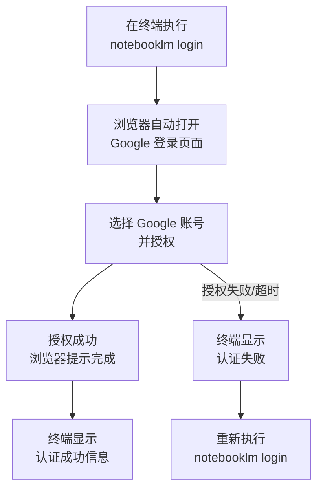
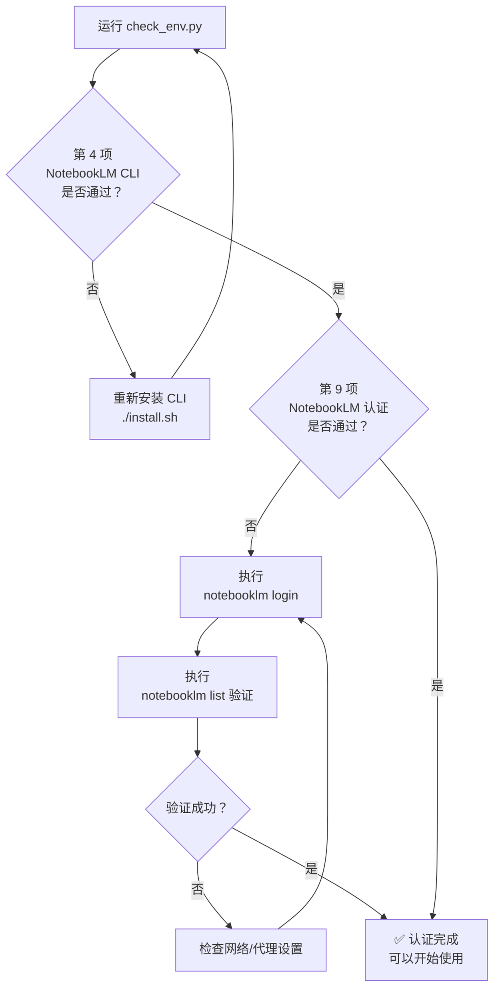

NotebookLM 认证是本 Skill 使用流程中的关键一步——只有成功完成 Google 账号授权，后续的内容上传、播客生成、PPT 导出等所有操作才能正常执行。本文将带你完成从认证到首次验证的全过程，并提供常见问题的排查方案。

## 认证前：确认 CLI 工具已安装

NotebookLM CLI 工具由 `notebooklm-py` 包提供，在运行 [快速安装与环境配置](2-kuai-su-an-zhuang-yu-huan-jing-pei-zhi) 的 `install.sh` 时，第 5 步会自动检测并安装它。安装脚本会先判断 `notebooklm` 命令是否已在系统 `PATH` 中，若未找到则从 GitHub 仓库拉取安装。安装成功后，`notebooklm --version` 应能正常输出版本号。

Sources: [install.sh](install.sh#L86-L103)

你可以用以下命令快速确认安装状态：

```bash
# 检查命令是否可用，并显示版本号
notebooklm --version
```

如果返回 `command not found`，说明安装未完成，请返回执行 `./install.sh` 或手动安装：

```bash
pip3 install git+https://github.com/monkeychen/notebooklm-py.git
```

Sources: [install.sh](install.sh#L93-L94), [requirements.txt](requirements.txt#L10-L11)

## 执行认证：notebooklm login

**首次使用前必须完成认证，且仅需一次。** 认证过程通过 Google 账号 OAuth 授权完成，具体流程如下：



**操作步骤：**

| 步骤 | 命令/操作 | 说明 |
|------|----------|------|
| 1 | `notebooklm login` | 终端执行，触发 OAuth 授权流程 |
| 2 | 浏览器自动弹出 | 显示 Google 账号登录页面 |
| 3 | 选择 Google 账号 | 登录你的 Google 账号并点击授权 |
| 4 | 等待终端确认 | 看到 "Login successful" 或类似提示即为成功 |

> ⚠️ 如果浏览器没有自动打开，终端会打印一个 URL，请手动复制到浏览器中打开。

Sources: [SKILL.md](SKILL.md#L80-L87), [README.md](README.md#L119-L122), [install.sh](install.sh#L146-L151)

## 验证认证：notebooklm list

认证完成后，执行 `notebooklm list` 来验证是否成功。该命令会调用 NotebookLM API 获取你的笔记本列表，**如果返回了列表（即使是空列表）而没有报错，说明认证已生效。**

```bash
# 验证认证是否成功
notebooklm list
```

**预期输出示例：**

```
📝 Notebooks:
  (空列表表示还没有创建过笔记本，这是正常的)
```

**如果出现错误**，请参考下方的故障排查部分。

Sources: [SKILL.md](SKILL.md#L86-L87), [check_env.py](check_env.py#L109-L130)

## 环境全面检查：check_env.py

完成认证后，建议运行环境检查脚本，一次性验证全部 9 项配置是否就绪。该脚本会依次检测 Python 版本、核心依赖、CLI 工具、MCP 配置以及 NotebookLM 认证状态。

```bash
python3 check_env.py
```

**9 项检查清单：**

| 序号 | 检查项 | 与认证的关系 | 失败影响 |
|------|--------|-------------|---------|
| 1 | Python 版本（≥ 3.9） | 前置依赖 | CLI 无法运行 |
| 2 | 核心 Python 依赖 | CLI 运行依赖 | 部分功能缺失 |
| 3 | Playwright 可导入性 | MCP 服务器依赖 | 微信抓取不可用 |
| 4 | **NotebookLM CLI** | **直接相关** | 无法执行任何 NotebookLM 操作 |
| 5 | markitdown CLI | 文件转换依赖 | 文档格式转换失败 |
| 6 | Git 命令 | 安装流程依赖 | 后续更新困难 |
| 7 | MCP 服务器文件 | 微信抓取依赖 | 微信文章无法获取 |
| 8 | MCP 配置 | 微信抓取依赖 | Claude 无法调用 MCP |
| 9 | **NotebookLM 认证** | **直接相关** | 所有 NotebookLM 操作被拒绝 |

其中第 4 项和第 9 项与认证直接相关。第 9 项的认证检查逻辑是：执行 `notebooklm list`，如果命令返回码为 0 则判定认证成功，否则提示"请运行 notebooklm login"。

Sources: [check_env.py](check_env.py#L132-L192)

**成功的完整输出示例：**

```
========================================
  环境检查 - anything-to-notebooklm
========================================

[1/8] Python 版本
✅ Python 3.12.0

[2/9] 核心 Python 依赖
✅ fastmcp 已安装
✅ playwright 已安装
✅ beautifulsoup4 已安装
✅ lxml 已安装
✅ markitdown 已安装

[3/9] Playwright 可导入性
✅ Playwright 可以正常导入

[4/9] NotebookLM CLI
✅ notebooklm 已安装

[5/9] markitdown CLI
✅ markitdown 已安装

[6/9] Git 命令
✅ git 已安装

[7/9] MCP 服务器文件
✅ MCP 服务器文件存在

[8/9] MCP 配置
✅ MCP 服务器已配置

[9/9] NotebookLM 认证
✅ NotebookLM 已认证

========================================
✅ 所有检查通过 (11/11)！环境配置完整。
========================================
```

Sources: [check_env.py](check_env.py#L194-L213)

## 常见认证问题与排查

| 问题现象 | 可能原因 | 解决方案 |
|---------|---------|---------|
| `notebooklm: command not found` | CLI 未安装或不在 PATH 中 | 重新运行 `./install.sh`，或手动 `pip3 install git+https://github.com/monkeychen/notebooklm-py.git` |
| 浏览器未自动弹出 | 系统默认浏览器设置异常 | 复制终端中打印的 URL 手动打开 |
| 认证成功但 `list` 报错 | Token 过期或网络问题 | 重新执行 `notebooklm login` |
| `list` 返回认证失败 | 授权过期 | `notebooklm login` 重新登录，然后 `notebooklm list` 验证 |
| `check_env.py` 第 9 项超时 | 网络连接不稳定 | 检查网络，重试或设置代理 |
| `check_env.py` 第 4 项失败 | CLI 安装不完整 | 参考上面第一条的解决方案 |

**排查流程图：**



Sources: [SKILL.md](SKILL.md#L433-L442), [SKILL.md](SKILL.md#L566-L577), [check_env.py](check_env.py#L109-L130)

## 认证后的第一个命令

认证成功后，你已经准备好使用 Skill 的全部功能了。以下命令可以帮你快速确认一切正常：

```bash
# 查看已有笔记本列表
notebooklm list

# 查看当前认证状态
notebooklm status
```

`notebooklm status` 可以随时查看认证是否仍然有效，而 `notebooklm list` 则是实际测试 API 连通性的最佳方式——它不仅检查认证，还验证了网络到 Google NotebookLM 服务器的端到端可达性。

Sources: [SKILL.md](SKILL.md#L569-L577)

## 下一步

认证完成后，你可以进入实际使用阶段：

- **了解触发方式**：阅读 [自然语言触发方式与使用示例](4-zi-ran-yu-yan-hong-fa-fang-shi-yu-shi-yong-shi-li) 学习如何用自然语言驱动 Skill
- **深入架构**：如果你想了解底层原理，可从 [整体技术架构：从自然语言到文件生成的数据流](5-zheng-ti-ji-zhu-jia-gou-cong-zi-ran-yu-yan-dao-wen-jian-sheng-cheng-de-shu-ju-liu) 开始
- **遇到问题**：直接跳转 [常见错误与解决方案：URL 格式、认证失败、生成卡住](25-chang-jian-cuo-wu-yu-jie-jue-fang-an-url-ge-shi-ren-zheng-shi-bai-sheng-cheng-qia-zhu) 查看排查指南