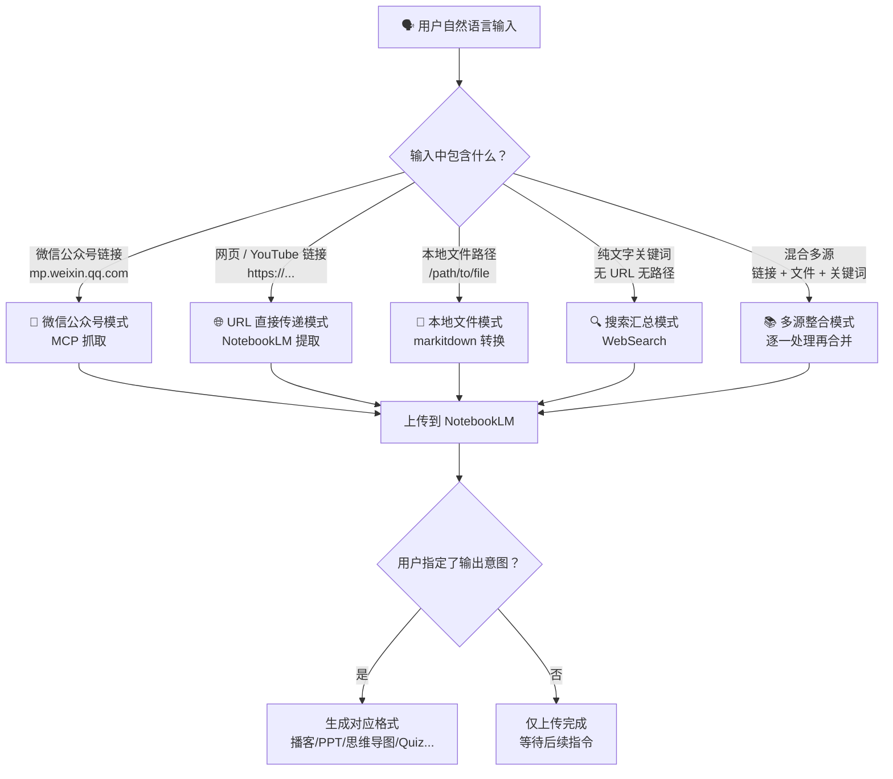

本页是 anything-to-notebooklm Skill 的**核心使用指南**。完成 [NotebookLM 认证与首次使用](3-notebooklm-ren-zheng-yu-shou-ci-shi-yong) 后，你就可以用日常中文自然语言驱动整个工作流——从内容获取到格式生成，全部由 Claude 自动理解和执行。本文将系统性地介绍 **触发方式、意图识别规则和真实使用场景**，帮助你快速上手。

## 核心理念：说你想做的，而不是记命令

anything-to-notebooklm 的设计哲学是**零学习成本**。你不需要背诵任何命令行语法，只需用自然语言表达两个信息：**内容从哪来**（内容源）和**你想得到什么**（输出意图）。Claude 会自动完成 URL 识别、文件格式判断、内容抓取、格式转换、上传和生成的全流程。

```
你说：把这篇微信文章生成播客
AI ：✅ 8 分钟播客已生成 → podcast.mp3

你说：这本 EPUB 电子书做成思维导图
AI ：✅ 思维导图已生成 → mindmap.json

你说：这个 YouTube 视频做成 PPT
AI ：✅ 25 页 PPT 已生成 → slides.pdf
```

**关键规则：如果你只说了内容源但没有指定输出意图，Skill 会默认只上传内容到 NotebookLM，不生成任何格式**，等待你后续给出指令。例如"把这篇文章传到 NotebookLM"只会完成上传步骤。

Sources: [SKILL.md](SKILL.md#L89-L135), [README.md](README.md#L21-L37)

## 触发方式总览

anything-to-notebooklm 支持以下 **5 种内容源触发方式**，每种方式在表达上略有区别，但底层原理相同——Claude 会从你的语句中提取 URL、文件路径或搜索关键词，自动判断内容类型并触发对应处理管道。



下面逐一讲解每种触发方式的具体表达形式和示例。

Sources: [SKILL.md](SKILL.md#L89-L120), [SKILL.md](SKILL.md#L139-L197)

## 触发方式一：微信公众号文章

微信公众号文章是最常用的内容源之一。由于微信平台存在反爬虫机制，Skill 通过 MCP（Model Context Protocol）服务器自动抓取文章内容，无需你手动复制粘贴。触发方式非常简单——只需在对话中提及微信相关的意图并附上文章链接：

| 触发语句示例 | 说明 |
|---|---|
| `/anything-to-notebooklm [微信文章链接]` | 显式调用 Skill |
| `"把这篇微信文章传到 NotebookLM"` | 仅上传，不生成 |
| `"把这篇微信文章转成 PDF 后直接上传至笔记本"` | MCP 抓取并生成 PDF |
| `"把这篇微信文章生成播客"` | 上传 + 生成播客 |

**链接格式要求**：必须是 `https://mp.weixin.qq.com/s/xxx` 或 `https://mp.weixin.qq.com/s?xxx` 格式。Claude 会自动识别这种 URL 模式并调用 MCP 工具 `read_weixin_article` 抓取全文内容，保存为 TXT 临时文件后上传。

Sources: [SKILL.md](SKILL.md#L91-L96), [SKILL.md](SKILL.md#L145-L146)

## 触发方式二：网页与 YouTube 链接

任意公开可访问的网页链接和 YouTube 视频链接，都可以直接传递给 NotebookLM 处理——不需要经过额外的格式转换，NotebookLM 会自动提取网页文本或 YouTube 字幕和元数据。

| 触发语句示例 | 说明 |
|---|---|
| `"把这个网页做成播客 [URL]"` | 网页 → 播客 |
| `"这篇文章帮我做成 PPT [URL]"` | 网页 → PPT |
| `"帮我分析这个网页 [URL]"` | 网页 → 仅上传 |
| `"把这个 YouTube 视频做成播客 [YouTube URL]"` | YouTube → 播客 |
| `"这个视频帮我生成思维导图 [YouTube URL]"` | YouTube → 思维导图 |

**链接识别逻辑**：以 `https://` 或 `http://` 开头的链接会被识别为网页；包含 `youtube.com` 或 `youtu.be` 域名的链接会被识别为 YouTube 视频。两种类型的处理方式略有不同——YouTube 视频由 NotebookLM 直接提取字幕，普通网页则由 NotebookLM 提取正文内容。

Sources: [SKILL.md](SKILL.md#L97-L105), [SKILL.md](SKILL.md#L147-L148)

## 触发方式三：本地文件

支持本地路径指向的文件作为内容源。Claude 会根据文件扩展名自动选择处理方式：Markdown 文件直接上传，其他格式（PDF、EPUB、DOCX、PPTX、XLSX、图片、音频等）通过 markitdown 工具转换为文本后再上传。

| 触发语句示例 | 说明 |
|---|---|
| `"把这个 PDF 上传到 NotebookLM /path/to/file.pdf"` | PDF → 仅上传 |
| `"这个 Markdown 文件生成 PPT /path/to/file.md"` | Markdown → PPT |
| `"这个 EPUB 电子书生成播客 /path/to/book.epub"` | EPUB → 播客 |
| `"把这个 Word 文档做成思维导图 /path/to/doc.docx"` | Word → 思维导图 |
| `"这个 PowerPoint 生成 Quiz /path/to/slides.pptx"` | PPTX → Quiz |
| `"把这个扫描 PDF 做成报告 /path/to/scan.pdf"` | 扫描件 → OCR + 报告 |

**支持的文件类型**涵盖：PDF、EPUB、Markdown (.md)、Word (.docx)、PowerPoint (.pptx)、Excel (.xlsx)、图片（JPEG/PNG/GIF/WebP）、音频（WAV/MP3）、CSV、JSON、XML、ZIP 压缩包。每种文件类型的详细转换机制在后续深入解析章节中展开。

Sources: [SKILL.md](SKILL.md#L106-L113), [SKILL.md](SKILL.md#L149-L157)

## 触发方式四：搜索关键词

当你没有现成的 URL 或文件时，可以直接给出搜索关键词。Skill 会使用 WebSearch 工具搜索关键词，汇总前 3-5 条结果，整合为一份综合文本后上传到 NotebookLM。

| 触发语句示例 | 说明 |
|---|---|
| `"搜索 'AI 发展趋势' 并生成报告"` | 搜索 → 报告 |
| `"搜索关于 '量子计算' 的资料做成播客"` | 搜索 → 播客 |

**识别逻辑**：当你的输入中既没有 URL、也没有文件路径时，Claude 会将整段文本视为搜索查询关键词，自动触发搜索汇总模式。

Sources: [SKILL.md](SKILL.md#L114-L116), [SKILL.md](SKILL.md#L157-L158)

## 触发方式五：多源混合

你可以在一次对话中同时提供多种内容源——网页链接、YouTube 视频、本地文件、搜索关键词可以任意组合。Claude 会依次处理每个内容源，将它们全部上传到同一个 NotebookLM 笔记本中，然后基于所有内容源生成你指定的格式。

| 触发语句示例 | 说明 |
|---|---|
| `"把这篇文章、这个视频和这个 PDF 一起上传，生成一份报告"` | 三源 → 报告 |
| `"把这些内容一起做成 PPT：<br/>① URL<br/>② YouTube 链接<br/>③ /path/to/file.pdf"` | 多源列表 → PPT |

Sources: [SKILL.md](SKILL.md#L118-L120)

## 自然语言意图识别：触发词映射表

当你在语句中表达了输出意图时，Claude 会通过关键词匹配识别你想要的格式。下表列出了**所有 8 种输出格式**对应的触发词和系统映射关系：

| 用户说的话（触发词） | 识别意图 | NotebookLM 命令 |
|---|---|---|
| "生成播客" / "做成音频" / "转成语音" | audio | `generate audio` |
| "做成 PPT" / "生成幻灯片" / "做个演示" | slide-deck | `generate slide-deck` |
| "画个思维导图" / "生成脑图" / "做个导图" | mind-map | `generate mind-map` |
| "生成 Quiz" / "出题" / "做个测验" | quiz | `generate quiz` |
| "做个视频" / "生成视频" | video | `generate video` |
| "生成报告" / "写个总结" / "整理成文档" | report | `generate report` |
| "做个信息图" / "可视化" | infographic | `generate infographic` |
| "生成数据表" / "做个表格" | data-table | `generate data-table` |
| "做成闪卡" / "生成记忆卡片" | flashcards | `generate flashcards` |

**无需精确匹配**——Claude 的自然语言理解能力允许你用各种表达方式。例如"帮我总结一下这篇文章"和"整理成文档"都会被识别为 `report` 意图。触发词的详细解析逻辑可参考 [自然语言意图识别：播客、PPT、思维导图、Quiz 等触发词](14-zi-ran-yu-yan-yi-tu-shi-bie-bo-ke-ppt-si-wei-dao-tu-quiz-deng-hong-fa-ci)。

Sources: [SKILL.md](SKILL.md#L121-L135)

## 真实使用场景与完整示例

下面通过 **6 个典型场景** 展示从输入到输出的完整流程。每个示例都包含你实际需要输入的文字、Claude 自动执行的步骤、以及最终返回的结果。

### 场景 1：快速学习 — 微信文章 → 播客

通勤路上听一篇深度文章，是最常见的使用方式。

```
你：把这篇文章生成播客 https://mp.weixin.qq.com/s/abc123xyz

AI 自动执行：
  ✓ 识别为微信公众号链接
  ✓ MCP 工具抓取文章内容
  ✓ 创建 TXT 临时文件
  ✓ 上传到 NotebookLM
  ✓ 生成播客（generate audio）
  ✓ 下载播客到本地

✅ 输出：
📄 文章：深度学习的未来趋势
👤 作者：张三
📅 发布：2026-01-20
🎙️ 播客已生成：
📁 文件：/tmp/weixin_深度学习的未来趋势_podcast.mp3
⏱️ 时长：约 8 分钟
📊 大小：12.3 MB
```

Sources: [SKILL.md](SKILL.md#L241-L268)

### 场景 2：团队分享 — 电子书 → PPT

把一本书的核心内容提炼成演示文稿，用于读书会或团队分享。

```
你：这本书做成 PPT /Users/joe/Books/sapiens.epub

AI 自动执行：
  ✓ 识别为 EPUB 文件
  ✓ markitdown 转换电子书内容（15 万字）
  ✓ 保存为 TXT 临时文件
  ✓ 上传到 NotebookLM
  ✓ 生成 PPT（generate slide-deck）

✅ 输出：
📚 电子书：Sapiens: A Brief History of Humankind
📊 PPT 已生成：
📁 文件：/tmp/sapiens_slides.pdf
📄 页数：25 页
📦 大小：3.8 MB
```

Sources: [SKILL.md](SKILL.md#L353-L379)

### 场景 3：自测学习 — YouTube 视频 → Quiz

看了一段教学视频后，自动生成测验题检验学习效果。

```
你：这个 YouTube 视频生成 Quiz https://youtube.com/watch?v=abc123

AI 自动执行：
  ✓ 识别为 YouTube 链接
  ✓ 直接传递给 NotebookLM（自动提取字幕）
  ✓ 生成 Quiz（generate quiz）

✅ 输出：
🎬 视频：Understanding Quantum Computing
⏱️ 时长：23 分钟
📝 Quiz 已生成：
📁 文件：/tmp/youtube_quantum_computing_quiz.md
❓ 题目：15 道（10 选择 + 5 简答）
```

Sources: [SKILL.md](SKILL.md#L270-L293)

### 场景 4：信息整合 — 多源混合 → 报告

从多个不同来源汇总信息，生成一份综合报告。

```
你：把这些内容一起做成报告：
    - https://example.com/article
    - https://youtube.com/watch?v=xyz
    - /Users/joe/Documents/research.pdf

AI 自动执行：
  ✓ 创建新 Notebook
  ✓ 添加网页内容为 Source
  ✓ 添加 YouTube 视频为 Source
  ✓ 转换 PDF 并添加为 Source
  ✓ 基于所有 Source 生成报告（generate report）

✅ 输出：
📚 内容源：
  1. 网页文章：AI in 2026
  2. YouTube：Future of AI
  3. PDF：Research Notes (12 页)
📄 报告已生成：
📁 文件：/tmp/multi_source_report.md
📝 章节：7 个
📊 大小：15.2 KB
```

Sources: [SKILL.md](SKILL.md#L323-L351)

### 场景 5：搜索汇总 — 关键词 → 报告

没有现成的 URL 或文件时，直接搜索并生成报告。

```
你：搜索 'AI 发展趋势 2026' 并生成报告

AI 自动执行：
  ✓ 识别为搜索查询
  ✓ WebSearch 搜索关键词
  ✓ 汇总前 5 条结果
  ✓ 创建 TXT 临时文件
  ✓ 上传到 NotebookLM
  ✓ 生成报告（generate report）

✅ 输出：
🔍 关键词：AI 发展趋势 2026
📊 来源：5 篇文章
📄 报告已生成：
📁 文件：/tmp/search_AI发展趋势2026_report.md
📝 章节：7 个
📊 大小：15.2 KB
```

Sources: [SKILL.md](SKILL.md#L295-L321)

### 场景 6：文档数字化 — 扫描件 → 文字

将扫描图片或扫描 PDF 通过 OCR 识别后生成结构化文档。

```
你：把这个扫描图片做成文档 /Users/joe/scan.jpg

AI 自动执行：
  ✓ 识别为图片文件
  ✓ markitdown OCR 识别文字
  ✓ 提取为纯文本
  ✓ 生成结构化文档

✅ 输出：
📁 文件：/tmp/scan_document.txt
📊 识别准确率：95%+
```

Sources: [README.md](README.md#L189-L201)

## 各格式生成时间参考

不同输出格式的生成时间差异较大，下表提供参考时间帮助你合理安排使用：

| 输出格式 | 典型生成时间 | 输出文件类型 | 最佳内容长度 |
|---|---|---|---|
| 🎙️ 播客 | 2-5 分钟 | .mp3 | 1000-5000 字 |
| 📊 PPT | 1-3 分钟 | .pdf | 1000-10000 字 |
| 🗺️ 思维导图 | 1-2 分钟 | .json | 1000-5000 字 |
| 📝 Quiz | 1-2 分钟 | .md | 1000-10000 字 |
| 🎬 视频 | 3-8 分钟 | .mp4 | 2000-10000 字 |
| 📄 报告 | 2-4 分钟 | .md | 1000-50000 字 |
| 📈 信息图 | 2-3 分钟 | .png | 1000-5000 字 |
| 📋 闪卡 | 1-2 分钟 | .md | 1000-5000 字 |

**注意**：生成时间受 NotebookLM 服务器负载影响，可能有所波动。内容少于 500 字的短文可能生成效果不佳，超过 10 万字的长文档需要更长处理时间。

Sources: [SKILL.md](SKILL.md#L498-L523), [README.md](README.md#L80-L92)

## 一次输入中表达多个意图

你可以在一条语句中同时指定多个输出格式，Skill 会**依次执行**每个生成任务。例如：

```
你：这篇文章帮我生成播客和 PPT https://mp.weixin.qq.com/s/abc123

AI 自动执行：
  ✓ 抓取文章 → 上传
  ✓ 第一步：生成播客 → 下载
  ✓ 第二步：生成 PPT → 下载
```

Claude 会按照语句中意图出现的顺序逐一处理，每个生成任务完成后再启动下一个。更多高级用法可参考 [多意图处理：一次性生成多种格式](22-duo-yi-tu-chu-li-ci-xing-sheng-cheng-duo-chong-ge-shi)。

Sources: [SKILL.md](SKILL.md#L462-L472)

## 下一步

至此，你已经掌握了 anything-to-notebooklm 的全部基础用法。根据你的兴趣，推荐以下阅读路径：

- **想了解底层技术架构**：阅读 [整体技术架构：从自然语言到文件生成的数据流](5-zheng-ti-ji-zhu-jia-gou-cong-zi-ran-yu-yan-dao-wen-jian-sheng-cheng-de-shu-ju-liu)
- **想深入特定内容源**：从 [微信公众号文章：MCP 服务器抓取与反爬虫绕过](9-wei-xin-gong-zhong-hao-wen-zhang-mcp-fu-wu-qi-zhua-qu-yu-fan-pa-chong-rao-guo) 开始
- **遇到问题需要排查**：直接跳到 [常见错误与解决方案：URL 格式、认证失败、生成卡住](25-chang-jian-cuo-wu-yu-jie-jue-fang-an-url-ge-shi-ren-zheng-shi-bai-sheng-cheng-qia-zhu)
- **想自定义高级用法**：阅读 [自定义 Notebook：指定已有笔记本或添加自定义生成指令](23-zi-ding-yi-notebook-zhi-ding-yi-you-bi-ji-ben-huo-tian-jia-zi-ding-yi-sheng-cheng-zhi-ling)