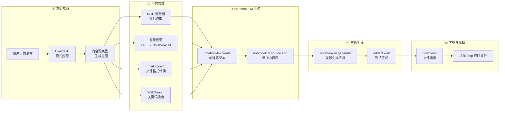
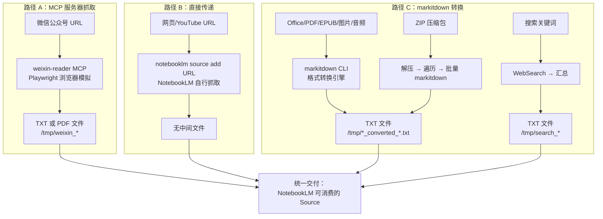
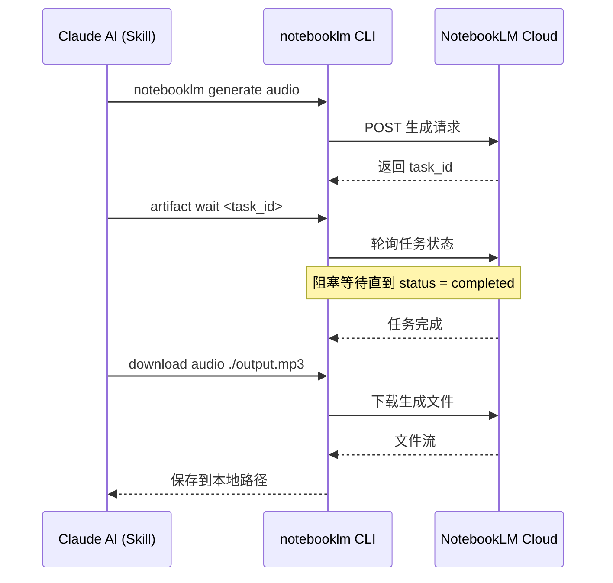

本文从**第一性原理**出发，拆解 anything-to-notebooklm 这个 Claude Code Skill 的完整技术架构。我们将追踪一条数据从用户口中的自然语言指令出发，经过**意图识别、内容获取、格式转换、云端上传、产物生成**五个阶段，最终以具体文件（MP3、PDF、JSON 等）落盘的全链路数据流。理解这条管线，是掌握后续所有内容源详解和输出格式章节的骨架。

Sources: [SKILL.md](SKILL.md#L1-L6)

## 架构总览：五阶段管线模型

整个 Skill 本质上是一条**五阶段顺序管线**（Pipeline），每一段有明确的输入契约和输出契约。Claude AI 充当管线的**编排器**（Orchestrator），负责根据自然语言输入调度各阶段的执行。这不是一个运行时框架，而是一组由 Claude AI 根据 SKILL.md 中定义的规则进行**模式匹配和命令调度**的指令集。



上图中每个子图代表一个架构层次。注意**阶段②是唯一存在分支的阶段**——不同的内容源类型会走不同的获取路径，这是整个架构中最复杂的路由决策点。阶段④和⑤是可选的（仅当用户明确指定了生成意图时才执行），否则流程在阶段③结束后即告完成。

Sources: [SKILL.md](SKILL.md#L137-L237)

## 阶段①：自然语言意图解析

Claude AI 同时承担两个识别任务：**内容源类型识别**和**生成意图识别**。两者互相独立，在单次请求中并行完成。

### 内容源类型识别规则

内容源的识别完全基于**输入特征的模式匹配**，不依赖任何外部服务。识别规则按优先级从高到低排列——微信链接优先于通用网页、本地文件路径优先于搜索关键词：

| 优先级 | 输入特征 | 识别结果 | 匹配方式 |
|:---:|---------|---------|---------|
| 1 | `https://mp.weixin.qq.com/s/` 或 `?` 前缀 | 微信公众号 | URL 前缀精确匹配 |
| 2 | `https://youtube.com/...` 或 `youtu.be/...` | YouTube 视频 | URL 前缀精确匹配 |
| 3 | `https://` 或 `http://` 开头 | 通用网页 | URL 协议匹配 |
| 4 | 本地文件路径 `.pdf/.epub/.docx/.pptx/.xlsx` | Office/文档 | 文件扩展名匹配 |
| 5 | 本地文件路径 `.md` | Markdown | 文件扩展名匹配 |
| 6 | 本地文件路径 `.jpg/.png/.gif/.webp` | 图片（OCR） | 文件扩展名匹配 |
| 7 | 本地文件路径 `.mp3/.wav` | 音频 | 文件扩展名匹配 |
| 8 | 本地文件路径 `.zip` | ZIP 压缩包 | 文件扩展名匹配 |
| 9 | 纯文本（无 URL、无路径） | 搜索关键词 | 排除法兜底 |

### 生成意图识别映射

意图识别同样基于自然语言中的**触发词匹配**。SKILL.md 中定义了一张完整的触发词映射表，Claude AI 根据用户表述中的关键词确定目标格式：

| 用户表述中的触发词 | 识别意图 | 对应 NotebookLM 命令 |
|-----------------|---------|---------------------|
| "生成播客" / "做成音频" / "转成语音" | `audio` | `generate audio` |
| "做成PPT" / "生成幻灯片" / "做个演示" | `slide-deck` | `generate slide-deck` |
| "画个思维导图" / "生成脑图" / "做个导图" | `mind-map` | `generate mind-map` |
| "生成Quiz" / "出题" / "做个测验" | `quiz` | `generate quiz` |
| "做个视频" / "生成视频" | `video` | `generate video` |
| "生成报告" / "写个总结" / "整理成文档" | `report` | `generate report` |
| "做个信息图" / "可视化" | `infographic` | `generate infographic` |
| "生成数据表" / "做个表格" | `data-table` | `generate data-table` |
| "做成闪卡" / "生成记忆卡片" | `flashcards` | `generate flashcards` |

**关键设计决策**：如果用户没有明确指定任何生成意图，默认行为是**只上传不生成**，等待用户后续下达指令。这种"惰性生成"策略避免了不必要的 API 调用和等待时间。

Sources: [SKILL.md](SKILL.md#L121-L158)

## 阶段②：内容获取与格式统一——三条路径

内容获取是架构中最具多样性的阶段。虽然输入源多达 15 种，但在架构层面可以归纳为**三条获取路径**，每条路径由不同的技术组件驱动：



### 路径 A：MCP 服务器抓取（微信公众号专用）

微信公众号文章因为存在**反爬虫机制**，无法通过简单的 HTTP 请求获取内容。项目通过一个独立的 MCP（Model Context Protocol）服务器 `weixin-reader` 解决这个问题。该服务器内部使用 **Playwright 无头浏览器**模拟真实用户访问，绕过微信的反爬虫检测。输出有两种模式：

- **默认模式**：`read_weixin_article` 工具获取纯文本 → 保存为 `/tmp/weixin_{title}_{timestamp}.txt`
- **PDF 模式**：当用户要求保留图片时，`save_weixin_article_to_pdf` 工具生成完整 PDF → 保存为 `/tmp/weixin_{title}_{timestamp}.pdf`

MCP 服务器的配置位于 `~/.claude/config.json`，Claude Code 启动时加载该配置并注册 `weixin-reader` 为可调用工具。

Sources: [SKILL.md](SKILL.md#L159-L163), [SKILL.md](SKILL.md#L530-L550)

### 路径 B：URL 直接传递

对于 YouTube 视频和公开网页，项目采用了**零中间层**策略：不自行抓取和转换内容，而是将 URL 直接传递给 NotebookLM，由 Google 的基础设施完成内容提取。这意味着：

- YouTube 视频：NotebookLM 自动提取字幕和元数据
- 通用网页：NotebookLM 自行抓取网页正文

这条路径的优势在于**零本地处理开销**，且 NotebookLM 对 YouTube 字幕的提取质量通常优于第三方工具。执行命令为 `notebooklm source add [URL]`，不产生任何中间文件。

Sources: [SKILL.md](SKILL.md#L165-L167)

### 路径 C：markitdown 格式转换

这是覆盖面最广的一条路径。所有本地文件（Office 文档、PDF、EPUB、图片、音频）都通过 **Microsoft markitdown** 工具进行格式转换。markitdown 是一个统一的文件格式转换引擎，支持 15+ 种输入格式，输出统一的 Markdown 文本。

转换流程为：`原始文件 → markitdown CLI → Markdown → 重命名为 TXT → 保存到 /tmp/`。命令格式为 `markitdown /path/to/file.docx -o /tmp/converted.md`，最终文件命名规则为 `/tmp/{filename}_converted_{timestamp}.txt`。

特殊子路径包括：
- **图片 OCR**：markitdown 自动调用 OCR 引擎识别文字并提取 EXIF 元数据
- **音频转录**：markitdown 自动转录语音为文字并提取音频元数据
- **ZIP 压缩包**：先解压到临时目录 → 遍历所有支持的文件 → 批量 markitdown 转换 → 合并或分别保存
- **搜索关键词**：使用 WebSearch 工具搜索 → 汇总前 3-5 条结果 → 保存为 `/tmp/search_{keyword}_{timestamp}.txt`

Sources: [SKILL.md](SKILL.md#L169-L196)

## 阶段③：NotebookLM 上传与 Source 注册

无论内容通过哪条路径获取，最终都要汇入 **NotebookLM** 这个统一的云端处理平台。上传阶段包含两个顺序操作：

```bash
# 1. 创建笔记本（每个请求默认创建新笔记本）
notebooklm create "{title}"

# 2. 添加内容源（--wait 参数确保处理完成后再继续）
notebooklm source add /tmp/weixin_xxx.txt --wait
```

**`--wait` 参数是关键的可靠性保障**。NotebookLM 处理上传内容需要时间（索引、分析），如果在处理未完成时发起后续的生成请求，会导致生成失败。`--wait` 让 CLI 阻塞等待直到 NotebookLM 确认内容已就绪。

对于多源内容的场景（如用户同时提供了网页、PDF 和 YouTube 链接），Skill 会**依次添加所有 Source 到同一个笔记本**，确保后续的生成操作能基于全部内容进行综合分析。

上传完成后，Skill 会执行临时文件清理：`rm /tmp/*.txt /tmp/*.pdf /tmp/*.json`，释放本地磁盘空间。这些文件已完成上传使命，NotebookLM 已持有副本。

Sources: [SKILL.md](SKILL.md#L198-L216)

## 阶段④⑤：产物生成与下载

当用户指定了生成意图（如"生成播客"），上传完成后进入**生成-等待-下载**三步流程：



### 8 种生成类型与产物格式

| 生成意图 | CLI 命令 | 产物格式 | 典型耗时 |
|---------|---------|---------|---------|
| 播客 `audio` | `generate audio` | `.mp3` | 2-5 分钟 |
| PPT `slide-deck` | `generate slide-deck` | `.pdf` | 1-3 分钟 |
| 思维导图 `mind-map` | `generate mind-map` | `.json` | 1-2 分钟 |
| 测验 `quiz` | `generate quiz` | `.md` | 1-2 分钟 |
| 视频 `video` | `generate video` | `.mp4` | 3-8 分钟 |
| 报告 `report` | `generate report` | `.md` | 2-4 分钟 |
| 信息图 `infographic` | `generate infographic` | `.png` | 2-3 分钟 |
| 闪卡 `flashcards` | `generate flashcards` | `.md` | 1-2 分钟 |

对于**多意图请求**（如"生成播客和PPT"），Skill 会依次执行多个生成任务，而非并行。这是受 NotebookLM 并发限制（最多 3 个同时进行的生成任务）约束的设计决策。

Sources: [SKILL.md](SKILL.md#L218-L237)

## 外部依赖组件角色总览

整个架构依赖四个外部组件，各自承担明确职责：

| 组件 | 角色 | 安装方式 | 配置位置 |
|------|------|---------|---------|
| **Claude AI** | 编排器：意图解析 + 流程调度 | Claude Code 自带 | SKILL.md 定义规则 |
| **weixin-reader MCP** | 微信文章抓取：Playwright 浏览器模拟 | `install.sh` 自动克隆 | `~/.claude/config.json` |
| **markitdown** | 文件格式转换：15+ 格式 → Markdown/TXT | `pip install markitdown[all]` | 无需配置 |
| **notebooklm CLI** | NotebookLM 云端交互：认证/上传/生成/下载 | `pip install notebooklm-py` | `notebooklm login` 认证 |

这四个组件形成了松耦合的协作关系：Claude AI 不直接处理内容，而是通过调用 MCP 工具、shell 命令和 CLI 工具完成所有实际工作。

Sources: [requirements.txt](requirements.txt#L1-L12), [install.sh](install.sh#L1-L168)

## 数据流的临时文件生命周期

所有中间文件都存储在 `/tmp/` 目录下，遵循**创建 → 上传 → 清理**的生命周期。了解文件命名规则有助于故障排查：

| 文件类型 | 命名模式 | 示例 |
|---------|---------|------|
| 微信文章文本 | `/tmp/weixin_{title}_{timestamp}.txt` | `/tmp/weixin_AI发展趋势_1706265600.txt` |
| 微信文章 PDF | `/tmp/weixin_{title}_{timestamp}.pdf` | `/tmp/weixin_AI发展趋势_1706265600.pdf` |
| 格式转换产物 | `/tmp/{filename}_converted_{timestamp}.txt` | `/tmp/research_converted_1706265600.txt` |
| 搜索汇总 | `/tmp/search_{keyword}_{timestamp}.txt` | `/tmp/search_量子计算_1706265600.txt` |
| 生成产物 | 用户指定路径或 `/tmp/` 下 | `/tmp/article_podcast.mp3` |

临时文件在 Source 上传完成后被清理，生成产物保留到用户指定的路径。macOS/Linux 系统重启后 `/tmp/` 目录会被自动清空，这是天然的垃圾回收机制。

Sources: [SKILL.md](SKILL.md#L210-L216), [SKILL.md](SKILL.md#L519-L523)

## 架构设计的关键约束

理解以下约束有助于在使用和排查问题时建立正确的心智模型：

- **无状态性**：Skill 本身不维护任何状态，所有中间数据通过文件系统传递。这意味着如果中途中断，无法自动恢复，需要从头开始。
- **同步阻塞**：`--wait` 和 `artifact wait` 都是同步阻塞调用。生成播客时用户需要等待 2-5 分钟，期间 Claude Code 会持续轮询状态。
- **频率限制**：微信 MCP 抓取间隔需 > 2 秒，NotebookLM 生成任务并发上限为 3 个。这决定了多源多意图场景下的实际耗时。
- **内容长度边界**：少于 500 字的短内容可能导致生成效果不佳；超过 50 万字的长内容可能直接生成失败。合理的输入范围在 1000-50000 字之间。

Sources: [SKILL.md](SKILL.md#L498-L517)

## 延伸阅读

理解整体架构后，建议按以下顺序深入各子系统：

1. [内容源智能识别：URL 与文件类型自动判断机制](6-nei-rong-yuan-zhi-neng-shi-bie-url-yu-wen-jian-lei-xing-zi-dong-pan-duan-ji-zhi) —— 阶段①的识别规则详解
2. [内容获取与转换：MCP 抓取、markitdown 转换与直接传递](7-nei-rong-huo-qu-yu-zhuan-huan-mcp-zhua-qu-markitdown-zhuan-huan-yu-zhi-jie-chuan-di) —— 阶段②三条路径的实现细节
3. [NotebookLM 上传与内容生成流程](8-notebooklm-shang-chuan-yu-nei-rong-sheng-cheng-liu-cheng) —— 阶段③④⑤的命令级详解
4. [自然语言意图识别：播客、PPT、思维导图、Quiz 等触发词](14-zi-ran-yu-yan-yi-tu-shi-bie-bo-ke-ppt-si-wei-dao-tu-quiz-deng-hong-fa-ci) —— 9 种生成意图的完整触发词列表
5. [生成命令与产物下载：artifact wait 与 download 工作流](15-sheng-cheng-ming-ling-yu-chan-wu-xia-zai-artifact-wait-yu-download-gong-zuo-liu) —— 生成-等待-下载的工程细节