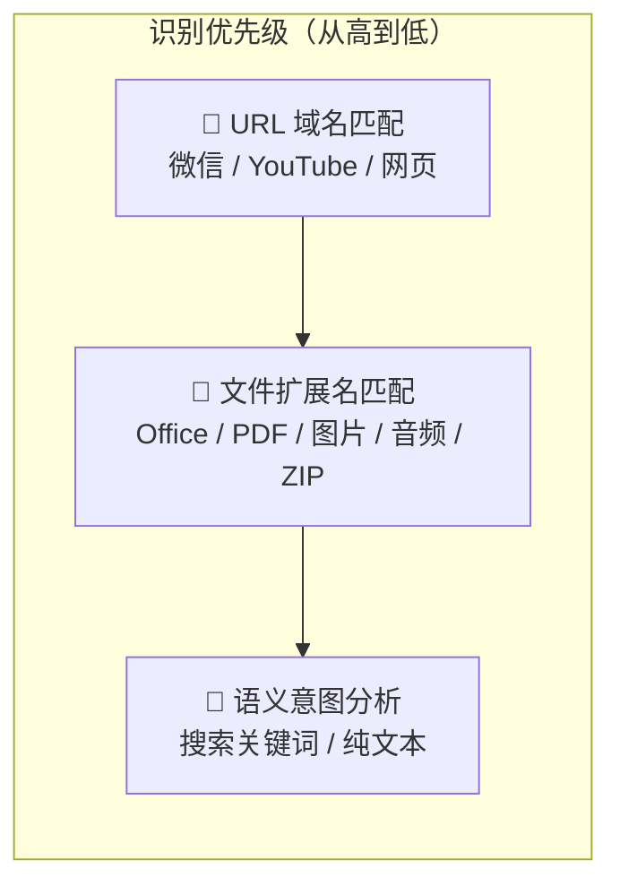

本页深入解析 **anything-to-notebooklm** Skill 如何在接收用户自然语言输入后，自动判断内容源的类型（微信公众号、YouTube、网页、本地文件、搜索关键词等），并将其路由到正确的处理管线。这一识别机制是整个工作流的**第一步**（Step 1），决定了后续内容获取与转换的路径选择。理解它的判断逻辑，有助于你在使用中准确触发目标内容源，也能在识别错误时快速定位原因。

Sources: [SKILL.md](SKILL.md#L139-L157)

## 识别机制总览：三层分类策略

内容源识别并非通过硬编码的 if-else 完成，而是基于 **Claude 的自然语言理解能力**配合 **SKILL.md 中定义的规则表**实现。Claude 在运行时读取 Skill 定义中的识别规则，对用户输入进行模式匹配与语义推理，最终将输入归类为三大阵营之一：**URL 类**、**本地文件类**、**纯文本/搜索类**。

这种设计的关键在于：识别规则以声明式表格形式写在 SKILL.md 中（而非嵌入代码逻辑），Claude 作为执行引擎在每次运行时动态解析这些规则，从而实现了**零代码配置**的类型路由。

下面的 Mermaid 图展示了完整的识别决策流程：

```mermaid
flowchart TD
    A["用户自然语言输入"] --> B{"输入中是否包含 URL？"}
    
    B -->|"是：含 mp.weixin.qq.com"| C["微信公众号"]
    B -->|"是：含 youtube.com / youtu.be"| D["YouTube 视频"]
    B -->|"是：含 http:// 或 https://"| E["普通网页"]
    
    B -->|"否：检查本地路径"| F{"路径是否指向文件？"}
    
    F -->|".md 文件| G["Markdown → 直接上传"]
    F -->|".docx / .pptx / .xlsx / .pdf / .epub"| H["Office/电子书 → markitdown 转换"]
    F -->|".jpg / .png / .gif / .webp"| I["图片 → OCR 识别"]
    F -->|".mp3 / .wav"| J["音频 → 语音转录"]
    F -->|".zip"| K["压缩包 → 批量解压处理"]
    F -->|".csv / .json / .xml"| L["结构化数据 → markitdown 转换"]
    
    F -->|"无 URL，无文件路径"| M{"是否含搜索意图？"}
    M -->|"是：如 '搜索 xxx'"| N["搜索关键词 → WebSearch"]
    M -->|"否"| O["纯文本内容 → 直接处理"]
    
    C --> P["Step 2: 内容获取"]
    D --> P
    E --> P
    G --> P
    H --> P
    I --> P
    J --> P
    K --> P
    L --> P
    N --> P
    O --> P
```

Sources: [SKILL.md](SKILL.md#L139-L157), [README.md](README.md#L205-L213)

## URL 类识别：域名模式匹配

URL 类是最优先的识别维度。当用户输入中包含 URL 时，Claude 会根据域名前缀进行精确匹配，路由到不同的处理管线。

### 识别规则表

| 输入特征 | 识别结果 | 处理方式 | 内容获取路径 |
|---------|---------|---------|------------|
| `https://mp.weixin.qq.com/s/` 或 `https://mp.weixin.qq.com/s?` | 微信公众号文章 | MCP 工具 `read_weixin_article` 抓取 | 需要独立 MCP 服务器 |
| `https://youtube.com/...` 或 `https://youtu.be/...` | YouTube 视频 | URL 直接传递给 NotebookLM | NotebookLM 自动提取字幕 |
| 其他 `https://` 或 `http://` 开头的 URL | 普通网页 | URL 直接传递给 NotebookLM | NotebookLM 自动抓取网页 |

值得注意的是三种 URL 类的**处理路径差异**：微信文章因为反爬虫机制，必须走本地 MCP 服务器（基于 Playwright 浏览器模拟）绕过限制；而 YouTube 和普通网页则通过 NotebookLM 的原生 URL 处理能力，由 NotebookLM 服务端直接抓取内容，客户端无需额外操作。

Sources: [SKILL.md](SKILL.md#L145-L147)

### 微信公众号的精确匹配逻辑

微信公众号的识别采用了**最长前缀匹配**的思路——域名 `mp.weixin.qq.com` 是微信文章的专属域名，这保证了不会与其他 URL 混淆。规则定义了两种合法的文章链接格式：

- `https://mp.weixin.qq.com/s/` — 短链接格式（路径含 `/s/`）
- `https://mp.weixin.qq.com/s?` — 参数格式（路径为 `/s` 后跟查询参数）

这两种格式覆盖了微信文章的所有 URL 变体。如果用户输入的 URL 包含 `mp.weixin.qq.com` 但不匹配以上两种路径格式（例如分享卡片中的其他页面），系统会将其识别为**普通网页**而非微信文章，从而避免错误调用 MCP 工具。

Sources: [SKILL.md](SKILL.md#L145)

### YouTube 的双域名识别

YouTube 的识别需要覆盖两种 URL 形态：

- `https://youtube.com/watch?v=...` — 标准完整链接
- `https://youtu.be/...` — 分享短链接

两种链接指向同一视频资源，NotebookLM 在接收后都能正确提取字幕和元数据。这种双域名识别确保了无论用户粘贴哪种分享链接，都能被正确路由到 YouTube 处理管线。

Sources: [SKILL.md](SKILL.md#L146)

## 本地文件类识别：扩展名驱动的处理路由

当输入中不包含 URL 但包含指向本地文件的路径时，识别机制进入**文件扩展名匹配**阶段。文件类型的差异直接决定了后续的转换工具和处理流程。

### 扩展名与处理方式映射表

| 文件扩展名 | 内容类别 | 转换工具 | 输出格式 | NotebookLM 上传方式 |
|-----------|---------|---------|---------|-------------------|
| `.docx` | Word 文档 | markitdown | Markdown → TXT | `notebooklm source add /tmp/*.txt` |
| `.pptx` | PowerPoint | markitdown | Markdown → TXT | `notebooklm source add /tmp/*.txt` |
| `.xlsx` | Excel 表格 | markitdown | Markdown → TXT | `notebooklm source add /tmp/*.txt` |
| `.pdf` | PDF 文档 | markitdown | Markdown → TXT | `notebooklm source add /tmp/*.txt` |
| `.epub` | EPUB 电子书 | markitdown | Markdown → TXT | `notebooklm source add /tmp/*.txt` |
| `.md` | Markdown | 无需转换 | 原文件直接上传 | `notebooklm source add /path/to/file.md` |
| `.jpg` / `.png` / `.gif` / `.webp` | 图片 | markitdown OCR | OCR 文字 → TXT | `notebooklm source add /tmp/*.txt` |
| `.mp3` / `.wav` | 音频 | markitdown | 语音转录 → TXT | `notebooklm source add /tmp/*.txt` |
| `.csv` / `.json` / `.xml` | 结构化数据 | markitdown | Markdown → TXT | `notebooklm source add /tmp/*.txt` |
| `.zip` | 压缩包 | 先解压，再按内部文件类型处理 | 合并为单个或多个 TXT | `notebooklm source add /tmp/*.txt` |

从表中可以观察到一个关键的设计分叉：**Markdown 文件（`.md`）是唯一跳过 markitdown 转换、直接上传至 NotebookLM 的文件类型**。这是因为 NotebookLM 原生支持 Markdown 格式，无需中间转换。而所有其他文件类型（包括 PDF、Office 文档、图片、音频等）都需要先通过 markitdown 转换为 TXT 中间文件，再上传到 NotebookLM。

Sources: [SKILL.md](SKILL.md#L148-L156)

### markitdown 转换管线

markitdown 是 Microsoft 开源的文件格式转换工具，是本 Skill 的核心依赖之一。它在文件处理管线中扮演**格式统一层**的角色——将 10 种以上不同的文件格式统一转换为 Markdown 文本，最终保存为 TXT 文件供 NotebookLM 消费。

转换命令的标准模式为：

```bash
markitdown /path/to/input_file.ext -o /tmp/converted.md
```

转换后的 Markdown 文件会被保存为带有时间戳的临时文件（如 `/tmp/{filename}_converted_{timestamp}.txt`），以避免并发处理时的文件名冲突。

Sources: [SKILL.md](SKILL.md#L169-L172), [requirements.txt](requirements.txt#L8)

### ZIP 压缩包的递归处理

ZIP 文件的识别触发了一套**递归处理管线**：首先解压到临时目录，然后遍历解压后的所有文件，对每个支持格式的文件分别调用 markitdown 转换，最终合并为单个 TXT 或作为多个独立 Source 上传。这意味着 ZIP 内的文件同样会经过上述的扩展名匹配逻辑——识别机制在 ZIP 解压后**递归生效**。

Sources: [SKILL.md](SKILL.md#L156)

## 搜索关键词与纯文本识别

当用户输入中**既不包含 URL、也不包含本地文件路径**时，识别机制进入第三层判断。

### 搜索关键词识别

如果用户输入包含明确的搜索意图（例如"搜索 'AI发展趋势'"、"搜索关于'量子计算'的资料"），Claude 会将其识别为**搜索查询**，触发 WebSearch 工具搜索关键词，汇总前 3-5 条结果，最终保存为 TXT 文件上传到 NotebookLM。

搜索关键词的识别依赖 Claude 对自然语言的理解能力——而非硬编码的触发词列表。用户表达搜索意图的方式可以非常多样（"帮我查一下"、"搜索"、"找找关于..."），Claude 会综合语义判断是否为搜索请求。

Sources: [SKILL.md](SKILL.md#L157)

### 纯文本直接处理

如果既无 URL、也无文件路径、也无搜索意图，那么用户输入的内容将被视为**纯文本**，直接作为内容源上传处理。这种模式适合用户直接粘贴文章内容、笔记片段等场景。

Sources: [SKILL.md](SKILL.md#L48-L49)

## 三层识别的优先级与冲突处理

整个识别机制遵循**严格的优先级顺序**：URL 匹配 > 文件路径匹配 > 文本/搜索意图分析。这意味着如果用户输入中同时包含 URL 和文件路径，系统会优先按 URL 处理。但在[多源内容混合整合](24-duo-yuan-nei-rong-hun-he-zheng-he)场景中，用户可以同时提供多种来源，系统会分别识别并并行处理。



Sources: [SKILL.md](SKILL.md#L139-L157)

## 识别后的路由与下一步

内容源类型被识别后，系统进入 **Step 2：内容获取与转换**阶段。不同识别结果会触发不同的获取管线，这在 [内容获取与转换：MCP 抓取、markitdown 转换与直接传递](7-nei-rong-huo-qu-yu-zhuan-huan-mcp-zhua-qu-markitdown-zhuan-huan-yu-zhi-jie-chuan-di) 页面中有详细解析。以下表格总结了各识别类型的下游处理走向：

| 识别结果 | 下游处理 | 核心依赖工具 |
|---------|---------|------------|
| 微信公众号 | MCP 服务器抓取 → TXT | weixin-reader MCP |
| YouTube / 网页 | URL 直接传递 | NotebookLM 原生能力 |
| Office / PDF / EPUB | markitdown → Markdown → TXT | markitdown CLI |
| 图片 | markitdown OCR → TXT | markitdown CLI |
| 音频 | markitdown 转录 → TXT | markitdown CLI |
| ZIP | 解压 → 递归识别 → 批量转换 | markitdown CLI |
| 搜索关键词 | WebSearch → 汇总 → TXT | WebSearch 工具 |
| 纯文本 | 直接处理 | — |

Sources: [SKILL.md](SKILL.md#L159-L196)

## 延伸阅读

- 了解识别后的具体内容获取管线，参见 [内容获取与转换：MCP 抓取、markitdown 转换与直接传递](7-nei-rong-huo-qu-yu-zhuan-huan-mcp-zhua-qu-markitdown-zhuan-huan-yu-zhi-jie-chuan-di)
- 了解各内容源的详细处理细节，参见 [微信公众号文章：MCP 服务器抓取与反爬虫绕过](9-wei-xin-gong-zhong-hao-wen-zhang-mcp-fu-wu-qi-zhua-qu-yu-fan-pa-chong-rao-guo)、[网页与 YouTube 视频：URL 直接传递处理](10-wang-ye-yu-youtube-shi-pin-url-zhi-jie-chuan-di-chu-li)、[Office 与电子书文档：markitdown 格式转换链路](11-office-yu-dian-zi-shu-wen-dang-markitdown-ge-shi-zhuan-huan-lian-lu)
- 了解整体技术架构，参见 [整体技术架构：从自然语言到文件生成的数据流](5-zheng-ti-ji-zhu-jia-gou-cong-zi-ran-yu-yan-dao-wen-jian-sheng-cheng-de-shu-ju-liu)