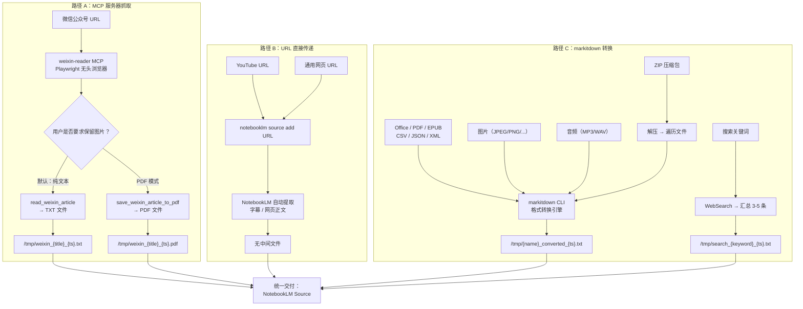
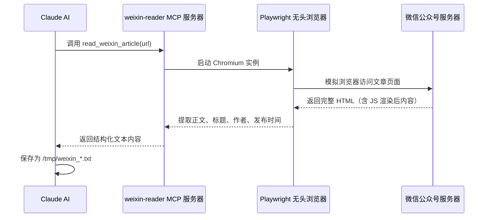
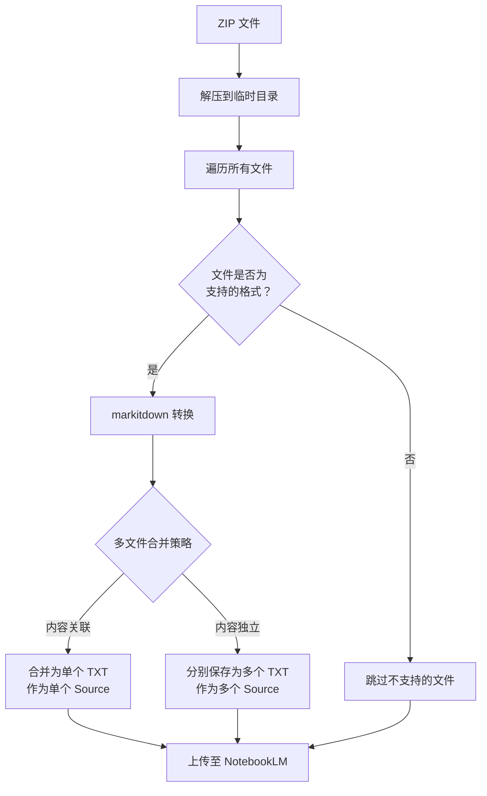

内容源类型被识别之后（参见 [内容源智能识别：URL 与文件类型自动判断机制](6-nei-rong-yuan-zhi-neng-shi-bie-url-yu-wen-jian-lei-xing-zi-dong-pan-duan-ji-zhi)），系统进入**内容获取与转换**阶段——这是整个五阶段管线中最具多样性的环节。虽然支持的输入源多达 15 种，但在架构层面可归纳为**三条获取路径**：**MCP 服务器抓取**（微信公众号）、**URL 直接传递**（网页与 YouTube）、**markitdown 格式转换**（本地文件与搜索汇总）。每条路径由不同的技术组件驱动，最终产出统一为 NotebookLM 可消费的 Source。

Sources: [SKILL.md](SKILL.md#L159-L196)

## 三条路径总览

下面这张 Mermaid 图展示了三条内容获取路径的完整数据流向，从不同的输入源出发，经过各自的转换管线，最终统一交付给 NotebookLM：



三条路径的**核心差异**在于内容获取的执行主体不同：路径 A 由本地 MCP 服务器执行抓取，路径 B 将抓取工作委托给 NotebookLM 云端，路径 C 由本地 markitdown CLI 执行格式转换。下表从多个维度对三条路径进行系统对比：

| 对比维度 | 路径 A：MCP 服务器抓取 | 路径 B：URL 直接传递 | 路径 C：markitdown 转换 |
|---------|---------------------|-------------------|----------------------|
| **适用内容源** | 微信公众号文章 | YouTube 视频、公开网页 | Office/PDF/EPUB/图片/音频/ZIP/结构化数据 |
| **执行主体** | 本地 MCP 服务器（Playwright） | NotebookLM 云端 | 本地 markitdown CLI |
| **是否产生中间文件** | ✅ 产生 TXT 或 PDF | ❌ 无中间文件 | ✅ 产生 TXT |
| **输出格式** | `.txt` 或 `.pdf` | 无（URL 直接注册为 Source） | `.txt` |
| **核心依赖** | weixin-reader MCP + Playwright + Chromium | NotebookLM 原生 URL 处理 | markitdown 及其 `[all]` 扩展 |
| **为什么需要这条路径** | 微信反爬虫机制阻止简单 HTTP 请求 | NotebookLM 对 YouTube/网页的提取能力更强 | NotebookLM 不支持直接消费 Office/图片等格式 |

Sources: [SKILL.md](SKILL.md#L159-L196), [requirements.txt](requirements.txt#L1-L11)

## 路径 A：MCP 服务器抓取——微信公众号专用管线

微信公众号文章是所有内容源中**唯一需要本地服务器参与抓取**的类型。原因是微信的**反爬虫机制**会拦截直接的 HTTP 请求（包括缺少浏览器指纹的 curl/wget 调用），因此项目引入了一个基于 MCP（Model Context Protocol）协议的独立服务器 `weixin-reader`，通过 **Playwright 无头浏览器**模拟真实用户访问来绕过限制。

### 双模式输出：TXT 与 PDF

MCP 服务器暴露了两个工具，对应两种输出模式，Claude 根据用户意图自动选择：

| 工具名称 | 触发条件 | 输出 | 保存路径 | 特点 |
|---------|---------|------|---------|------|
| `read_weixin_article` | 默认模式（用户未指定格式） | 纯文本 TXT | `/tmp/weixin_{title}_{timestamp}.txt` | 轻量、快速，适合文本类生成（播客、报告等） |
| `save_weixin_article_to_pdf` | 用户要求转为 PDF 或保留图片 | 完整 PDF | `/tmp/weixin_{title}_{timestamp}.pdf` | 保留原始图片和排版，适合视觉类生成 |

### MCP 调用链路



MCP 服务器的配置位于 `~/.claude/config.json`，Claude Code 启动时加载该配置并注册 `weixin-reader` 为可调用工具。在 `.claude/settings.local.json` 中，`mcp__weixin-reader__read_weixin_article` 被显式添加到权限白名单，确保 Claude 可以无需用户确认直接调用该工具。

Sources: [SKILL.md](SKILL.md#L159-L163), [SKILL.md](SKILL.md#L530-L550), [.claude/settings.local.json](.claude/settings.local.json#L1-L8)

## 路径 B：URL 直接传递——零本地开销策略

对于 YouTube 视频和公开可访问的网页，项目采用了**零中间层**策略：**不自行抓取和转换内容**，而是将 URL 直接传递给 NotebookLM，由 Google 的基础设施完成内容提取。

### 执行方式

```bash
notebooklm source add https://www.youtube.com/watch?v=abc123
notebooklm source add https://example.com/article
```

这条路径**不产生任何中间文件**。URL 被直接注册为 NotebookLM 的一个 Source，NotebookLM 服务端负责：

- **YouTube 视频**：自动提取字幕（包括自动生成的字幕）和视频元数据（标题、时长、描述）
- **通用网页**：自行抓取网页正文，剥离导航栏、广告等噪声内容

### 设计决策：为什么选择直接传递

选择直接传递而非本地抓取转换，基于以下考量：

1. **NotebookLM 对 YouTube 字幕的提取质量**通常优于第三方转录工具，因为 Google 拥有 YouTube 的完整数据
2. **零本地处理开销**——不需要额外的 HTTP 请求库或字幕提取工具
3. **避免版权风险**——内容始终在 NotebookLM 的合规框架内处理
4. **简化依赖链**——不引入额外的 Python 包（如 `youtube-transcript-api`）

Sources: [SKILL.md](SKILL.md#L165-L167)

## 路径 C：markitdown 格式转换——覆盖面最广的管线

这是三条路径中**覆盖文件类型最多**的一条。所有需要从本地文件中提取文本内容的场景都走这条路径，包括 Office 文档、PDF、EPUB 电子书、图片（OCR）、音频（转录）、结构化数据（CSV/JSON/XML），以及 ZIP 压缩包内的批量文件。

### markitdown：统一的格式转换引擎

**markitdown** 是 Microsoft 开源的文件格式转换工具（`markitdown[all]`），在本 Skill 中扮演**格式统一层**的角色。它将 10 种以上不同的文件格式统一转换为 Markdown 文本，最终保存为 TXT 文件供 NotebookLM 消费。

转换的标准命令模式为：

```bash
markitdown /path/to/input_file.ext -o /tmp/converted.md
```

转换后的 Markdown 文件以带时间戳的 TXT 文件保存，命名规则为 `/tmp/{filename}_converted_{timestamp}.txt`，避免并发处理时的文件名冲突。最终通过 `notebooklm source add /tmp/xxx.txt --wait` 上传至 NotebookLM。

### 各文件类型的转换详情

| 文件类型 | 扩展名 | markitdown 内部处理 | 产出 |
|---------|-------|-------------------|------|
| Word 文档 | `.docx` | 解析 DOCX XML 结构，提取段落、表格、列表 | Markdown → TXT |
| PowerPoint | `.pptx` | 提取每页幻灯片的文本内容和备注 | Markdown → TXT |
| Excel 表格 | `.xlsx` | 按工作表逐个转换为 Markdown 表格 | Markdown → TXT |
| PDF 文档 | `.pdf` | 全文提取（非扫描件）；扫描件走 OCR 通道 | Markdown → TXT |
| EPUB 电子书 | `.epub` | 解析电子书结构，按章节提取全文 | Markdown → TXT |
| 图片 | `.jpg/.png/.gif/.webp` | 调用 OCR 引擎识别文字 + 提取 EXIF 元数据 | OCR 文字 → TXT |
| 音频 | `.mp3/.wav` | 自动转录语音为文字 + 提取音频元数据 | 转录文字 → TXT |
| CSV 数据 | `.csv` | 逗号分隔数据转为 Markdown 表格 | Markdown → TXT |
| JSON 数据 | `.json` | JSON 结构化数据格式化展示 | Markdown → TXT |
| XML 文档 | `.xml` | XML 结构化数据解析与展示 | Markdown → TXT |
| Markdown | `.md` | **跳过 markitdown，直接上传原文件** | 无中间文件 |

**关键例外**：Markdown 文件（`.md`）是唯一不走 markitdown 转换的本地文件类型，因为 NotebookLM **原生支持 Markdown 格式**，直接执行 `notebooklm source add /path/to/file.md` 即可。

Sources: [SKILL.md](SKILL.md#L148-L172), [requirements.txt](requirements.txt#L8)

### ZIP 压缩包的递归管线

ZIP 文件触发一条**递归处理管线**，其流程如下：



解压后的每个文件会根据其扩展名被重新识别和路由（复用 [内容源智能识别](6-nei-rong-yuan-zhi-neng-shi-bie-url-yu-wen-jian-lei-xing-zi-dong-pan-duan-ji-zhi) 的规则），然后走对应的 markitdown 转换路径。这种递归设计保证了 ZIP 内的嵌套文件（如 ZIP 中包含的 PDF 或 Office 文档）能被正确处理。

Sources: [SKILL.md](SKILL.md#L156), [SKILL.md](SKILL.md#L186-L191)

### 搜索关键词的汇总管线

当用户输入被识别为搜索关键词时（参见 [内容源智能识别](6-nei-rong-yuan-zhi-neng-shi-bie-url-yu-wen-jian-lei-xing-zi-dong-pan-duan-ji-zhi)），系统使用 **WebSearch 工具**搜索关键词，汇总前 3-5 条搜索结果，将汇总内容保存为 `/tmp/search_{keyword}_{timestamp}.txt`。这条路径的产出同样是 TXT 文件，与其他 markitdown 路径的输出格式保持一致。

Sources: [SKILL.md](SKILL.md#L157), [SKILL.md](SKILL.md#L193-L196)

## 临时文件生命周期

三条路径中，路径 A 和路径 C 都会在 `/tmp/` 目录下产生临时文件。理解这些文件的生命周期对排查问题和管理系统资源至关重要。

| 文件模式 | 产生路径 | 示例文件名 | 何时清理 |
|---------|---------|-----------|---------|
| `weixin_*_{ts}.txt` | 路径 A（MCP 抓取，纯文本模式） | `/tmp/weixin_深度学习的未来趋势_1706265600.txt` | 上传至 NotebookLM 后统一清理 |
| `weixin_*_{ts}.pdf` | 路径 A（MCP 抓取，PDF 模式） | `/tmp/weixin_深度学习的未来趋势_1706265600.pdf` | 上传至 NotebookLM 后统一清理 |
| `{name}_converted_{ts}.txt` | 路径 C（markitdown 转换） | `/tmp/research_converted_1706265600.txt` | 上传至 NotebookLM 后统一清理 |
| `search_{keyword}_{ts}.txt` | 路径 C（搜索汇总） | `/tmp/search_AI发展趋势_1706265600.txt` | 上传至 NotebookLM 后统一清理 |

清理操作在所有内容成功上传至 NotebookLM 后执行，命令为 `rm /tmp/*.txt`、`rm /tmp/*.pdf`、`rm /tmp/*.json`。由于文件存放在 `/tmp/` 目录，即使 Skill 未执行清理，操作系统也会在重启时自动清除。文件命名中的 **`{timestamp}`** 后缀确保了并发处理多个文件时不会发生命名冲突。

Sources: [SKILL.md](SKILL.md#L210-L216), [SKILL.md](SKILL.md#L519-L522)

## 获取完成后的下一步

内容获取与转换完成后，系统进入 **Step 3：上传至 NotebookLM** 阶段。无论内容通过哪条路径获取，最终的产出物（TXT/PDF 文件或 URL）都会通过 `notebooklm source add` 命令注册为 NotebookLM 的 Source，并使用 `--wait` 参数确保处理完成。完整的上传与后续生成流程详见 [NotebookLM 上传与内容生成流程](8-notebooklm-shang-chuan-yu-nei-rong-sheng-cheng-liu-cheng)。

| 获取路径产出 | NotebookLM 上传命令 | 说明 |
|------------|-------------------|------|
| `/tmp/weixin_*.txt` | `notebooklm source add /tmp/weixin_*.txt --wait` | 微信文章纯文本 |
| `/tmp/weixin_*.pdf` | `notebooklm source add /tmp/weixin_*.pdf --wait` | 微信文章 PDF（含图片） |
| YouTube/网页 URL | `notebooklm source add [URL] --wait` | 无中间文件，直接注册 |
| `/tmp/*_converted_*.txt` | `notebooklm source add /tmp/*_converted_*.txt --wait` | markitdown 转换产物 |
| `/tmp/search_*.txt` | `notebooklm source add /tmp/search_*.txt --wait` | 搜索汇总产物 |

Sources: [SKILL.md](SKILL.md#L198-L207)

## 延伸阅读

- **上游**：内容获取的输入来自 [内容源智能识别：URL 与文件类型自动判断机制](6-nei-rong-yuan-zhi-neng-shi-bie-url-yu-wen-jian-lei-xing-zi-dong-pan-duan-ji-zhi)
- **下游**：获取后的上传与生成流程参见 [NotebookLM 上传与内容生成流程](8-notebooklm-shang-chuan-yu-nei-rong-sheng-cheng-liu-cheng)
- **深入 MCP**：微信公众号抓取的技术细节参见 [微信公众号文章：MCP 服务器抓取与反爬虫绕过](9-wei-xin-gong-zhong-hao-wen-zhang-mcp-fu-wu-qi-zhua-qu-yu-fan-pa-chong-rao-guo)
- **深入直接传递**：参见 [网页与 YouTube 视频：URL 直接传递处理](10-wang-ye-yu-youtube-shi-pin-url-zhi-jie-chuan-di-chu-li)
- **深入 markitdown**：参见 [Office 与电子书文档：markitdown 格式转换链路](11-office-yu-dian-zi-shu-wen-dang-markitdown-ge-shi-zhuan-huan-lian-lu)
- **整体架构**：参见 [整体技术架构：从自然语言到文件生成的数据流](5-zheng-ti-ji-zhu-jia-gou-cong-zi-ran-yu-yan-dao-wen-jian-sheng-cheng-de-shu-ju-liu)