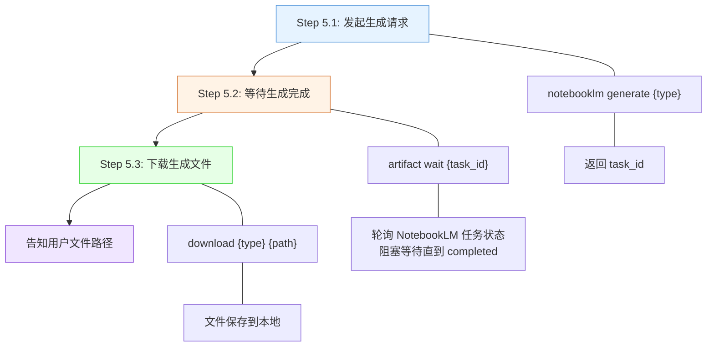
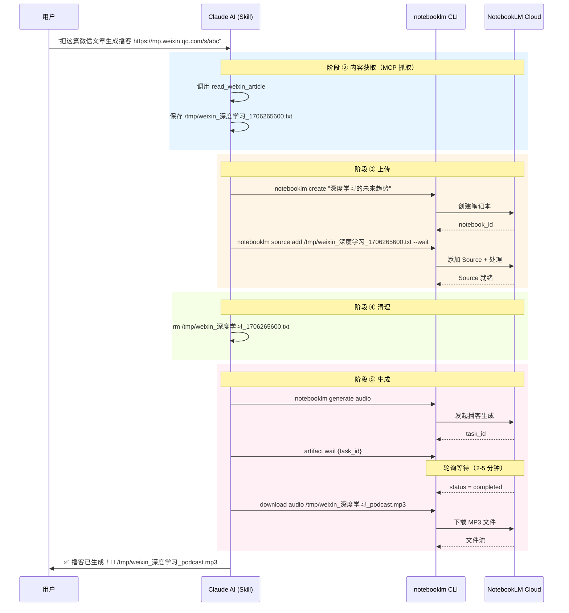

内容经过三条获取路径（参见 [内容获取与转换：MCP 抓取、markitdown 转换与直接传递](7-nei-rong-huo-qu-yu-zhuan-huan-mcp-zhua-qu-markitdown-zhuan-huan-yu-zhi-jie-chuan-di)）统一交付后，系统进入**五阶段管线**的后半段——**上传（Stage ③）、清理（Stage ④）、生成与下载（Stage ⑤）**。这三个阶段是整个数据流中与 NotebookLM 云端交互最密集的部分，也是决定最终产物质量的关键环节。本文将从命令级粒度解析这三个阶段的执行逻辑、设计决策和故障模式。

Sources: [SKILL.md](SKILL.md#L198-L237), [SKILL.md](SKILL.md#L239-L351)

## Stage ③：上传至 NotebookLM——从本地文件到云端 Source

无论内容通过哪条路径获取，最终都要汇入 NotebookLM 这个统一的云端处理平台。上传阶段包含两个**严格顺序执行**的操作：先创建笔记本容器，再向其中添加内容源。

### 两步上传序列

```mermaid
sequenceDiagram
    participant Claude as Claude AI (编排器)
    participant CLI as notebooklm CLI
    participant NLM as NotebookLM Cloud

    Note over Claude: 前置阶段：内容获取与转换已完成
    rect rgb(230, 245, 255)
        Claude->>CLI: notebooklm create "{title}"
        CLI->>NLM: POST /notebooks
        NLM-->>CLI: 返回 notebook_id
        CLI-->>Claude: 笔记本创建成功
    end

    rect rgb(255, 245, 230)
        Claude->>CLI: notebooklm source add /tmp/weixin_xxx.txt --wait
        CLI->>NLM: POST /notebooks/{id}/sources
        NLM-->>CLI: 返回 task_id，开始处理
        Note over CLI,NLM: --wait 阻塞等待<br/>NotebookLM 索引与分析
        NLM-->>CLI: status = completed
        CLI-->>Claude: Source 添加完成
    end

    Note over Claude: 多源场景：重复 source add 步骤
    rect rgb(245, 255, 230)
        Claude->>CLI: notebooklm source add /tmp/research_converted_xxx.txt --wait
        CLI->>NLM: POST /notebooks/{id}/sources
        NLM-->>CLI: 处理完成
    end
end
```

**第一步：创建笔记本**。命令 `notebooklm create "{title}"` 在 NotebookLM 云端创建一个新的笔记本容器。每个用户请求默认创建独立笔记本，确保不同任务的内容互不干扰。`{title}` 从原始内容的标题或文件名中提取，使笔记本具有可识别性。

**第二步：添加内容源**。命令 `notebooklm source add <file_or_url> --wait` 将获取阶段产出的文件或 URL 注册为该笔记本的一个 Source。不同获取路径的产出物通过同一个命令汇入：

| 获取路径产出 | 上传命令示例 | 说明 |
|------------|------------|------|
| MCP 抓取的 TXT 文件 | `notebooklm source add /tmp/weixin_深度学习_1706265600.txt --wait` | 微信文章纯文本 |
| MCP 抓取的 PDF 文件 | `notebooklm source add /tmp/weixin_深度学习_1706265600.pdf --wait` | 微信文章含图片版 |
| YouTube / 网页 URL | `notebooklm source add https://youtube.com/watch?v=abc --wait` | 无中间文件，直接注册 |
| markitdown 转换产物 | `notebooklm source add /tmp/research_converted_1706265600.txt --wait` | Office/PDF/EPUB 等转换后 |
| 搜索汇总 TXT | `notebooklm source add /tmp/search_AI趋势_1706265600.txt --wait` | WebSearch 汇总产物 |
| Markdown 原文件 | `notebooklm source add /Users/joe/notes.md --wait` | 唯一直接上传原文件的类型 |

Sources: [SKILL.md](SKILL.md#L198-L207)

### `--wait` 参数：可靠性的关键保障

`--wait` 是上传阶段中**最重要的可靠性参数**。它的作用是让 notebooklm CLI 在发出添加 Source 请求后**同步阻塞等待**，直到 NotebookLM 云端完成对上传内容的处理（包括索引构建、语义分析等后台任务）。

不使用 `--wait` 时，CLI 命令会立即返回成功，但 NotebookLM 可能还在后台处理内容。此时如果立即发起 `generate` 请求，NotebookLM 会因为 Source 尚未就绪而导致**生成失败**。SKILL.md 中明确强调：

> **等待处理完成很重要**，否则后续生成会失败。

这是一个典型的**异步一致性**问题。`--wait` 将其转化为同步语义——命令返回时，Source 已被完全处理，后续操作可以安全进行。

Sources: [SKILL.md](SKILL.md#L202-L207)

### 多源上传的顺序策略

当用户同时提供多个内容源时（例如"把这篇文章、这个视频和这个 PDF 一起做成 PPT"），Skill 会**依次执行多个 `source add --wait`** 操作，将所有内容注册到同一个笔记本中。这种顺序执行而非并行执行的设计，原因是：

1. **每个 `--wait` 都是阻塞调用**——前一个 Source 确认就绪后才添加下一个，保证 NotebookLM 的内部状态一致
2. **避免 NotebookLM 的请求频率限制**——同时发起多个上传请求可能触发服务端限流
3. **简化错误处理**——任何一步失败可以立即中断并报告，无需管理并发任务的复杂状态

上传完成后，该笔记本将包含所有 Source 的完整内容，后续的生成操作可以基于**全部内容进行综合分析与关联**——这正是 NotebookLM 多源分析能力的价值所在。

Sources: [SKILL.md](SKILL.md#L323-L351)

## Stage ④：临时文件清理——释放本地资源

所有 Source 成功上传至 NotebookLM 后，本地 `/tmp/` 目录下的中间文件已完成使命。Skill 在此阶段执行统一清理：

```bash
rm /tmp/*.txt    # 删除所有临时 TXT 文件（微信文本、markitdown 转换产物、搜索汇总）
rm /tmp/*.pdf    # 删除微信 PDF 模式的临时文件
rm /tmp/*.json   # 删除可能的 JSON 中间文件（如思维导图临时数据）
```

清理时机的选择很重要——必须在**所有 Source 上传成功**之后执行，而非每个 Source 上传后立即清理。因为多源场景下，后续的 `source add` 操作可能需要引用前面的文件信息。统一清理确保了操作的原子性。

即使 Skill 因异常退出未执行清理，macOS/Linux 系统在重启时会自动清空 `/tmp/` 目录，这构成了天然的垃圾回收机制。但最佳实践仍然是主动清理，避免长时间运行中 `/tmp/` 空间被大量临时文件占满。

Sources: [SKILL.md](SKILL.md#L210-L216), [SKILL.md](SKILL.md#L519-L522)

## Stage ⑤：内容生成——从 Source 到最终产物

上传完成后，如果用户在自然语言输入中指定了生成意图（如"生成播客"、"做成 PPT"），系统进入**生成-等待-下载**三步流程。这是整个管线的最终产出阶段。

### 三步生成流程



**Step 5.1：发起生成请求**。`notebooklm generate {type}` 命令向 NotebookLM 发起指定类型的生成任务。NotebookLM 会基于笔记本中所有已注册 Source 的内容进行分析和生成。命令返回一个 `task_id`，作为后续跟踪的句柄。

**Step 5.2：等待生成完成**。`artifact wait {task_id}` 命令以**轮询方式**持续查询 NotebookLM 的任务状态，直到状态变为 `completed`。这个命令同样是同步阻塞的——调用者必须等待 NotebookLM 完成生成。如果任务状态在超过 10 分钟后仍为 `pending`，通常意味着生成卡住（参见 [常见错误与解决方案](25-chang-jian-cuo-wu-yu-jie-jue-fang-an-url-ge-shi-ren-zheng-shi-bai-sheng-cheng-qia-zhu)）。

**Step 5.3：下载生成文件**。`download {type} {local_path}` 命令将 NotebookLM 生成的文件下载到本地指定路径，完成最终交付。

Sources: [SKILL.md](SKILL.md#L218-L237)

### 8 种生成类型全景映射

下表展示了全部 8 种生成类型的完整命令链路和产物特征：

| 生成意图 | 发起命令 | 等待命令 | 下载命令示例 | 产物格式 | 典型耗时 |
|---------|---------|---------|------------|---------|---------|
| 🎙️ 播客 `audio` | `generate audio` | `artifact wait` | `download audio ./output.mp3` | `.mp3` | 2-5 分钟 |
| 📊 PPT `slide-deck` | `generate slide-deck` | `artifact wait` | `download slide-deck ./output.pdf` | `.pdf` | 1-3 分钟 |
| 🗺️ 思维导图 `mind-map` | `generate mind-map` | `artifact wait` | `download mind-map ./map.json` | `.json` | 1-2 分钟 |
| 📝 测验 `quiz` | `generate quiz` | `artifact wait` | `download quiz ./quiz.md --format markdown` | `.md` | 1-2 分钟 |
| 🎬 视频 `video` | `generate video` | `artifact wait` | `download video ./output.mp4` | `.mp4` | 3-8 分钟 |
| 📄 报告 `report` | `generate report` | `artifact wait` | `download report ./report.md` | `.md` | 2-4 分钟 |
| 📈 信息图 `infographic` | `generate infographic` | `artifact wait` | `download infographic ./infographic.png` | `.png` | 2-3 分钟 |
| 📋 闪卡 `flashcards` | `generate flashcards` | `artifact wait` | `download flashcards ./cards.md --format markdown` | `.md` | 1-2 分钟 |

注意 `quiz` 和 `flashcards` 的下载命令支持 `--format markdown` 参数，将 NotebookLM 内部格式转换为可读性更强的 Markdown 输出。

Sources: [SKILL.md](SKILL.md#L220-L231)

### 完整生成时序：以播客为例

下面通过一个端到端的时序图，展示从用户输入到最终文件下载的完整交互过程：



Sources: [SKILL.md](SKILL.md#L239-L268)

## 关键设计约束与故障模式

理解上传和生成阶段的几个关键约束，有助于在使用中建立正确的心智模型并快速定位问题。

### 同步阻塞模型

整个生成流程采用**同步阻塞**模型——从 `source add --wait` 到 `artifact wait`，每一步调用都会阻塞当前线程直到操作完成。这意味着：

- **播客生成**需要等待 2-5 分钟，期间 Claude Code 会持续轮询 NotebookLM 任务状态
- **视频生成**耗时最长可达 8 分钟
- 用户在等待期间应保持 Claude Code 会话活跃，不要关闭终端

Sources: [SKILL.md](SKILL.md#L512-L518)

### 并发限制

NotebookLM 对生成任务有**并发上限（最多 3 个同时进行）**。对于多意图请求（如"生成播客和 PPT"），Skill 采用**顺序执行**策略而非并行——第一个生成任务完成并下载后，才发起第二个。这种保守策略避免了并发冲突，但代价是多意图场景的总耗时是各任务耗时之和。

Sources: [SKILL.md](SKILL.md#L498-L501), [SKILL.md](SKILL.md#L462-L472)

### 内容长度边界

生成质量与输入内容长度强相关。下表列出了不同长度区间的预期效果：

| 内容长度 | 预期效果 | 风险 |
|---------|---------|------|
| < 500 字 | 生成效果不佳 | 内容不足以支撑有意义的分析 |
| 1000 - 5000 字 | ✅ **最佳区间** | 微信文章的典型长度，播客 3-8 分钟 |
| 5000 - 10000 字 | 效果良好 | 生成时间可能更长 |
| 10000 - 500000 字 | 可用但耗时长 | 生成时间显著增加 |
| > 500000 字 | ❌ 可能直接失败 | 超过 NotebookLM 处理上限 |

Sources: [SKILL.md](SKILL.md#L448-L456), [SKILL.md](SKILL.md#L503-L505)

### 生成任务卡住的处理

如果 `artifact wait` 在**超过 10 分钟**后仍未返回，通常意味着生成任务卡住。排查步骤如下：

```bash
# 检查当前所有任务状态
notebooklm artifact list

# 如果显示 "pending" 超过 10 分钟，需要在 NotebookLM 网页端手动操作
# （当前 CLI 不支持取消任务）
```

目前 notebooklm CLI 不提供任务取消命令，遇到卡住的情况需要在 [NotebookLM 网页端](https://notebooklm.google.com/) 手动处理。

Sources: [SKILL.md](SKILL.md#L589-L597)

## 无意图时的行为：惰性上传策略

一个容易被忽略但至关重要的设计决策：**如果用户的自然语言输入中没有包含任何生成意图的触发词**（参见 [自然语言意图识别：播客、PPT、思维导图、Quiz 等触发词](14-zi-ran-yu-yan-yi-tu-shi-bie-bo-ke-ppt-si-wei-dao-tu-quiz-deng-hong-fa-ci)），Skill 在执行完 Stage ③（上传）和 Stage ④（清理）后就会**立即停止**，不进入 Stage ⑤（生成）。

这种"惰性生成"策略的优势在于：

1. **避免不必要的 API 调用**——用户可能只想上传内容，稍后再决定生成什么
2. **节省等待时间**——跳过 2-8 分钟的生成等待，即时返回
3. **保留灵活性**——用户可以在 NotebookLM 网页端或后续对话中随时触发生成

上传完成后，内容已安全存储在 NotebookLM 云端，用户可以随时回来追加生成指令。

Sources: [SKILL.md](SKILL.md#L220-L221)

## 延伸阅读

- **上游**：内容如何从各种来源获取和转换，参见 [内容获取与转换：MCP 抓取、markitdown 转换与直接传递](7-nei-rong-huo-qu-yu-zhuan-huan-mcp-zhua-qu-markitdown-zhuan-huan-yu-zhi-jie-chuan-di)
- **生成意图识别**：如何从自然语言中判断用户想要什么格式，参见 [自然语言意图识别：播客、PPT、思维导图、Quiz 等触发词](14-zi-ran-yu-yan-yi-tu-shi-bie-bo-ke-ppt-si-wei-dao-tu-quiz-deng-hong-fa-ci)
- **生成命令详解**：`artifact wait` 与 `download` 的工程细节，参见 [生成命令与产物下载：artifact wait 与 download 工作流](15-sheng-cheng-ming-ling-yu-chan-wu-xia-zai-artifact-wait-yu-download-gong-zuo-liu)
- **高级场景**：多意图、自定义笔记本、自定义指令等，参见 [多意图处理：一次性生成多种格式](22-duo-yi-tu-chu-li-ci-xing-sheng-cheng-duo-chong-ge-shi) 和 [自定义 Notebook：指定已有笔记本或添加自定义生成指令](23-zi-ding-yi-notebook-zhi-ding-yi-you-bi-ji-ben-huo-tian-jia-zi-ding-yi-sheng-cheng-zhi-ling)
- **故障排查**：上传失败、生成卡住等问题，参见 [常见错误与解决方案](25-chang-jian-cuo-wu-yu-jie-jue-fang-an-url-ge-shi-ren-zheng-shi-bai-sheng-cheng-qia-zhu)
- **整体架构**：五阶段管线的完整全景，参见 [整体技术架构：从自然语言到文件生成的数据流](5-zheng-ti-ji-zhu-jia-gou-cong-zi-ran-yu-yan-dao-wen-jian-sheng-cheng-de-shu-ju-liu)