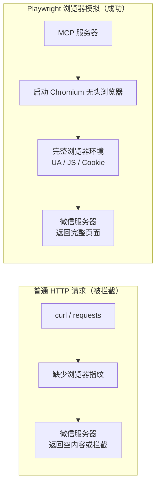
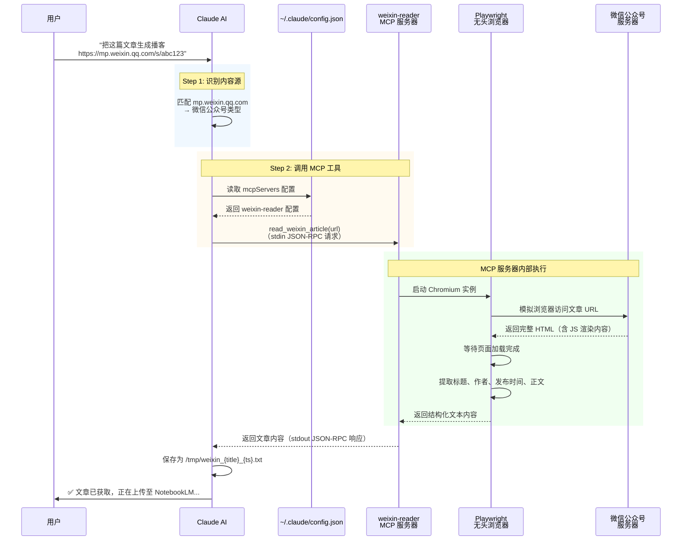
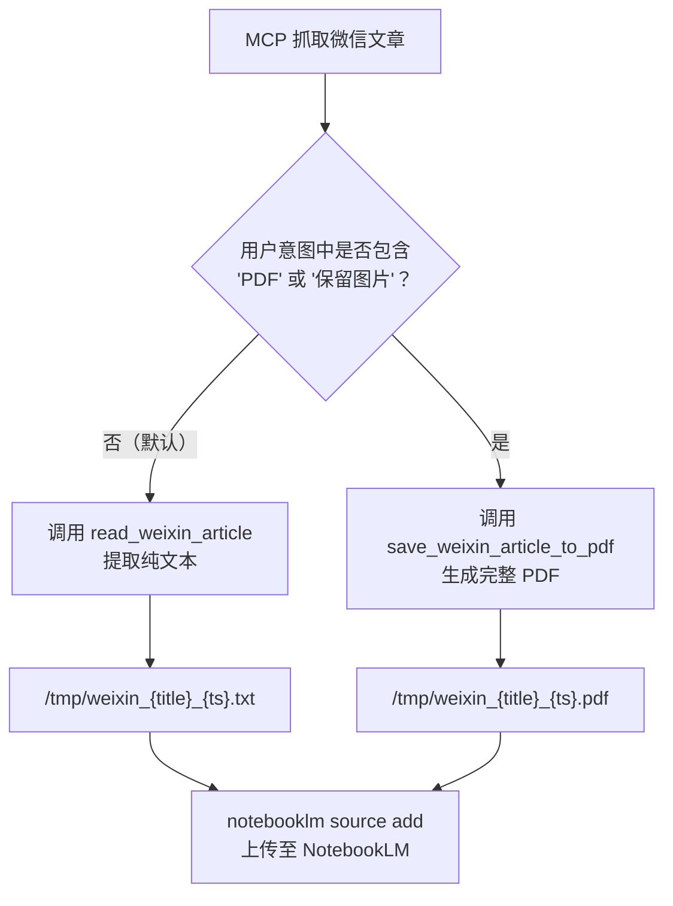

本页深入解析 **anything-to-notebooklm** Skill 如何通过独立的 MCP 服务器（`weixin-reader`）实现对微信公众号文章的可靠抓取——这是所有 15 种内容源中**唯一需要本地服务器参与内容获取**的类型。我们将从"为什么微信需要特殊处理"这个问题出发，逐步拆解 MCP 服务器的架构、Playwright 浏览器模拟的原理、双模式输出（TXT/PDF）的设计选择，以及配置与故障排查的完整指南。

Sources: [SKILL.md](SKILL.md#L14-L16), [README.md](README.md#L366-L370)

## 为什么微信公众号需要 MCP 服务器？

微信公众号文章的抓取与普通网页有着**本质区别**。当使用 curl、wget 或 Python 的 `requests` 库等工具直接发起 HTTP 请求时，微信服务器会检测请求中缺少浏览器特征（User-Agent、JavaScript 执行环境、Cookie 等），返回空内容或拦截页面，这就是所谓的**反爬虫机制**。



为绕过这一限制，项目引入了基于 **MCP（Model Context Protocol）** 的独立服务器——`weixin-reader`。该服务器使用 **Playwright** 驱动的 Chromium 无头浏览器来模拟真实用户访问，从而获得与浏览器中打开文章完全一致的页面内容。Playwright 会在后台启动一个不可见的 Chromium 浏览器实例，该实例拥有完整的 JavaScript 执行引擎、真实的浏览器 User-Agent、以及标准的 Cookie 管理——微信服务器无法将其与真实用户访问区分开来。

Sources: [SKILL.md](SKILL.md#L14-L16), [SKILL.md](SKILL.md#L405-L431), [README.md](README.md#L366-L370)

## MCP 服务器架构：weixin-reader 概览

`weixin-reader` 是一个遵循 MCP 协议的独立进程，通过标准输入/输出（stdin/stdout）与 Claude Code 通信。Claude Code 在启动时加载 `~/.claude/config.json` 中的 MCP 服务器配置，将 `weixin-reader` 注册为可调用的工具集。

### 配置结构

MCP 服务器的配置入口位于 Claude Code 的全局配置文件中：

| 配置项 | 值 | 说明 |
|-------|---|------|
| 服务器名称 | `weixin-reader` | Claude Code 中注册的工具集标识 |
| 启动命令 | `python` | 使用 Python 解释器启动 |
| 参数 | `server.py` 的绝对路径 | MCP 服务器入口文件的完整路径 |
| 通信方式 | stdin/stdout（标准 MCP 协议） | 通过 JSON-RPC 消息交换指令和结果 |

配置示例：

```json
{
  "primaryApiKey": "any",
  "mcpServers": {
    "weixin-reader": {
      "command": "python",
      "args": [
        "/Users/{用户名}/.claude/skills/anything-to-notebooklm/wexin-read-mcp/src/server.py"
      ]
    }
  }
}
```

注意 `server.py` 的路径必须是**绝对路径**，指向本地的 `wexin-read-mcp/src/server.py` 文件。该文件在 `install.sh` 安装过程中通过 `git clone` 从 GitHub 仓库克隆到 Skill 目录下。

Sources: [SKILL.md](SKILL.md#L56-L78), [SKILL.md](SKILL.md#L530-L550), [install.sh](install.sh#L40-L51)

### 完整调用链路

下面的时序图展示了从 Claude AI 识别微信链接到最终获取文章内容的完整调用流程：



整个调用链路中，Claude AI 充当**调度中心**的角色：它识别用户输入中的微信链接，从配置文件中找到 MCP 服务器地址，通过标准 MCP 协议调用远程工具，最后将返回的内容保存为本地文件。

Sources: [SKILL.md](SKILL.md#L159-L163), [SKILL.md](SKILL.md#L56-L78)

## 双模式输出：TXT 与 PDF

MCP 服务器暴露了**两个工具**，对应两种内容输出模式。Claude 根据用户的意图自动选择合适的工具：

### 模式对比

| 对比维度 | 纯文本模式 | PDF 模式 |
|---------|----------|---------|
| **MCP 工具名称** | `read_weixin_article` | `save_weixin_article_to_pdf` |
| **触发条件** | 默认模式（用户未指定格式） | 用户明确要求"转为 PDF"或"保留图片" |
| **输出格式** | `.txt` 纯文本文件 | `.pdf` 包含图片的完整文档 |
| **保存路径** | `/tmp/weixin_{title}_{timestamp}.txt` | `/tmp/weixin_{title}_{timestamp}.pdf` |
| **内容完整性** | 仅文本（标题、作者、时间、正文） | 文本 + 原始图片 + 排版格式 |
| **文件大小** | 较小（通常 10-100 KB） | 较大（取决于图片数量） |
| **适用场景** | 生成播客、报告、思维导图等文本类输出 | 保留文章视觉效果的存档或分享 |
| **上传命令** | `notebooklm source add /tmp/weixin_*.txt --wait` | `notebooklm source add /tmp/weixin_*.pdf --wait` |

### 模式选择决策流程



对于**初学者**来说，大多数情况下默认的纯文本模式就足够了——NotebookLM 生成播客、PPT、思维导图等所有输出格式都基于文本内容，不需要原始图片。只有当你明确需要保留文章中的配图（例如包含图表、信息图的图文并茂的文章）时，才需要切换到 PDF 模式。

Sources: [SKILL.md](SKILL.md#L160-L163), [SKILL.md](SKILL.md#L91-L95)

## 微信 URL 的识别规则

微信公众号文章的 URL 具有高度可辨识的特征，Claude 通过域名和路径模式进行精确匹配：

| URL 特征 | 示例 | 判定结果 |
|---------|------|---------|
| 包含 `mp.weixin.qq.com/s/` | `https://mp.weixin.qq.com/s/abc123xyz` | ✅ 微信公众号文章 |
| 包含 `mp.weixin.qq.com/s?` | `https://mp.weixin.qq.com/s?__biz=xxx&mid=xxx` | ✅ 微信公众号文章 |
| 包含 `mp.weixin.qq.com` 但路径不匹配 | `https://mp.weixin.qq.com/other_page` | ❌ 降级为普通网页 |
| 不包含 `mp.weixin.qq.com` | `https://weixin.sogou.com/...` | ❌ 非微信文章 |

这种**最长前缀匹配**策略确保了只有真正的微信文章才走 MCP 服务器抓取路径。其他 URL（包括微信搜狗搜索等非文章页面）不会被错误路由，避免了 MCP 工具的无谓调用。

Sources: [SKILL.md](SKILL.md#L145-L146)

## Playwright 反爬虫绕过原理

要理解 MCP 服务器如何绕过微信的反爬虫，需要了解 Playwright 的核心技术机制。

### 浏览器模拟的三个关键层

| 模拟层 | 技术手段 | 绕过的反爬虫检测 |
|-------|---------|----------------|
| **网络层** | Chromium 内核发出真实的 HTTP/HTTPS 请求 | IP 信誉、TLS 指纹检测 |
| **JavaScript 层** | 完整的 V8 引擎执行页面 JS 代码 | JS 挑战、动态内容加载 |
| **渲染层** | 完整的 Blink 渲染引擎渲染页面 | CSS 隐藏内容、Canvas 指纹 |

普通的 HTTP 库（如 Python `requests`）只在网络层工作——它发送 HTTP 请求并获取响应，但无法执行 JavaScript 或渲染页面。微信的文章页面通常依赖 JavaScript 来动态加载正文内容，这意味着使用纯 HTTP 请求只能获取到一个空的页面框架。

Playwright 的**无头模式**（headless mode）在没有显示器的情况下运行完整的 Chromium 浏览器。它执行所有 JavaScript、处理所有 Cookie、完成所有网络请求，就像一个真实用户在 Chrome 浏览器中打开链接一样。微信服务器收到的请求与真实用户请求在技术上几乎无法区分。

### 依赖组件

MCP 服务器的正常运行依赖以下 Python 包，均在 `install.sh` 安装过程中自动安装：

| 依赖包 | 版本要求 | 职责 |
|-------|---------|------|
| `fastmcp` | >= 0.1.0 | MCP 协议实现，提供服务器框架和 JSON-RPC 通信 |
| `playwright` | >= 1.40.0 | 浏览器自动化，驱动 Chromium 无头浏览器 |
| `beautifulsoup4` | >= 4.12.0 | HTML 解析，从渲染后的页面中提取结构化内容 |
| `lxml` | >= 4.9.0 | 高性能 XML/HTML 解析后端，加速 BeautifulSoup 处理 |

此外，Playwright 还需要一个 Chromium 浏览器二进制文件，通过 `playwright install chromium` 命令下载（约 150-200 MB）。

Sources: [requirements.txt](requirements.txt#L1-L5), [install.sh](install.sh#L57-L83)

## 安装与配置指南

### MCP 服务器的安装路径

`wexin-read-mcp` 在安装过程中被克隆到 Skill 目录下的 `wexin-read-mcp/` 子目录中，其关键文件结构如下：

```
~/.claude/skills/anything-to-notebooklm/
└── wexin-read-mcp/
    ├── src/
    │   └── server.py          ← MCP 服务器入口文件
    └── requirements.txt       ← MCP 服务器专属依赖
```

`install.sh` 的第 2 步负责克隆这个仓库：如果 `wexin-read-mcp/` 目录已存在则跳过，否则从 GitHub 克隆。第 3 步安装 MCP 服务器的 Python 依赖（`fastmcp`、`playwright`、`beautifulsoup4`、`lxml`）。第 4 步下载 Chromium 浏览器二进制文件。

Sources: [install.sh](install.sh#L40-L83)

### 配置步骤（手动）

安装完成后，需要手动将 MCP 服务器配置添加到 `~/.claude/config.json` 中。`install.sh` 会在安装结束时打印配置模板，但**不会自动写入文件**，因为错误的修改可能导致 Claude Code 无法启动。

配置步骤：

1. 打开或创建 `~/.claude/config.json` 文件
2. 确保 JSON 结构中包含 `mcpServers` 对象
3. 在 `mcpServers` 中添加 `weixin-reader` 条目，注意 `args` 中的路径需要替换为你的实际用户名
4. **重启 Claude Code** 使配置生效

### 权限白名单

在 `.claude/settings.local.json` 中，`mcp__weixin-reader__read_weixin_article` 被显式添加到权限白名单中：

```json
{
  "permissions": {
    "allow": [
      "Bash(claude mcp:*)",
      "mcp__weixin-reader__read_weixin_article"
    ]
  }
}
```

这意味着 Claude 在调用 `read_weixin_article` 工具时**不需要用户手动确认**，实现了全自动的微信文章抓取。如果该权限未被添加，Claude 每次调用 MCP 工具时都会请求用户授权，影响自动化体验。

Sources: [.claude/settings.local.json](.claude/settings.local.json#L1-L8), [install.sh](install.sh#L105-L143)

## 环境验证

安装配置完成后，可以通过 `check_env.py` 脚本验证 MCP 服务器相关的三个检查项：

| 检查项 | 检查逻辑 | 失败原因与解决方案 |
|-------|---------|------------------|
| **MCP 服务器文件** | 检查 `wexin-read-mcp/src/server.py` 是否存在 | 文件不存在 → 运行 `./install.sh` 重新克隆 |
| **MCP 配置** | 读取 `~/.claude/config.json`，检查是否包含 `weixin-reader` 条目 | 未配置 → 按上述"配置步骤"手动添加 |
| **核心 Python 依赖** | 检查 `fastmcp`、`playwright`、`beautifulsoup4`、`lxml` 是否可导入 | 依赖缺失 → 运行 `pip3 install -r requirements.txt` |

Sources: [check_env.py](check_env.py#L75-L107), [check_env.py](check_env.py#L145-L151)

## 故障排查：微信文章获取失败的常见场景

微信文章获取失败时，系统会返回结构化的错误信息，帮助定位问题：

### 场景 1：MCP 工具未找到

**表现**：Claude 提示找不到 `read_weixin_article` 工具。

| 可能原因 | 排查方法 | 解决方案 |
|---------|---------|---------|
| `~/.claude/config.json` 中未配置 MCP | `cat ~/.claude/config.json` 查看内容 | 按"配置步骤"添加 `weixin-reader` 条目 |
| 配置后未重启 Claude Code | 检查 Claude Code 启动时间 | 重启 Claude Code |
| `server.py` 路径不正确 | `ls` 检查路径是否存在 | 修正 `config.json` 中的绝对路径 |
| `server.py` 文件不存在 | `ls ~/.claude/skills/anything-to-notebooklm/wexin-read-mcp/src/` | 运行 `./install.sh` 重新克隆 |

Sources: [SKILL.md](SKILL.md#L553-L564)

### 场景 2：文章获取失败

**表现**：MCP 工具调用成功但返回空内容或错误。

| 可能原因 | 表现特征 | 解决方案 |
|---------|---------|---------|
| 文章已被作者删除 | 页面显示"该内容已被发布者删除" | 无法恢复，换一篇文章 |
| 文章需要登录查看 | 返回登录页面或部分内容 | MCP 服务器不支持登录态，手动复制内容 |
| 网络连接问题 | 请求超时或返回网络错误 | 检查网络连接后重试 |
| 微信反爬虫升级拦截 | 短时间内大量请求后返回验证码 | 等待 2-3 秒后重试，避免频繁请求 |

Sources: [SKILL.md](SKILL.md#L417-L431)

### 场景 3：Playwright 或 Chromium 问题

**表现**：MCP 服务器启动失败或浏览器模拟失败。

```bash
# 测试 MCP 服务器是否可正常启动
python ~/.claude/skills/anything-to-notebooklm/wexin-read-mcp/src/server.py

# 如果报错，重新安装依赖
cd ~/.claude/skills/anything-to-notebooklm/wexin-read-mcp
pip3 install -r requirements.txt
playwright install chromium
```

Sources: [SKILL.md](SKILL.md#L556-L564), [README.md](README.md#L304-L313)

## 频率限制与使用注意事项

微信公众号的反爬虫机制会监控请求频率，项目在 SKILL.md 中明确规定了频率限制：

| 限制项 | 具体要求 | 原因 |
|-------|---------|------|
| **请求间隔** | 每次请求间隔 > 2 秒 | 避免触发微信的频率限制和 IP 封禁 |
| **内容长度** | 推荐 1000-10000 字效果最佳 | 过短（< 500 字）生成效果差，过长（> 10000 字）处理时间增加 |
| **版权声明** | 仅用于个人学习研究 | 遵守微信公众号版权规定，生成内容不得用于商业用途 |

Sources: [SKILL.md](SKILL.md#L498-L511)

## 完整示例：从微信链接到播客

以下展示一个端到端的完整工作流，涵盖微信文章处理的所有环节：

```
用户输入：把这篇文章生成播客 https://mp.weixin.qq.com/s/abc123xyz
```

**执行流程**：

1. **识别**：Claude 检测到 `mp.weixin.qq.com/s/` → 判定为微信公众号文章
2. **抓取**：调用 `mcp__weixin-reader__read_weixin_article` → Playwright 模拟浏览器访问 → 提取标题、作者、正文
3. **保存**：内容保存为 `/tmp/weixin_深度学习的未来趋势_1706265600.txt`
4. **上传**：`notebooklm create "深度学习的未来趋势"` 创建笔记本
5. **添加源**：`notebooklm source add /tmp/weixin_深度学习的未来趋势_1706265600.txt --wait`
6. **生成**：`notebooklm generate audio` → `artifact wait` → `download audio /tmp/output.mp3`
7. **清理**：删除 `/tmp/` 下的临时 TXT 文件

**输出示例**：

```
✅ 微信文章已转换为播客！

📄 文章：深度学习的未来趋势
👤 作者：张三
📅 发布：2026-01-20

🎙️ 播客已生成：
📁 文件：/tmp/weixin_深度学习的未来趋势_podcast.mp3
⏱️ 时长：约 8 分钟
📊 大小：12.3 MB
```

Sources: [SKILL.md](SKILL.md#L240-L268)

## 延伸阅读

- **配置细节**：MCP 服务器的完整配置方法参见 [Claude Code config.json 中 weixin-reader MCP 配置方法](20-claude-code-config-json-zhong-weixin-reader-mcp-pei-zhi-fang-fa)
- **服务器内部机制**：Playwright 浏览器模拟与内容抓取的深层技术解析参见 [wexin-read-mcp 服务器：Playwright 浏览器模拟与内容抓取](21-wexin-read-mcp-fu-wu-qi-playwright-liu-lan-qi-mo-ni-yu-nei-rong-zhua-qu)
- **上游流程**：微信文章的 URL 识别规则参见 [内容源智能识别：URL 与文件类型自动判断机制](6-nei-rong-yuan-zhi-neng-shi-bie-url-yu-wen-jian-lei-xing-zi-dong-pan-duan-ji-zhi)
- **并行路径**：其他 URL 类内容（网页、YouTube）的处理方式参见 [网页与 YouTube 视频：URL 直接传递处理](10-wang-ye-yu-youtube-shi-pin-url-zhi-jie-chuan-di-chu-li)
- **下游流程**：上传后的 NotebookLM 处理参见 [NotebookLM 上传与内容生成流程](8-notebooklm-shang-chuan-yu-nei-rong-sheng-cheng-liu-cheng)